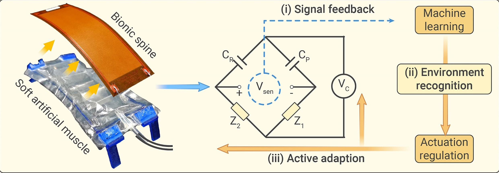
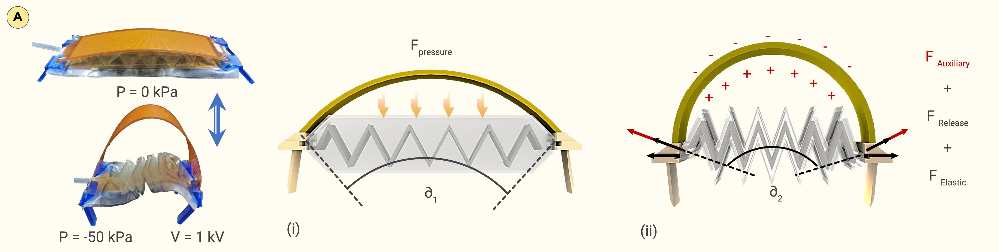
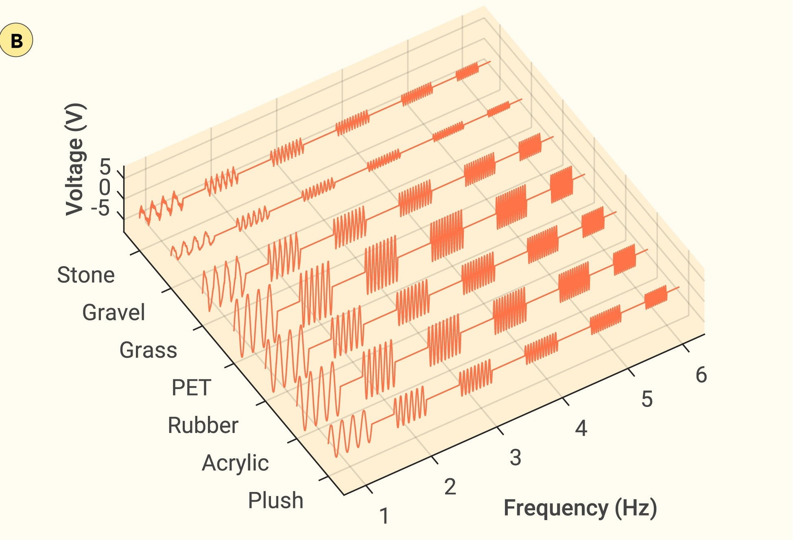
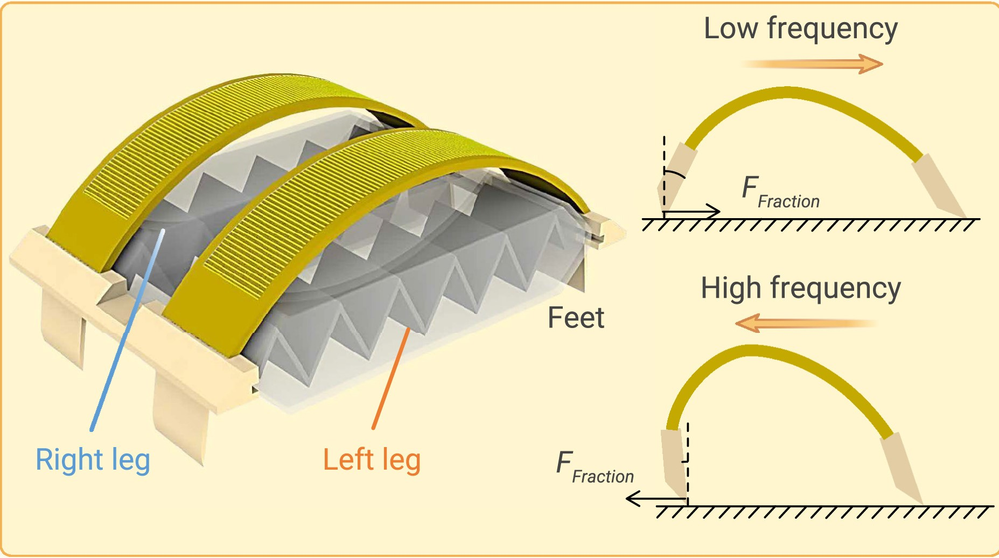

论文：[https://doi.org/10.1016/j.xinn.2024.100640](https://doi.org/10.1016/j.xinn.2024.100640)

---

文章提出了一种具有自感知-适应能力的软体机器人，利用正逆压电效应，设计了具有“传感-驱动”功能一体化集成的仿生脊椎，赋予了软体机器人一定的运动能力和对不同环境的感知能力。它通过学习步态调整，识别并积极适应不断变化的环境并且具有一定的避障能力。

该软体机器人用柔性压电纤维复合片材作为他的“仿生脊柱”，以PET塑料骨架内含折纸气动装置作为他的“人工肌肉”，这种“人工肌肉”具有重量轻，制造方便，线收缩率大的特点。

他的环境感知过程分成三个阶段，在第一阶段，仿生脊柱持续监测机器人的运动状态及其与环境的相互作用；在第二阶段，监测到的反馈信号在地形变化过程中的变化，并基于预训练的机器学习模型将其用于地形识别；在第三阶段，机器人的驱动状态将自我调节，主动适应新识别的地形，从而切换到该任务的最优运动解。

他的运动机理与折纸气动装置和仿生脊柱有关，首先折纸气动装置被施加负压时，人造肌肉收缩，仿生脊柱的挠度也增加，导致仿生脊柱和人造肌肉内PET塑料骨架的势能同时增加。爬行机器人将从初始状态过渡到收缩状态，当负压被撤去时，仿生脊柱上同时作用一个电压作为辅助驱动，仿生脊柱机器人将恢复原状并产生一个跨距。在此过程中，仿生脊柱和PET内部的势能被释放而产生了恢复力 $F_\text{Elastic},F_\text{Release}$，同时，仿生脊柱由于被作用了电压而产生逆压电效应，其产生了一个额外的驱动力 $F_\text{Auxiliary}$。如下图

恢复力和驱动力的公式如下所示

$$
\begin{align}
&F_{\text{Elastic}} = C_1-C_2x_a\\
&F_{\text{Release}} = K_1\left[\int^{\frac{\pi}{2}}_0\frac{d \varphi}{\sqrt{1-\sin^2 \frac{\partial}{2}\sin^2 \varphi}}\right]^2\\
&F_{\text{Auxiliary}}=K_2 \frac{V}{y_a+\frac{x_a}{\tan \partial}}
\end{align}
$$

 $\partial$  表示圆弧形弯曲脊柱的中心角，它对所有输出力有显着影响，$C_1$ 和 $C_2$ 包含折纸骨架的固有属性（尺寸和杨氏模量），$K_1$ 和 $K_2$ 包含仿生脊柱的属性（尺寸和杨氏模量,压电应变常数），$x_a$和$y_a$描绘了弯曲仿生脊柱的形状，$V$是施加到压电脊柱的电压。

作者证明了最大跨距总是出现在气动驱动与辅助驱动频率相同的情况下。而机器人在不同地形上的爬行速度是实际步幅和驱动频率的函数，驱动频率与其步幅成反比。同时，环境地形的阻力会减少步幅，导致不同地形的爬行速度差异较大，对于每个特定的地形，总有一组相应的最佳驱动参数，对应着更好的效率和更高的速度

仿生脊柱利用桥式电路的解耦压电反馈信号，使软体爬行机器人具有本体感觉和外感觉的自感知能力。作者监测不同驱动频率下仿生脊柱的反馈型号来展示机器人的感受能量，测量型号可以直观反馈爬行频率和步幅变化。根据响应信号和脊柱弯曲程度相关的模型来重建机器人的运动状态，为机器人提供其自身身体的位置和运动感知。通过分析反馈信号中的特征来实现爬行机器人针对不同地形的感知能力。在这个过程中运用了机器学习技术来处理反馈信号。

作者将两个脊柱驱动器并联组合来建构两栖软体机器人，根据两个脊柱驱动器不同的输出速度可以实现对于机器人多向爬行和避障能力。

本研究的创新之处在于开发了一种新型的仿生脊椎结构，在仿生脊柱上集成了驱动和感知的功能，该结构不仅提高了软体机器人的运动效率，还显著增强了其环境适应性和智能决策能力。从仿生学的角度提出了仿生脊柱，脊柱用柔性压电纤维复合片制成，不仅有助于对于外界环境的识别，而且利用压电效应提高了运动效率

不足：但是文章中对于机器人的自感知的测试都是在较为理想的实验室环境，而没有具体到实际环境，所以并不能说明该机器人在现实环境中的识别和感知能力。机器人仍依赖于外加电源，极大限制了机器人的可使用范围。

