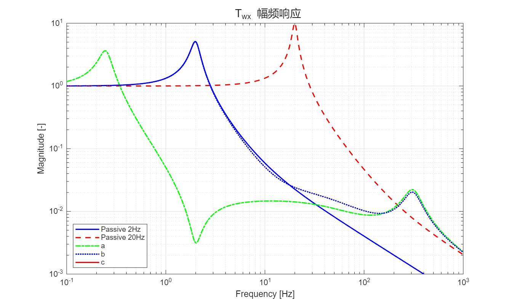

# Review of Active Vibration Isolation Strategies
doi: [10.2174/2212797611104030212](http://dx.doi.org/10.2174/2212797611104030212)

!!! info "说明"
    这篇文章是老师给的，因为我以后要做主动控制隔振（大概）。这篇文章精彩在大多数参考文献都是专利，而且写的非常简洁概要。

简单的动力学模型：

$$
m \ddot{x} + c(\dot{x} - \dot{w} ) + k(x- w) = F
$$

使用 Laplace 变换：

$$
X(s) = \frac{cs+k}{ms^{2}+cs+k}W(s) + \frac{1}{ms^{2}+cs+k}F(s)
$$

$T_{wx}(s) = \frac{cs+k}{ms^{2}+cs+k}$ 称为 transmissibility ，$T_{Fx}(s)= \frac{1}{ ms^{2}+cs + k}$ 称为 compliance 

两个 tradeoff

- 第一个Tradeoff ：通过增加粘性阻尼来降低共振频率的幅度，但是这会造成一个高频隔离效果的退化，这是一个阻尼和隔振效果之间需要达到的一个权衡（tradeoff）。一个有效的解决办法是在将粘性阻尼和一个弹簧并联，如图 $(b)$ 。

- 第二个 Tradeoff：但是随着共振频率的降低，在低频区域 compliance 增大，也就是说系统对于外力作用变得更加敏感。这是另一个隔振效果与外力的鲁棒性之间需要达到的权衡（tradeoff）

图 $c$ 是一个简单的主动隔振器，与之前相比多了运动传感器，激励器 $f$ 和控制单元（传递函数） $H(s)$，激励器提供的力简单总结为：

$$
f = g_{a}\ddot{x} + g_{v}\dot{x} + g_{p} x
$$

- 加速度反馈：增加虚拟质量
- 速度反馈：sky-hook damper，降低共振时的幅度，但没有影响高频隔振效果 （对应第一个 Tradeoff）
- 位移反馈：sky-hook spring，低频隔振，增加刚性（对应第二个 Tradeoff）

具体效果见下图：

**Problem**：传感器只能测定相对位移，对于图 $(c)$ ，我们实际上测得的是 $x-w,\dot{x}-\dot{w}$  ，也就是说我们并没有过多更改 $T_{wx}$  和 $T_{Fx}$。因此我们需要选取一些合适的惯性参考系，下面是三种参考系的选取方法

效果：

- 模型 $(a)$ 惯性参考点在设备上：高频稳定性，低频滞后降低 overshoot 。控制器共振出现零点
- 模型 $(b)$ 惯性参考点位于地面：高频稳定，在极低频对外力具有更强的鲁棒性（模型 $(a)$ 中无法处理低频外力），变体出现了更低的共振频率。
- 模型 $(c)$ 硬安装：整体刚度非常高，因此对外部干扰具有很强的鲁棒性。提高高频的隔振能力

（上面图片的实现涉及到了传递函数 $H(s)$ 的选取，我所采用的是 PID 算法，能复现出总体趋势，但是效果没有很好，文章中给出了仿真时所用的传递函数特征）

