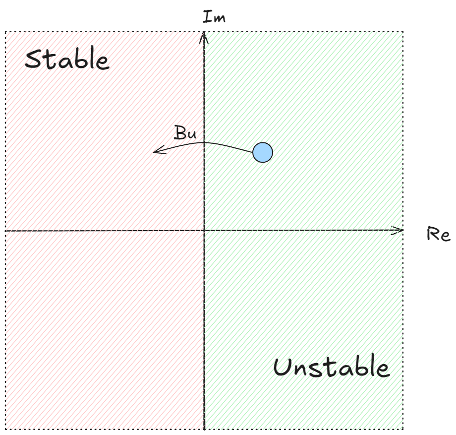
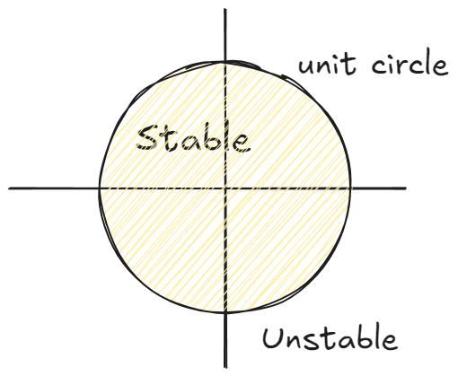

# Linear System

## Linear Systems
简单的线性控制系统可以为描述为：

$$
\dot{x} = Ax +Bu
$$

其中 $Bu$ 表示我们的控制。当不考虑控制影响时，即考虑 $\dot{x} =Ax$ 对应解：

$$
x(t) = e^{At}x(0)
$$

$A$ 是一个矩阵，我们可以利用如下泰勒展开计算结果：

$$
e^{At} = I+At +\frac{A^{2}t^{2}}{2} +\frac{A^{3} t^{3}}{3!} + \dots
$$

---
考虑一个如下坐标变换

$$
x = T z
$$

其中 $T$ 是矩阵 $A$ 对应的特征向量构成的矩阵，满足 $A = TDT^{-1}$ ，$z$ 是特征向量方向上的坐标。

$$
\begin{align}
\dot{x} = T \dot{z} & = Ax  \\
T\dot{z} & = ATz \\
\dot{z} &= T^{-1}ATz  \\
\dot{z} &= Dz
\end{align}
$$

此时我们将原本动力学系统变换到了一个特殊 $z$ 坐标系中，在这个坐标系中，系统的方程变成了一个简洁的对角形式，这也意味着各个分量之间相互解耦。带回到泰勒展开表达式：

$$
\begin{align}
e^{TDT^{-1}t} &= TT^{-1} + TDT^{-1}t +\frac{TD^{2}T^{-1}}{2}t^{2}+\dots \\
&=T\left[ I+D+\frac{D^{2}t^{2}}{2!}+\dots \right]T^{-1} \\
&=T[e^{Dt}]T^{-1}
\end{align}
$$

所以

$$
x(t) = Te^{Dt}T^{-1}x(0) = Te^{Dt}z(0) = Tz(t)
$$

所以我们分解线性系统中的特征值和特征向量，在这些特征向量坐标中，动力学系统变得很简单

## Stability
接下来讨论系统的稳定性，也就是当时间趋于无穷大时，系统会呈现出怎样的行为，这与 $e^{Dt}$ ，注意这时候 $D$ 是对角特征矩阵：

$$
e^{Dt} = \begin{bmatrix}
e^{\lambda_{1}t} &  &  &0  \\
 & e^{\lambda_{2}t} &  & \\
 &  & \ddots &  \\
 0&  &  & e^{\lambda_{n}t} 
\end{bmatrix}
$$

这些项中，即使其中只有一个趋向于无穷大也会导致 $x$ 在某个方向趋向于无穷大，这并不是我们想要的事情。

考虑特征值 $\lambda = a +\mathrm{i} b$ ，这里有点奇怪，因为我们在一个实值系统中考虑了复数，但是当我们考虑复数时，虚部总是以相反数的形式出现，即 $\lambda = a\pm \mathrm{i} b$ ，从物理或数学的角度来说，当我们将混合项相加后，虚部会抵消，最终会得到实数的输出。

利用欧拉公式：

$$
e^{\lambda t} = e^{a t}\left[ \cos (bt) +\mathrm{i} \sin (bt) \right] 
$$

- 当 $a > 0$ 系统以正弦波形式震荡，但是振幅以指数形式增大（指数增长的包络）
- 当 $a < 0$ 系统以正弦波形式震荡，但是振幅以指数形式衰减（指数衰减的包络）

因此，当所有的特征值实部小于零时，系统是稳定的。在设计时，我们原本的线性系统的一部分特征值落在不稳定的区域，但是我们的驱动项 $Bu$ 可以迫使其到达稳定区域

---
如果考虑一个离散系统

$$
X_{k+1} = \tilde{A}x_{k} ,x_{k} = x(k\Delta t)
$$

$$
\tilde{A} = e^{ A\Delta t }
$$

在离散时间中也存在稳定性的问题。我们将特征值以极坐标形式表示：$\lambda = Re^{i\theta}$ 。对于第 N 时刻 $x_{N}= \tilde{A}^{N}x_{0}$ ，对应的特征值为 $\lambda^{N} = R^{N} e^{iN\theta}$ ，对应在复平面上半径要么增大要么减小，而角度发生不停的旋转。因此当半径大于 $1$ 时，$\lambda^{N}$ 会无穷增大，当半径小于 $1$ 时， $\lambda^{N}$ 会衰减到零。所以所有特征值必须位于单位圆内系统才能保持稳定。

## Linearizing around a fixed point 

考虑一个非线性系统：

$$
\dot{x} = f(x)
$$

可以通过以下步骤获得一个线性系统：

- 先找到固定点 $f(\bar{x}) = 0$
- 在 $\bar{x}$ 附近进行线性化，即计算 $\left .\frac{{\rm{D}} f  }{{\rm {D}} x }\right\vert_{\bar{x}} =\left[ \frac{\partial f_{i} }{\partial x_{j} } \right]$

利用泰勒展开可以知道，在非线性系统的固定点附近系统的表现近似线性：

$$
\Delta \dot{x} = A\Delta x = \frac{{\rm{D}}  f }{{\rm {D}} x }\Big|_{\bar{x}}\Delta x 
$$
 
如果我们的控制项 $Bu$ 有效，我们能够使系统保持在该固定点附近，它能够稳定该系统并使其维持在固定点附近且表现良好。

但是线性化并不能总是准确描述非线性周围的动态特性。

!!! note "[Hartman-Grobman theorem](https://en.wikipedia.org/wiki/Hartman%E2%80%93Grobman_theorem)"

    动力系统在双曲平衡点（特征值有非零实部）附近的域中的行为与其在该平衡点附近的线性化行为近似相同。因此，在处理此类动力系统时，可以使用系统的更简单的线性化来分析其围绕平衡的行为

    但如果特征值是纯虚数的话，线性化会失效。

!!! example

    考虑一个简单的摆系统：

    $$
    \ddot{\theta} = -\sin\theta -\delta \dot{\theta}
    $$

    系统状态：
    
    $$
    \begin{bmatrix}
    x_{1} \\
    x_{2}
    \end{bmatrix}= \begin{bmatrix}
    \theta  \\
    \dot{\theta}
    \end{bmatrix}\quad \frac{{\rm{d}}   }{{\rm {d}} t }\begin{bmatrix}
    x_{1}  \\
    x_{2}
    \end{bmatrix}  = \begin{bmatrix}
    x_{2} \\
    -\sin(x_{1})-\delta x_{2}
    \end{bmatrix}
    $$

    先寻找固定点 

    $$
    \begin{bmatrix}
    x_{1} \\
    x_{2}
    \end{bmatrix}= \begin{bmatrix}
    0 \\
    0
    \end{bmatrix}\quad\begin{bmatrix}
    x_{1} \\
    x_{2}
    \end{bmatrix}= \begin{bmatrix}
    \pi \\
    0
    \end{bmatrix}
    $$

    Jacobian 矩阵

    $$
    A =\begin{bmatrix}
    0 & 1 \\
    -\cos(x_{1}) & -\delta
    \end{bmatrix}
    $$

    将固定点带入：

    $$
    A|_{\bar{x}=[0,0]} = \begin{bmatrix}
    0 & 1 \\
    -1& -\delta
    \end{bmatrix}\quad A|_{\bar{x}=[\pi,0]} = \begin{bmatrix}
    0 & 1 \\
    1& -\delta
    \end{bmatrix}
    $$

    可以求得在第二个固定点的 Jacobian 对应的特征值存在大于零的，换言之这是一个不稳定的定点，而 $[0,0]$ 是一个稳定的定点

