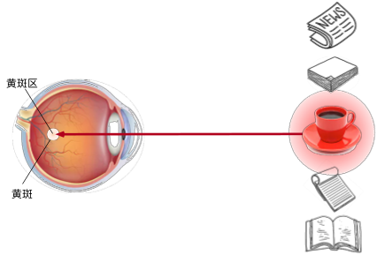
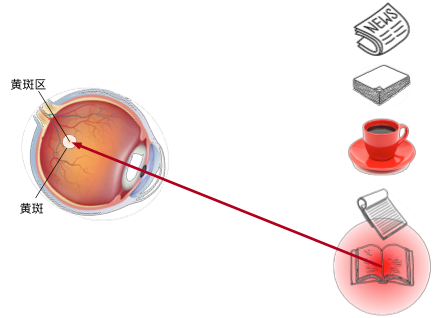
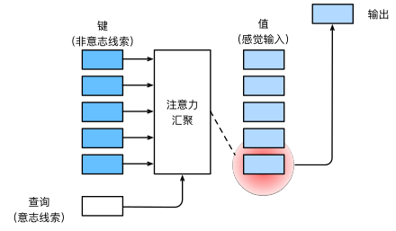

!!! warning
    注意力机制理论上很简单，但是对我很难搞懂（

## Sequence-to-Sequence with RNNs and Attention 

当Seq2Seq模型与RNNs结合时，它可以有效地处理变长的输入和输出序列。

这种模型的工作方式如下：一个称为编码器的循环神经网络接受并且处理原始输入向量，然后产生隐藏状态序列，并且在最后总结输入，产生两个输出向量（隐藏状态和上下文向量），上下文向量是要传送给解码器的每一个时间步的，这样，理论上模型就可以充分考虑上下文信息，每一个输出都是在结合所有输入的基础上得到的。

在解码器的开始，同时接受隐藏状态和上下文向量，然后用开始标记作为输入

在这里，这个上下文向量式一个在编码解码序列之间传递信息的向量，所以现在这个上下文向量应该以某种方式总结解码器生成其句子所需的所有信息，然后进入解码器的每个时间步

但是，这里有一个问题，如果我们希望使用序列架构的RNN来处理非常长的序列，比如说我们想翻译一本书，那么这种架构是难以完成的，因为我们难以将一个很长序列的内容打包到一个上下文向量中（或者说，一本书的内容难以打包为一页纸），我们希望有一些机制，不要强迫模型把所有的信息都集中在一个单一的向量上

那么，我们可以在编码器的每个时间步上计算一个上下文向量，然后解码器可以选择上下文向量，或者说关注上下文向量的不同部分（也可以理解为关注输入序列的不同），我们称为注意力(Attention)机制

我们有编码器，将输入序列（这个输入序列可能是整个网络的输入或者上一层输出的隐藏状态）编码为一系列隐藏状态，然后使用解码器进行预测，然后使用一些对齐函数（可以理解成一个很小的全连接网络），这个对齐函数的输入是两个向量：当前编码器的隐藏状态，解码器的隐藏状态

$$
e_{t,i}=f_{att}(s_{t-1},h_i)\ f_{att}\quad is \quad an\quad MLP(多层感知机) 
$$

这些对齐函数会输出一个分数，这个分数表示，考虑到解码器的当前隐藏状态，我们应该对编码器的每个隐藏状态关注多少，不过最开始，这些分数也是随机的，因为是直接从前馈函数中产生的，没有经过反向传播的学习

我们会根据这个分数，以某种方式在解码器的每一步构建一个新的上下文向量，在使用比对分数的时候，我们将会使用这个对齐函数来比较$s_0$和$h_i$，比对分数代表模型认为隐藏状态对于预测输出隐藏状态$s_0$之后的单词所必须的信息

然后我们就得到了每个隐藏状态的对其分数编码序列，即

$$ 
\vec{e_{i}}=(e_{i,1},e_{i,2},\cdots,e_{i,n}) 
$$

然后我们经过一个Softmax操作，将这些分数转化为概率分布，这个分布说明，我们对于编码器的每个隐藏状态上放置多少权重（或者说关注度多少），这些分布也被称为注意力权重

$$ 
\vec{a_i}=softmax\left(\vec{e_i}\right) 
$$

然后我们对隐藏状态进行线性加权求和，得到上下文向量

也就是说，这个网络可以自行预测我们要对输入序列的每个隐藏状态施加多少权重，并且我们可以为解码器网络的每个时间步动态改变该权重

然后，我们就可以使用我们计算出的上下文向量和输入来进行预测了

我们输入上下文向量和第一个输入单词，然后我们得到的输出词可能对应于输入词中的一个或者多个单词，但是我们这里的上下文向量是动态生成的，它允许解码器专注于编码器网络不同的输入

这里给出了这种直觉：如果解码器网络想生成输出序列的特定单词，那么将专注于这个单词所需的输入序列中的重要部分

然后我们在使用解码器中上一步的隐藏状态来计算这一步的上下文向量（重复之前的对齐、概率分布计算等操作），来继续生成新的文本

我们给出一个例子，比如说我们想要将英文翻译成法语，我们的输入是 “The agreement on the European Economic Area was signed in August 1992.”，希望的输出是“L’accord sur la zone économique européenne a été signé en août 1992.”

这句话被分成单独的单词转换成向量嵌入到编码器中，经解码器生成对应的法语句子。在此过程中，注意力机制被用来确定输入句子中哪些部分最相关。而注意力权重显示了在生成每个输出单词是，模型所关注的输入句子的单词。对角线注意力模式表示一种直接的词序对应关系。同时，注意力机制帮助模型学习如何对齐输入和输出序列，特别是在单词顺序不同时。例如，英语中的形容词顺序与法语不同，注意力机制允许模型在生成法语翻译时调整词序，注意力机制使得模型在生成每个输出单词时可以选择性地关注输入序列中相关的信息。这有助于模型捕捉到长距离的依赖关系，并在翻译中保留重要的细节。注意力机制允许模型在生成翻译时正确地调整词序并处理动词变位等翻译问题，因此，注意力机制不仅提高了翻译质量，还增强了模型的解释性。

## Image Captioning with RNNs and Attention 

我们可以使用注意力机制来生成图像说明。我们通过 CNN 来计算一张图的特征向量，通过RNN 解码器和注意力机制，模型生成图像的描述文本。在解码器的每个时间步，都会使用一个不同的上下文向量，这个向量决定了模型在生成描述的每一步时关注图像的哪个部分。

模型通过分析图像并使用注意力机制来决定在生成每个单词时应该关注图像的哪些部分。

## Human Vision 
人眼是一个球体，然后你在一侧有一个晶状体，相当于一个透镜，然后在你眼睛的后部有一个叫做视网膜的区域，光线通过晶状体进入眼球，投射到视网膜上

视网膜上包括实际检测光的感光细胞，它们感光之后，产生信号并且发送给大脑，然后大脑进行处理并理解为我们现在看到的东西

但是，视网膜的所有部分不是平等的，实际上视网膜正中央的一个特定区域，学名为“fovea”，中文名"黄斑窝"或者"中央凹"。这是视网膜中央部位的一个小凹陷，直径约为1.5毫米，它的特点是细胞密度最高，主要由视锥细胞构成，负责我们的中心视力和色彩视觉。当我们集中注意力看某个物体时，我们的眼睛会自动调整，使得光线尽可能地落在黄斑窝上，这样可以得到最清晰的视觉效果。

从上图也可以看到，视网膜不同区域的敏感度不一样（或者可以表现为视力），越是边缘区，视力越差，在中央凹这里，视力达到最高

注意力是如何应用于视觉世界中的呢？ 这要从当今十分普及的 _双组件_（two-component）的框架开始讲起： 这个框架的出现可以追溯到19世纪90年代的威廉·詹姆斯， 他被认为是“美国心理学之父” 。 在这个框架中，受试者基于 _非自主性提示_ 和 _自主性提示_ 有选择地引导注意力的焦点。

非自主性提示是基于环境中物体的突出性和易见性。 想象一下，假如我们面前有五个物品： 一份报纸、一篇研究论文、一杯咖啡、一本笔记本和一本书， 所有纸制品都是黑白印刷的，但咖啡杯是红色的。 换句话说，这个咖啡杯在这种视觉环境中是突出和显眼的， 不由自主地引起人们的注意。 所以我们会把视力最敏锐的地方放到咖啡上。

喝咖啡后，我们会变得兴奋并想读书， 所以转过头，重新聚焦眼睛，然后看看书，由于突出性导致的选择不同， 此时选择书是受到了认知和意识的控制， 因此注意力在基于自主性提示去辅助选择时将更为谨慎。 受试者的主观意愿推动，选择的力量也就更强大

所以，就像人们不停环顾周围以获取信息，注意力机制不断环顾图像上来获取相关信息。

## Attention Layer 

自主性的与非自主性的注意力提示解释了人类的注意力的方式， 下面来看看如何通过这两种注意力提示， 用神经网络来设计注意力机制的框架，

首先，考虑一个相对简单的状况， 即只使用非自主性提示。 要想将选择偏向于感官输入， 则可以简单地使用参数化的全连接层， 甚至是非参数化的最大汇聚层或平均汇聚层。

因此，“是否包含自主性提示”将注意力机制与全连接层或汇聚层区别开来。 在注意力机制的背景下，自主性提示被称为 _查询_（query）。 给定任何查询，注意力机制通过 _注意力汇聚_（attention pooling） 将选择引导至 _感官输入_（sensory inputs，例如中间特征表示）。 在注意力机制中，这些感官输入被称为 _值_（value）。 更通俗的解释，每个值都与一个 _键_（key）配对， 这可以想象为感官输入的非自主提示。可以通过设计注意力汇聚的方式， 便于给定的查询（自主性提示）与键（非自主性提示）进行匹配， 这将引导得出最匹配的值（感官输入）。

我们尝试将注意力机制抽象并且概括，将其用在更多类型的任务中，尝试得到一个通用的层，然后直接插入到 RNN 和 CNN 中进行使用，这种方法可以很好地对注意力机制进行重建。

我们的输入是一个查询向量（Query Vector，即$q$），这个将取代隐藏状态向量，查询向量的作用是帮助模型确定应该关注的输入数据的哪些部分，从而提高模型的性能和准确性。它是实现注意力机制的关键组件，使模型能够更好地处理复杂和大规模的数据。

我们也有一个输入向量（即$X$），来代替我们想关注的这组隐藏向量

然后还有一些相似函数，来对比查询向量和数据库中的每个输入向量，当然，实际上主要是点积作为相似函数

然后就是使用softmax，对相似函数的输出进行处理，得到注意力权重，然后对输入向量进行加权来计算输出向量

我们将相似函数改成用向量之间的简单点积，同时为了限制相似性函数计算结果过大过小，我们使用缩放点积，来使得相似性有一个限定范围，这样就可以限制梯度不会过大，导致梯度爆炸（因为这个相似性会进入softmax进行计算的，这个值太大，也会导致反向的梯度很大，同时如果向量e中一个元素远大于其他元素，也会导致一个非常高的softmax峰值分布，导致梯度几乎在任何地方接近消失）

此外，如果向量很长，那么就更容易产生非常大的数值，然后我们除以平方根，就可以消除这种影响

然后，我们想要允许多个查询向量，所以以前我们总是在每个时间步都有一个查询向量，在解码器中，我们使用该查询向量在所有输入向量上生成一个概率分布

现在我们想概括注意力机制，并且有一组查询向量 Q 和输入向量 X（以矩阵形式出现的），对于每一个查询向量，我们想在每个输入向量上生成一个概率分布，以便于计算相似度

我们想计算每个查询向量和每个输入向量之间的相似度，我们就使用比例点积来作为计算相似度的函数（这里改进为矩阵乘法），然后我们计算概率分布的时候，就可以使用针对单个维度的softmax，在这里我们是在第一维上计算

然后我们使用 softmax 就可以得到注意力权重了，然后使用注意力权重矩阵来对输入矩阵进行加权求和，得到输出矩阵 Y

这里实际上输入向量有两个功能，一个是计算注意力权重，另一个是计算输出向量，但是我们可以将这个输入向量转换为两个向量：键向量和值向量

这里我们使用两个可学习的矩阵完成这个操作，一个是键矩阵$W_k$，另一个是值矩阵$W_v$

我们这里使用查询向量和键矩阵来计算相似性，使用注意力权重矩阵和值向量来计算输出，这使得模型在如何正确使用其输入数据方面具有更大的灵活性

下图中，底部我们有四个查询向量，然后左侧是一组输入向量

首先我们使用键矩阵来计算输入向量的键矩阵，然后将键矩阵与查询向量进行对比，得到非标准化相似性分数矩阵

然后进行softmax操作，得到对齐分数，然后继续计算

最后输出向量 Y，其中就包括了更多的信息，而且其中更重要的信息占比更大（不过也有一点不重要的信息）

### Self-Attention Layer 
自注意力层（Self-Attention Layer），也称为内部注意力层，是一种特殊类型的注意力机制，它允许模型在处理序列时关注序列内部的不同部分。自注意力层不依赖于外部信息，而是仅基于输入序列本身来计算注意力权重。这种机制在处理长序列数据时特别有用，因为它可以帮助模型捕捉序列内部的长距离依赖关系

他在处理一个序列时，模型可以对序列中的每个元素（如单词或图像特征）进行加权，以决定在生成表示时应该关注哪些其他元素。这种机制使得模型能够捕捉到长距离依赖关系，并提高了对上下文信息的理解。

在之前的情况下，我们都是有两组输入：查询向量和输入向量，但是实际上我们只有一组向量作为输入，并且我们想将输入集中的每个向量与其他向量进行比较，使用整个输入来找到关键信息，所以我们需要将输入进行转换，我们再使用一个可学习的查询矩阵 $W_Q$，来获得查询向量

然后类似地，我们将使用键矩阵来获得键向量，然后计算查询向量和键向量之间的相似性矩阵$E$​（也就是查询得到的重要性信息），进行放缩然后使用softmax得到概率分布，加上值矩阵得到注意力权重矩阵，加权求和之后得到输出向量（实际上就是进行信息汇总）

当然，这里实际上是通过点乘的方法计算 $Q$ 和 $K$ 中每一个事物的相似度，进而找到对于 $Q$ 更重要的那些（通过权重表示重要程度），而这里的 $K$ 和 $V$​ 实际上是一样的或者说是有联系的，这样子 $QK$ 点乘才可以指导哪些信息重要

### Multihead Self-Attention 

在实践中，当给定相同的查询、键和值的集合时， 我们希望模型可以基于相同的注意力机制学习到不同的行为， 然后将不同的行为作为知识组合起来， 捕获序列内各种范围的依赖关系 （例如，短距离依赖和长距离依赖关系）。 因此，允许注意力机制组合使用查询、键和值的不同 _子空间表示_（representation subspaces）可能是有益的。

多头自注意力（Multi-Head Self-Attention）将输入序列进行多次线性变换，然后分别计算自注意力得分，最后将所有头的输出进行拼接，并通过一个线性层得到最终的输出。这样做的好处是可以让模型从不同的子空间学习到不同的注意力信息，提高模型的表达能力。

为此，与其只使用单独一个注意力汇聚， 我们可以用独立学习得到的h组不同的 _线性投影_（linear projections）来变换查询、键和值。 然后，这h组变换后的查询、键和值将并行地送到注意力汇聚中。 最后，将这h个注意力汇聚的输出拼接在一起， 并且通过另一个可以学习的线性投影进行变换， 以产生最终输出。 这种设计被称为 _多头注意力_（multihead attention）

### Three ways of Processing Squences

1. 循环神经网络（Recurrent Neural Network）
	- **工作原理**：RNN通过递归地处理序列中的每个元素来处理有序序列。每个元素的输出不仅依赖于当前输入，还依赖于前一个元素的输出。
	- **优点**：RNN擅长处理长序列，因为每个RNN层在处理完一个序列后，能够“看到”整个序列的信息。
	- **缺点**：RNN不是并行化的，需要顺序地计算隐藏状态，这限制了其训练速度和处理长序列的能力。现在构建大型神经网络都是使用GPU和张量来并行处理，因此无法很好的利用算例，也就难以构建大型的RNN

 2. 一维卷积（1D Convolution）
	- **工作原理**：1D卷积通过在多维网格上滑动卷积核来处理序列数据。这种方法可以看作是将卷积应用于一维序列。
	- **优点**：1D卷积是高度并行的，每个输出都可以独立计算，这使得它在处理长序列时比RNN更高效。
	- **缺点**：1D卷积不擅长处理非常长的序列，因为随着卷积层的增加，为了“看到”整个序列，需要堆叠很多层，这会导致梯度消失或梯度爆炸问题。

3. 自注意力（Self-Attention）

	- **工作原理**：自注意力机制通过计算输入序列中每个元素对其他所有元素的注意力权重来处理集合向量。每个输出“看到”所有输入，使得模型能够并行处理序列中的所有元素。
	- **优点**：自注意力机制擅长处理长序列，因为每个输出都可以并行计算，并且能够捕捉序列中任意两个元素之间的关系。
	- **缺点**：自注意力机制占用内存，因为需要计算和存储序列中所有元素之间的注意力权重。

不过，结果证明，如果我们想构建一个处理序列类型的神经网络，我们可以只使用自注意力机制来完成，这种工作就是transformer

## Transformer 

Transformer 模型的核心思想是利用自注意力（Self-Attention）机制来捕捉序列中不同位置之间的依赖关系，而不需要像传统的循环神经网络（RNN）那样顺序地处理序列。这种方法允许模型并行处理序列中的所有元素，从而显著提高了训练效率，并能够捕捉长距离依赖关系。

在 Transformer 模型中，自注意力层通过计算序列中每个元素对其他所有元素的注意力得分，然后根据这些得分对序列中的元素进行加权求和，生成输出。这种机制使得模型能够灵活地关注序列中的不同部分，从而更好地理解上下文信息。

### Layer Normalization

Transformer 接受一个输入序列，然后将其通过一个自注意力层，同时增加一个残差连接来完成归一化操作。使得每一层的输出具有稳定的均值和方差，从而减少内部协变量偏移问题，加速训练过程。

在Transformer模型中，层归一化（Layer Normalization）是一种重要的技术，用于提高模型训练的稳定性和性能。层归一化的核心思想是对每一层的输出进行归一化处理，使得每一层的输出具有稳定的均值和方差，从而减少内部协变量偏移问题，加速训练过程。

层归一化首先计算每一层所有激活值的均值（$μ$）和方差（$σ^2$），然后使用这些统计量对激活值进行归一化，使得归一化后的激活值具有均值为0，方差为1的分布。归一化后的输出会经过两个可学习的参数——缩放因子（$γ$）和偏移因子（$β$）进行缩放和平移，以恢复模型的表达能力。公式表示为：

$$
\begin{align}
&x_i = \frac{x_i-\mu}{\sqrt{\sigma^2+\varepsilon}}\\
&y_i =\gamma x_i +\beta 
\end{align}
$$

其中，$x_i$​ 是输入，$μ$ 和 $σ$ 分别是均值和标准差，$ϵ$ 是一个很小的常数，防止除零错误，$γ$ 和 $β$ 是可学习的参数。

于是层归一化能够解决内部协变量偏移问题，即减少层与层之间数据分布的差异。层归一化会对残差连接后的输出进行归一化处理，然后使用可学习的参数（如 $β$ 和 $γ$ ）对归一化后的输出进行缩放和平移。这样既可以保持数据的分布稳定性，又可以保留一定的灵活性

但是，归一化层不涉及不同向量之间的交互，仅仅是对单个向量完成归一化

在这个归一化层之后，我们得到的还是一组向量，就是应该前馈的多层感知机，这是一个全连接的神经网络，会独立地对每个向量进行处理

然后我们继续增加一个残差连接进行归一化处理，然后输出向量Y

我们一般将这些层封装为一个块，称为Transformer，它可以是处理向量序列的大型模型的基本构建块

输入是一组向量 x，输出也是一组向量 y，不会改变输入输出的数量，但是维度可能改变，向量之间的唯一交互发生在自注意力层内部，因为归一化和前馈感知机都是在单个向量上进行独立处理的

### Transformer block
Transformer Block是Transformer模型中的一个基本构建单元，它包含了多个关键组件，这些组件共同工作以实现模型的复杂功能。一个典型的Transformer Block由以下几个主要部分组成：

1. **多头自注意力机制（Multi-Head Self-Attention）**：这个机制允许模型在处理序列数据时，关注输入序列中的不同部分。它通过计算序列中每个元素对其他所有元素的注意力得分，然后根据这些得分对序列中的元素进行加权求和，生成输出。
    
2. **残差连接（Residual Connection）**：在自注意力层和前馈神经网络层的输出上，都会应用残差连接。这意味着层的输入会被加到层的输出上，有助于避免深层网络训练中的梯度消失问题。
    
3. **层归一化（Layer Normalization）**：在每个子层（自注意力层和前馈神经网络层）的输出上进行归一化处理，以稳定和加速训练过程。层归一化通过对每一层的输出进行归一化，使得每一层的输出具有稳定的均值和方差。
    
4. **前馈神经网络（Feed-Forward Neural Network）**：在自注意力层之后，每个位置的输出会通过一个独立的全连接前馈神经网络，进一步处理和转换特征表示。
    

Transformer Block的设计使得模型能够并行处理序列中的所有元素，这与传统的循环神经网络（RNN）形成鲜明对比，后者需要顺序地处理序列。Transformer Block的这种并行处理能力，以及其能够捕捉长距离依赖关系的能力，是Transformer模型在自然语言处理任务中取得成功的关键因素之一。

在实际应用中，Transformer模型通常由多个这样的Transformer Block堆叠而成，以增加模型的深度和复杂度，从而能够学习到更高层次的特征表示。每个Transformer Block都是模型中的一个独立单元，可以单独进行优化和调整，以适应不同的任务需求。

