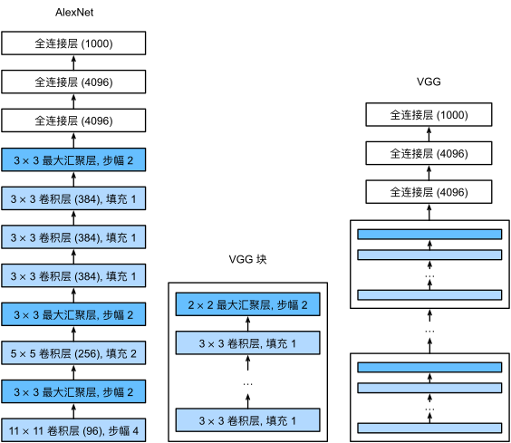
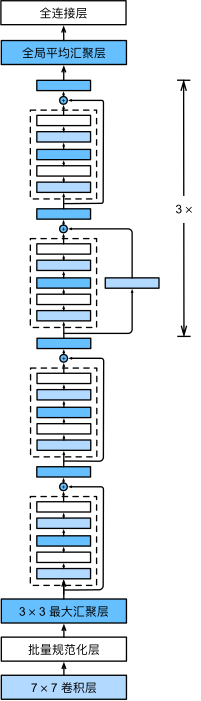

## AlexNet 

2012年，AlexNet横空出世。它首次证明了学习到的特征可以超越手工设计的特征。

AlexNet和LeNet的设计理念非常相似，但也存在显著差异。

1. AlexNet比相对较小的LeNet5要深得多。AlexNet由八层组成：五个卷积层、两个全连接隐藏层和一个全连接输出层。 
2. AlexNet使用ReLU而不是sigmoid作为其激活函数。

在AlexNet的第一层，卷积的窗口的形状是$11\times11$,第二层中的卷积窗口形状被缩减为$5\times5$，然后是$3\times 3$。 此外，在第一层、第二层和第五层卷积层之后，加入窗口形状为$3\times3$、步幅为 $2$ 的最大汇聚层。

此外，AlexNet将sigmoid激活函数改为更简单的ReLU激活函数。 一方面，ReLU激活函数的计算更简单，它不需要如sigmoid激活函数那般复杂的求幂运算。 另一方面，当使用不同的参数初始化方法时，ReLU激活函数使训练模型更加容易。 当sigmoid激活函数的输出非常接近于0或1时，这些区域的梯度几乎为0，因此反向传播无法继续更新一些模型参数。 相反，ReLU激活函数在正区间的梯度总是1。 因此，如果模型参数没有正确初始化，sigmoid函数可能在正区间内得到几乎为0的梯度，从而使模型无法得到有效的训练。

AlexNet通过暂退法控制全连接层的模型复杂度，而LeNet只使用了权重衰减。 为了进一步扩充数据，AlexNet在训练时增加了大量的图像增强数据，如翻转、裁切和变色。 这使得模型更健壮，更大的样本量有效地减少了过拟合。

- Most of the memory usage is in the early convolutions layers 
- Nearly all parameters are in the fully-connected layers 
- Most floating-point ops occur in the convolution layers 

总结：

- AlexNet的架构与LeNet相似，但使用了更多的卷积层和更多的参数来拟合大规模的ImageNet数据集。
- 今天，AlexNet已经被更有效的架构所超越，但它是从浅层网络到深层网络的关键一步。
- 尽管AlexNet的代码只比LeNet多出几行，但学术界花了很多年才接受深度学习这一概念，并应用其出色的实验结果。这也是由于缺乏有效的计算工具。
- Dropout、ReLU和预处理是提升计算机视觉任务性能的其他关键步骤。

**ZFNet**
ZFNet(Zeiler&Fergus Net)是对于AlexNet的改进，通过调整架构超参数，特别是通过扩展中间卷积层的大小

但实际上，ZFNet只是在AlexNet基础上进行了一些细节的改动，网络结构上并没有太大的突破。

## VGG

VGG Design rules:

1. All conv are $3\times3$ stride 1 pad 1
2. All max pool are $2\times2$ stride 2
3. After pool, double channels

VGG网络可以分为两部分：第一部分主要有卷积层和汇聚层组成，第二部分又全连接层组成

从ALexNet到VGG，他们本质上都是块设计

总结：

- VGG-11使用可复用的卷积块构造网络。不同的VGG模型可通过每个块中卷积层数量和输出通道数量的差异来定义。
- 块的使用导致网络定义的非常简洁。使用块可以有效地设计复杂的网络。
- 在VGG论文中，Simonyan和Ziserman尝试了各种架构。特别是他们发现深层且窄的卷积（即3×3）比较浅层且宽的卷积更有效。

## NiN

LeNet、AlexNet和VGG都有一个共同的设计模式：通过一系列的卷积层与汇聚层来提取空间结构特征；然后通过全连接层对特征的表征进行处理。 AlexNet和VGG对LeNet的改进主要在于如何扩大和加深这两个模块。 或者，可以想象在这个过程的早期使用全连接层。然而，如果使用了全连接层，可能会完全放弃表征的空间结构。 网络中的网络（NiN）提供了一个非常简单的解决方案：在每个像素的通道上分别使用多层感知机

NiN的想法是在每个像素位置（针对每个高度和宽度）应用一个全连接层。如果我们将权重连接到每个空间位置，我们可以将其视为 $1\times 1$卷积层，或作为在每个像素上独立作用的全连接层。从另一个角度看，即将空间维度中的每个像素是为单个样本，将通道维度是为不同特征

NiN网络的优势在于提供了更强的非线性建模能力，同时减少了网络的参数量和计算复杂度。它在图像分类、目标检测和语义分割等任务中取得了良好的效果。
## GoogleNet 

GoogleLeNet是谷歌团队研究出的网络，发表于2014年，这是谷歌团队为了致敬Yann LeCun及其创建的LeNet所命名的，他吸收了NiN中串联网络的思想，并在此基础上做了改进，本文一个观点是，有时使用不同大小的卷积核组合是有利的，其特点之一是尝试更高效的神经网络，降低其复杂性，使得可以在手机上运行。

当然，这个也是第一个真正意义上的深度神经网络，其深度可以超过100层

在GoogLeNet中，基本的卷积被称为 Inception 块。它由四块并行路径组成。前三条路径使用窗口大小为 $1\times 1$、$3 \times 3$ 和 $5 \times 5$ 的卷积层，从不同空间大小中提取信息。中间两条路径在输入执行 $1 \times 1$ 卷积，以减少通道数，从而降低模型的复杂性。第四条路径使用 $3 \times 3$ 最大汇聚层，然后使用 $1 \times 1$卷积层来改变通道数。 这四条路径都使用合适的填充来使输入与输出的高和宽一致，最后我们将每条线路的输出在通道维度上连结，并构成Inception块的输出。在Inception块中，通常调整的超参数是每层输出通道数。

- Global Average Pooling 
No large FC layers at the end! Instead uses **global average pooling** to collapse spatial dimensions, and one linear layer to produce class scores
全局平均池化层将每个特征图中的所有元素进行平均，得到一个全局特征向量，用于最后的分类。这样的设计使得网络更加紧凑，并减少了参数数量，降低了过拟合的风险。

- Auxiliary Classifiers 
Training using loss at the end of the network didn’t work well: Network is too deep, gradients don’t propagate cleanly
As a hack, attach “auxiliary classifiers” at several intermediate points in the network that also try to classify the image and receive loss
GoogLeNet was before batch normalization! With BatchNorm no longer need to use this trick

## Residual Networks 

Once we have Batch Normalization, we can train networks with 10+ layers. But Deepr model does worse than shallow model ! 

In fact the deep model seems to be underfitting since it also performs worse than the shallow model on the training set! It is actually underfitting

A deeper model can emulate a shallower model: copy layers form shallower model, set extra layers to identity.

Thus deeper models should do at least as good as shallow models

Solution: Change the network so learning identity functions with extra layers is easy! 

假定我们希望理想的输出结果为 $H(x) = F(x) + x$。于是在残差块中，我们希望原来的正常块（basic block）能够拟合出残差映射 $F(x) = H(x)- x$。残差映射在现实中往往更容易优化。

ResNet沿用了VGG完整的3×3卷积层设计。 残差块里首先有2个有相同输出通道数的3×3卷积层。 每个卷积层后接一个批量规范化层和ReLU激活函数。 然后我们通过跨层数据通路，跳过这2个卷积运算，将输入直接加在最后的ReLU激活函数前。 这样的设计要求2个卷积层的输出与输入形状一样，从而使它们可以相加。 如果想改变通道数，就需要引入一个额外的1×1卷积层来将输入变换成需要的形状后再做相加运算。

ResNet的前两层跟之前介绍的GoogLeNet中的一样： 在输出通道数为64、步幅为2的7×7卷积层后，接步幅为2的3×3的最大汇聚层。 不同之处在于ResNet每个卷积层后增加了批量规范化层。

GoogLeNet在后面接了4个由Inception块组成的模块。 ResNet则使用4个由残差块组成的模块，每个模块使用若干个同样输出通道数的残差块。 第一个模块的通道数同输入通道数一致。 由于之前已经使用了步幅为2的最大汇聚层，所以无须减小高和宽。 之后的每个模块在第一个残差块里将上一个模块的通道数翻倍，并将高和宽减半。

接着在ResNet加入所有残差块，这里每个模块使用2个残差块。

最后，与GoogLeNet一样，在ResNet中加入全局平均汇聚层，以及全连接层输出。

每个模块有4个卷积层（不包括恒等映射的1×1卷积层）。 加上第一个7×7卷积层和最后一个全连接层，共有18层。 因此，这种模型通常被称为ResNet-18。 通过配置不同的通道数和模块里的残差块数可以得到不同的ResNet模型，例如更深的含152层的ResNet-152。 虽然ResNet的主体架构跟GoogLeNet类似，但ResNet架构更简单，修改也更方便。这些因素都导致了ResNet迅速被广泛使用。

Improving Residual Networks: 

## ResNet

2015年ResNet出现，这是具有划时代的意义，因为批量归一化的方法出现（这是一个很有意义的创新），然后神经网络的深度可以大大加深，一年内网络深度从22层增加到152层，在这之前，更深的网络表现的可能比浅层网络更差

## MobileNet

这是一个非常轻量化的网络，可能其准确率并不会高过那些网络，但是轻量化的结构可以使得在计算的时候非常快速，并且在手机登设备上实现这些计算