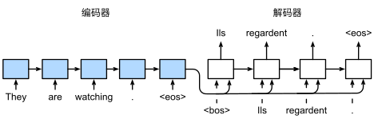

之前已经讲了包括CNN结构、训练方法等，但是这些实际上只是一种前馈结构，所有的信息都是前向传播（有分支），每一层都接受单一输入（如图像等），每一层的输出都会进入下一层进行处理，最后输出一个单项，比如说一个完整的神经网络，我们输入一个图像，就可以输出一个标签（尽管这个标签未必是对的）

到目前为止我们默认数据都来自于某种分布， 并且所有样本都是独立同分布的 （independently and identically distributed，i.i.d.）。 然而，大多数的数据并非如此。 例如，文章中的单词是按顺序写的，如果顺序被随机地重排，就很难理解文章原始的意思。 同样，视频中的图像帧、对话中的音频信号以及网站上的浏览行为都是有顺序的。 因此，针对此类数据而设计特定模型，可能效果会更好。

简言之，如果说卷积神经网络（CNN）可以有效地处理空间信息，那么循环神经网络（RNN）则可以更好地处理序列信息。
## Recurrent Neural Networks 

We can process a sequence of vectors $x$ by applying a recurrence formula at every time step.

RNN 多了一个内部隐藏状态（或者叫内部状态），每一次输入之后，都会使用某一种公式来更新这个状态。

其可以处理任意长度的序列，处理时间看序列中包含元素的个数，其处理的计时单位是时间步，一个时间步处理一个元素，但是循环网络和权重都是相同的

根据任务不同，网格的处理方法也不一样
- 多对多的情况下，需要为序列中的每个点做出决定，类似于视频分类，我们需要为视频中的每一帧进行分类，这时候我们可以加上另一个权重矩阵$W_Y$，使得我们可以输出Y，然后处理得到标签$L_n$来进行预测，然后我们也可以在每一个时间步上应用损失函数来训练我们的模型：每个时间步的损失加在一起就是最终损失，然后就可以进行反向传播

- 多对一的情况下，我们最终产生一个标签，比如说我们想对这整个视频序列做一个分类，那么我们可以连接我们的模型，在序列的最后做一个预测

- 一对多的情况 比如说我们有一张图片，我们希望能供描述这张图片的内容

## Seq2Seq 

序列到序列的学习（Sequence to Sequence，简称Seq2Seq）是一种广泛应用于自然语言处理（NLP）、语音识别、机器翻译等领域的深度学习方法。它的主要目的是将一个输入序列转换为一个输出序列，这两个序列的长度和内容可能会有所不同。

Seq2Seq模型通常由两个主要组件构成：编码器（Encoder）和解码器（Decoder）。

实际上，Seq2Seq就是先是一个多对一循环神经网络接受不定长度的输入序列（可能是英文句子），然后将整个序列的全部内容整合到一个输出的隐藏向量中(Many to One)，我们可以在编码器序列的末尾获取这个向量，然后将其作为单个输入提供给第二个循环神经网络（解码器），这是一个一对多循环神经网络(One to Many)

RNN 使用长度可变的序列作为输入，将其转换为固定形状的隐状态。换言之，输入序列的信息被编码到循环神经网络编码器的隐状态中。为了连续生成输出序列的词元，独立循环神经网络解码器是基于输入序列的编码星系和输出序列已经看见或者生成的词元来预测下一个词元。

在上图中，特定的 “\<eos\>” 表示序列结束词元。一旦输出序列生成此词元，模型就会听证预测。在循环神经网络解码器的初始化时间步，有两个特定的设计决定：首先，特定的“\<bos\>” 表示序列开始词元，他是解码器的输入序列的第一个词元。其次，使用循环神经网络编码器最终的隐状态来初始来初始化解码器的隐状态。

### Language Modeling 

我们希望使用一个循环神经网络，接受数据之后来预测下一个字符或者单词是什么，这个称为语言模型

在训练的时候，我们使用独热向量来对输入序列进行编码，每个元素（一个字符）变成一个独热向量，然后输入到循环神经网络中进行处理，并且改变序列隐藏状态，然后我们就可以使用矩阵来预测每个点的词汇表中元素的分布，因为网络的任务是在每个时间点都试图预测序列中的下一个元素

如果已经有了一个训练有素的语言模型，可以用来生成新文本（以它学习到的文本的风格），这个过程是这样的

我们先给与一个初始种子（initial seed token，在这里给的是字符h），然后让网络生成以种子为条件的新文本，其工作方式将给予的种子转化为独热向量，然后得到对下一个字符的预测分布，然后采样出最有可能的字符，将其作为下一个时间步的输入，如此反复即可

Matrix multiply with a one-hot vector just extracts a column from the weight matrix. Often extract this into a separate embedding layer

我们使用嵌入层(embedding layer) 来获得输入序列中每个词元的特征向量。嵌入层的权重是一个矩阵，其行数等于输入词表的大小(vocab_szie)，其列数等于特征向量的维度(embed_szie)。

## Backpropagation Through Time 

BPTT（back-propagation through time）算法是常用的训练RNN的方法，其实本质还是BP算法，只不过RNN处理时间序列数据，所以要基于时间反向传播，故叫随时间反向传播算法。BPTT的中心思想和BP算法相同，沿着需要优化的参数的负梯度方向不断寻找更优的点直至收敛。综上所述，BPTT算法本质还是BP算法，BP算法本质还是梯度下降法，那么求各个参数的梯度便成了此算法的核心。

它要求我们将循环神经网络的计算图一次展开一个时间步， 以获得模型变量和参数之间的依赖关系。 然后，基于链式法则，应用反向传播来计算和存储梯度。 由于序列可能相当长，因此依赖关系也可能相当长。 例如，某个1000个字符的序列， 其第一个词元可能会对最后位置的词元产生重大影响。 这在计算上是不可行的（它需要的时间和内存都太多了）， 并且还需要超过1000个矩阵的乘积才能得到非常难以捉摸的梯度。 这个过程充满了计算与统计的不确定性。

我们前面提到，循环神经网络的损失是将所有时间步上的损失进行相加，然后进行反向传播，但是这有一个问题，如果想处理很长的序列，这会耗费大量内存，尤其是一些超大的语言模型，所以我们在实践中训练循环神经网络的语言模型的时候，我们有时候会使用替代的近似算法，称为随时间截断的反向传播。

我们要做的就是，截取序列的一些子集，比如说前十个序列或者前一百个序列，然后展开网络的前向传播，来计算梯度和传播，也就是说，我们将一些序列变为一个块，然后每个块来计算这个输出和梯度，这使得训练循环神经网络变得可行

也就是说，我们每给一块序列提供一个输入，得到输出之后就可以计算损失，然后就对这块序列进行训练

这样就可以携带隐藏状态一直向前，但是只会在某些时间步上进行反向传播，大大减小了训练难度

除了上面常规截断，还有一种随机截断，它使用一个随机变量，这个随机变量在预期中是正确的，但会截断序列。这个随机变量是通过序列 $\xi_t$ 来实现的，这个序列预定义了 $0\le \pi_t \le1$，其中 $P(\xi_t=0)=1-\pi_t$ 且 $P(\xi_t = pi_t^{-1})= \pi_t$，当 $\xi_t = 0$，敌对计算介质，导致不同长度序列的加权和。

- 第一行采用随机截断，方法是将文本划分为不同长度的片段，这也是一种办法
- 第二行采用常规截断，方法是将文本分解为相同长度的子序列。这也是我们在循环神经网络实验中一直在做的。
- 第三行采用通过时间的完全反向传播，结果是产生了在计算不可行的表达式。

遗憾的是，虽然随机截断在理论上具有吸引力， 但很可能是由于多种因素在实践中并不比常规截断更好。 首先，在对过去若干个时间步经过反向传播后， 观测结果足以捕获实际的依赖关系。 其次，增加的方差抵消了时间步数越多梯度越精确的事实。 第三，我们真正想要的是只有短范围交互的模型。 因此，模型需要的正是截断的通过时间反向传播方法所具备的轻度正则化效果。

### Image Captioning 

我们想为视频配上说明字幕，这也就是一个一对多问题。

我们要输入一个图像将它提供给一个卷积网络来提取特征，然后将特征传递给循环神经网络，该模型将一次生成一个词来描述该图像的内容，这有些像迁移学习。

在实际操作的时候，我们先对卷积神经网络进行截断，舍去其最后的两层。

在这里，与语言模型不同的是，我们处理的是有限长度的数据（视频是有限长度的），所以我们需要关注具有一些实际的开始和结束，开始序列的第一个元素总是一个叫做start的特殊标记，这意味着这是一个新句子的开始。

然后，我们需要以某种方式将来自卷积神经网络的数据连接到循环神经网络，或者说，我们将卷积网络输出的特征向量$v$与矩阵$W_{ih}$相乘，进行一次线性变换，然后使用隐藏状态和序列当前元素，结合在一起使用tanh函数进行压缩，然后不断进行处理，直至另一个特殊标记end出现为止。

所以无论我们处理的有限长度序列是什么，将这两个额外的特殊标记添加到词汇表中是很常见的，一个称为开始标记，我们放在每个序列的开头，另一个称为结束标记，代表序列的结束。

至于实际效果，总的来说还是很不错的，模型输出的不只是猫、狗、卡车这种单一标签，而是一连串的单词。

当然肯定有识别效果不佳的图片，这个一般和训练集有关。

### Vanilla RNN Gradient Flow 

首先我们知道，在这个神经网络中我们是使用tanh函数进行非线性传递的，那么其反向传播的时候，tanh就会出现一些不好的情况

我们在一个单元里面计算梯度的话，它接受上流的梯度并且乘以本身的梯度并且传递下去，但是，当我们计算数以百计的单元的时候，如果最大奇异值大于一并且反复相乘，那么就会发生梯度爆炸，反之则会出现梯度消失

在这里，对于梯度爆炸问题，我们有一个方案，就是限制最大梯度，我们会检查局部梯度的欧几里得范数，如果太高就进行缩小，然后进行反向传播（如上图所示），这样就至少不会出现梯度爆炸问题了（虽然这个方法看起来很不学术）

对于梯度消失问题，大概研究者所做的事情就是换一种循环神经网络，比如说长短期记忆网络LSTM

## Long Short Term Memory (LSTM) 

RNN的关键点之一就是他们可以用来连接先前的信息到当前的任务上，例如使用过去的视频段来推测对当前段的理解。如果RNN可以做到这个，他们就变得非常有用。但是真的可以么？答案是，还有很多依赖因素。

有时候，我们仅仅需要知道先前的信息来执行当前的任务。例如，我们有一个语言模型用来基于先前的词来预测下一个词。如果我们试着预测这句话中“the clouds are in the sky”最后的这个词“sky”，我们并不再需要其他的信息，因为很显然下一个词应该是sky。在这样的场景中，相关的信息和预测的词位置之间的间隔是非常小的，RNN可以学会使用先前的信息。

不幸的是，在这个间隔不断增大时，RNN会丧失学习到连接如此远的信息的能力。

在理论上，RNN绝对可以处理这样的长期依赖问题。人们可以仔细挑选参数来解决这类问题中的最初级形式，但在实践中，RNN则没法太好的学习到这些知识。Bengio,etal.(1994)等人对该问题进行了深入的研究，他们发现一些使训练RNN变得非常困难的相当根本的原因。

换句话说， RNN 会受到短时记忆的影响。如果一条序列足够长，那它们将很难将信息从较早的时间步传送到后面的时间步。

因此，如果你正在尝试处理一段文本进行预测，RNN 可能从一开始就会遗漏重要信息。在反向传播期间（反向传播是一个很重要的核心议题，本质是通过不断缩小误差去更新权值，从而不断去修正拟合的函数），RNN 会面临梯度消失的问题。

因为梯度是用于更新神经网络的权重值（新的权值 = 旧权值 - 学习率\*梯度），梯度会随着时间的推移不断下降减少，而当梯度值变得非常小时，就不会继续学习。 换言之，在递归神经网络中，获得小梯度更新的层会停止学习—— 那些通常是较早的层。 由于这些层不学习，**RNN会忘记它在较长序列中以前看到的内容，因此RNN只具有短时记忆**。

所以，RNN的一种变体，也就是LSTM出现了，可以一定程度上解决这两个问题

LSTM的特点是，具有两个不同的隐藏向量，分别代表长时间记忆和短期记忆，其中一个为$C_t$，一个是$H_t$，前者称为细胞状态，后者称为隐藏状态

在LSTM中，我们接受输入向量X和状态向量H，然后使用权重矩阵W进行线性映射，然后将输出分为四个不同向量，每个向量的大小为h，h是隐藏单元中元素数量，这也称为四个门（如图所示），而普通的循环神经网络则是矩阵乘法输出就是下一个隐藏状态，然后使用非线性函数进行输出

- Gate Gate：经过tanh，值域在正负一之间，决定如何修改Cell的值，比如说是增加还是减少
- Input Gate：告诉我们具体改变多少Cell的值
- Forget Gate：决定细胞要丢弃哪些东西，它通过查看$h_{t-1}$和$x_t$信息来输出一个0-1之间的向量，该向量里面的0-1值表示细胞状态$C_{t-1}$中的哪些信息保留或丢弃多少。0表示不保留，1表示都保留。
- Output Gate：使用输入门、遗忘门和Gate门计算输出，我们使用tanh对细胞状态进行非线性压缩，然后使用输出门对隐藏状态进行改变

### Gradient flow

一个很好的地方在于，Cell中只有加法和数乘，这对于梯度的反向传播是一个非常好的改进，便于LSTM在学习过程中保持信息流

Cell状态常被认为是一种LSTM的私有变量

LSTM某种意义上类似于ResNet，ResNet可以有数百层的深度，可以看到通过添加跨越不同层和深度卷积的连接的方式，来提供跨越多层的不间断梯度流

比如说我们有一连串的LSTM单元连接在一起，然后沿着序列进行处理，那么通过所有的细胞状态（Cell State）的上层路径形成了一条不间断的梯度高速公路，信息可以沿着这条高速公路非常容易地通过，这样，LSTM就可以长时间记住东西了

## More RNN Architectures 

### Muyilayer RNNs 

我们已经看到了对于处理图像的CNN来说，更多层通常性能更好，更多层通常允许模型在使用的任务上性能更好，所以我们自然而然的想到，我们能不能使用类似的方法来在RNN上堆叠不同的层，这也就是**多层循环神经网络**或者**深度循环神经网络**，一般是在隐藏状态序列之上应用另一个递归神经网络来做到这一点（如图所示）

在这里，我们有一个循环神经网络来处理原始输入序列，产生隐藏状态序列，然后隐藏状态序列被当做另一个循环神经网络的输入序列，然后产生第二个隐藏状态序列，如此循环多次；但是一般来说，循环神经网络的深度没有CNN那么深

在卷积神经网络中，不同的层我们会使用不同的权重矩阵，在这里也是一样的

### Gated Recurrent Unit (GRU)

Gated Recurrent Unit（GRU）是一种门控循环单元，属于循环神经网络（RNN）的一种变体。GRU由Kyunghyun Cho等人在2014年提出，旨在解决传统RNN在处理长序列数据时的梯度消失或梯度爆炸问题。GRU通过引入门控机制来控制信息的流动，从而提高了模型在处理长序列时的效果。

GRU的网络结构主要包括以下几个部分：

1. **更新门（Update Gate）**：更新门决定了新的隐藏状态应该包含多少旧的隐藏状态信息。它基于当前输入和前一个隐藏状态来计算更新门的激活值，通常使用sigmoid函数。
2. **重置门（Reset Gate）**：重置门决定了旧的隐藏状态对新隐藏状态的影响程度。它同样基于当前输入和前一个隐藏状态来计算重置门的激活值，也通常使用sigmoid函数。
3. **候选隐藏状态（Candidate Hidden State）**：这是一个中间状态，用于计算可能的新隐藏状态。它结合了当前输入和前一个隐藏状态的信息，通常使用tanh函数。
4. **最终隐藏状态**：最终隐藏状态是更新门、重置门和候选隐藏状态的组合，决定了新的隐藏状态。

GRU 的计算公式如下

- 更新门： $z_t = \sigma(W_z\cdot[h_{t-1},x_t])$
- 重置门：$r_t = \sigma(W_r\cdot[h_{t-1},x_t])$
- 候选隐藏状态：$\overset{\sim}{h}_t=\tanh(W \cdot[r_t*h_{t-1},x_t])$
- 最终隐藏状态：$h_t= (1-z_t)*h_{t-1}+z_t\cdot\overset{\sim}{h}_t$

其中 $*$ 表示逐元素乘法

GRU的优点包括：

1. **简化结构**：相比于LSTM，GRU的结构更简单，参数更少，训练速度更快。
2. **避免过拟合**：由于参数较少，GRU在一定程度上避免了过拟合的问题。
3. **梯度传播**：GRU的门控机制有助于缓解梯度消失和梯度爆炸问题，提高了模型在处理长序列时的效果。

### Neural Architecture Search
Neural Architecture Search（NAS）是一个专注于自动化设计神经网络架构的新兴领域。NAS旨在自动化地发现特定任务（如图像识别或自然语言处理）的最优网络架构，而无需大量的知识，通过算法来探索可能的架构空间，识别最有前途的架构，并优化它们以提高性能。

