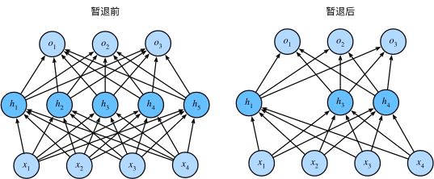

1. One time setup
	Activation functions, data preprocessing, weight initialization, regularization
2. Training dynamics
	Learning rate schedules; Large-batch training; hyperparameter optimization 
3. After training 
	Model ensembles, transfer learning 

## Activation Functions 
我们知道，在人工神经元中总是要有一个激活函数（非线性），这对于提高神经网络的处理能力是很有必要的，否则神经网络的所有操作都会被折叠成一个线性层上，实际上，人工神经元的拟合能力，主要来自于这个激活函数


我们回顾一下常见的激活函数：


我们来研究 Sigmoid 函数

对于一个定义域在$\mathbb{R}$中的输入， _sigmoid函数_ 将输入变换为区间(0, 1)上的输出。 因此，sigmoid通常称为 _挤压函数_（squashing function）： 它将范围$(-\inf, \inf)$中的任意输入压缩到区间$(0, 1)$中的某个值：

$$
\text{sigmoid}(x) = \frac{1}{1+\exp(-x)}
$$

在最早的神经网络中，科学家们感兴趣的是对“激发”或“不激发”的生物神经元进行建模。 因此，这一领域的先驱可以一直追溯到人工神经元的发明者麦卡洛克和皮茨，他们专注于阈值单元。 阈值单元在其输入低于某个阈值时取值0，当输入超过阈值时取值1。

当人们逐渐关注到到基于梯度的学习时， sigmoid函数是一个自然的选择，因为它是一个平滑的、可微的阈值单元近似。 当我们想要将输出视作二元分类问题的概率时， sigmoid仍然被广泛用作输出单元上的激活函数 （sigmoid可以视为softmax的特例）。 然而，sigmoid在隐藏层中已经较少使用， 它在大部分时候被更简单、更容易训练的ReLU所取代。

但是， sigmoid 函数也有着一些问题
- 饱和区域具有“零梯度”，这些区域可能导致神经元的死亡或者杀死梯度，导致难以训练网络，如果一个上流梯度流经这里，会变得非常小，可能导致下流的层无法学习
- 其输出不是以零为中心的，是始终为正值的
- 因为涉及指数运算，所以运算量较大，硬件资源给定的情况下，学习效率低，速度慢

ReLU

- Does not saturate (in +region)
- Very computationally efficient 
- Converges much faster than sigmoid/tanh in pratice 
- Not zero-centered output 

但是实际上，ReLU在神经网络中表现良好，模型收敛并没有问题，可能说明非零中心化问题相对其他两个问题来说并不重要

对于 ReLU 最大的问题是当 $x<0$ 时，这个时候对应的局部梯度是0，从而使得下游梯度也为0 。虽然在 sigmoid 激活函数中，当 $x<0$ 时所对应的梯度特别小，但这些仍能被学习。但对应 ReLU， 学习是一定无法继续的，也就是 dead ReLU，他不会更新。也就是神经元失活。

我们希望ReLU能够释放一些梯度用于学习。

Sometimes initialize ReLU neurons with slightly positive biases.


Leaky ReLU

- Does not saturate 
- Computationally efficient 
- Converges much faster than sigmoid/tanh in pratice
- will not "die"


ELU

- All benefits of ReLU 
- Closer to zero mean outputs 
- Negative saturation regime compared with Leaky ReLU add some robustness to noise 


- Scaled version of ELU that works better for deep networks 
- "Self-Normalizing" property; can train deep SELU networks without BatchNorm 

我们给出在CIFAR10 上不同激活函数的训练结果


可以看出，虽然不同非线性激活函数确实会影响训练效果，但这个差距是很小的（几乎在1%），但是代价确实不同。

Summary：

- Don’t think too hard. Just use ReLU 
- Try out Leaky ReLU / ELU / SELU / GELU if you need to squeeze that last 0.1% 
- Don’t use sigmoid or tanh

## Data Preprocessing 

关于数据预处理我们有3个常用符号，数据矩阵 $X$，假设其尺寸是 $[N \times D]$（$N$是数据样本数量，$D$ 是数据的维度）

在使用PyTorch框架处理图片类型的数据时，数据通常以四维张量（4D tensor）的形式存储。这个四维张量的每个维度具有特定的意义：

1. **批次大小（Batch Size）**：这是第一个维度，表示在一个批次中有多少张图片。在训练深度学习模型时，通常不会一次处理单张图片，而是将多张图片打包成一个批次进行处理。这样做可以提高内存利用率，加速训练过程，并有助于模型的泛化。
2. **通道数（Channels）**：这是第二个维度，表示每张图片的通道数。对于普通的彩色图片，这通常是3（红色、绿色、蓝色），对于灰度图像，这个数值是1。在某些特殊应用中，比如卫星图像处理，可能会有更多的通道。
3. **高度（Height）**：这是第三个维度，表示图片的高度，即像素的垂直数量。
4. **宽度（Width）**：这是第四个维度，表示图片的宽度，即像素的水平数量。

总结起来，如果我们有一个批次的图片数据，其张量的形状可以表示为 `[Batch Size, Channels, Height, Width]`。例如，如果你有一个包含32张彩色图片的批次，每张图片的大小为64x64像素，那么这个张量的形状将是 `[32, 3, 64, 64]`。

在PyTorch中，这种数据布局有时被称为“NCHW”格式（N代表批次大小，C代表通道数，H代表高度，W代表宽度）。这种格式是深度学习中处理图像数据的标准方式之一。

我们对数据用两种方法做预处理。

**均值减法（Mean subtraction）** 是预处理最常用的形式。它对数据中每个独立特征减去平均值，从几何上可以理解为在每个维度上都将数据云的中心都迁移到原点。

**归一化（Normalization）** 是指将数据的所有维度都归一化，使其数值范围都近似相等。有两种常用方法可以实现归一化。第一种是先对数据做零中心化（zero-centered）处理，然后每个维度都除以其标准差，实现代码为 `X /= np.std(X, axis=0)` 。第二种方法是对每个维度都做归一化，使得每个维度的最大和最小值是1和-1。这个预处理操作只有在确信不同的输入特征有不同的数值范围（或计量单位）时才有意义，但要注意预处理操作的重要性几乎等同于学习算法本身。在图像处理中，由于像素的数值范围几乎是一致的（都在0-255之间），所以进行这个额外的预处理步骤并不是很必要。


实际上，归一化的用处很大，对于某些未归一化的数据，可能优化上会非常困难（如下图左），可能一点小优化都会导致非常大的误差，或者说一点小改动都会造成系统性能的巨大变化，但是在归一化之后，就会变得容易优化


我们简单描述一下预处理的流程：


左图：原始的2维输入数据。中图：在每个维度都减去平均值得到零中心化数据，现在数据是以原点为中心的。右边：每个维度都除以其标准差来调整其数值范围，红色的线指出了数据各维度的数值范围，在中间的零中心化数据的数值范围不同，但在右边归一化数据中数值范围相同。

---
**PCA和白化（Whitening）** 是另一种预处理形式。在这种处理中，先对数据进行零中心化处理，然后计算协方差矩阵，这样可以用来旋转数据点云，使得数据不相关，它展示了数据中的相关性结构。


```python
    # 假设输入数据矩阵X的尺寸为[N x D]
    X -= np.mean(X, axis = 0) # 对数据进行零中心化(重要)
    cov = np.dot(X.T, X) / X.shape[0] # 得到数据的协方差矩阵
```

数据协方差矩阵的第(i, j)个元素是数据第i个和第j个维度的协方差。具体来说，该矩阵的对角线上的元素是方差。还有，协方差矩阵是对称和[半正定](hhttps://en.wikipedia.org/wiki/Positive-definite_matrix#Negative-definite.2C_semidefinite_and_indefinite_matrices)的。我们可以对数据协方差矩阵进行SVD（奇异值分解）运算。

```python
    U,S,V = np.linalg.svd(cov)
```

U的列是特征向量，S是装有奇异值的1维数组（因为cov是对称且半正定的，所以S中元素是特征值的平方）。为了去除数据相关性，将已经零中心化处理过的原始数据投影到特征基准上：

```python
    Xrot = np.dot(X,U) # 对数据去相关性
```

注意U的列是标准正交向量的集合（范式为1，列之间标准正交），所以可以把它们看做标准正交基向量。因此，投影对应x中的数据的一个旋转，旋转产生的结果就是新的特征向量。如果计算**Xrot**的协方差矩阵，将会看到它是对角对称的。`np.linalg.svd` 的一个良好性质是在它的返回值 **U** 中，特征向量是按照特征值的大小排列的。我们可以利用这个性质来对数据降维，只要使用前面的小部分特征向量，丢弃掉那些包含的数据没有**方差**的维度。 这个操作也被称为主成分分析（ [Principal Component Analysis](https://en.wikipedia.org/wiki/Principal_component_analysis) 简称PCA）降维：

```python
    Xrot_reduced = np.dot(X, U[:,:100]) # Xrot_reduced 变成 [N x 100]
```

经过上面的操作，将原始的数据集的大小由[N x D]降到了[N x 100]，留下了数据中包含最大**方差**的100个维度。通常使用PCA降维过的数据训练线性分类器和神经网络会达到非常好的性能效果，同时还能节省时间和存储器空间。

最后一个在实践中会看见的变换是**白化（whitening）**。白化操作的输入是特征基准上的数据，然后对每个维度除以其特征值来对数值范围进行归一化。该变换的几何解释是：如果数据服从多变量的高斯分布，那么经过白化后，数据的分布将会是一个均值为零，且协方差相等的矩阵。该操作的代码如下：

```python
    # 对数据进行白化操作:
    # 除以特征值 
    Xwhite = Xrot / np.sqrt(S + 1e-5)
```

_警告：夸大的噪声_。注意分母中添加了1e-5（或一个更小的常量）来防止分母为0。该变换的一个缺陷是在变换的过程中可能会夸大数据中的噪声，这是因为它将所有维度都拉伸到相同的数值范围，这些维度中也包含了那些只有极少差异性(方差小)而大多是噪声的维度。在实际操作中，这个问题可以用更强的平滑来解决（例如：采用比1e-5更大的值）。

**实践操作。** 在这个笔记中提到PCA和白化主要是为了介绍的完整性，实际上在卷积神经网络中并不会采用这些变换。然而对数据进行零中心化操作还是非常重要的，对每个像素进行归一化也很常见。

**常见错误。** 进行预处理很重要的一点是：任何预处理策略（比如数据均值）都只能在训练集数据上进行计算，算法训练完毕后再应用到验证集或者测试集上。例如，如果先计算整个数据集图像的平均值然后每张图片都减去平均值，最后将整个数据集分成训练/验证/测试集，那么这个做法是错误的。**应该怎么做呢？应该先分成训练/验证/测试集，只是从训练集中求图片平均值，然后各个集（训练/验证/测试集）中的图像再减去这个平均值。**


## Weight Initialization 

我们已经看到如何构建一个神经网络的结构并对数据进行预处理，但是在开始训练网络之前，还需要初始化网络的参数。

先考虑 $W=0,b=0$ 会发生什么，显然，所有的输出结果都是0，所有的梯度也是相同的
No “symmetry breaking”

**错误：全零初始化。** 让我们从应该避免的错误开始。在训练完毕后，虽然不知道网络中每个权重的最终值应该是多少，但如果数据经过了恰当的归一化的话，就可以假设所有权重数值中大约一半为正数，一半为负数。这样，一个听起来蛮合理的想法就是把这些权重的初始值都设为0吧，因为在期望上来说0是最合理的猜测。这个做法错误的！因为如果网络中的每个神经元都计算出同样的输出，然后它们就会在反向传播中计算出同样的梯度，从而进行同样的参数更新。甚至如果所有的参数包括偏差项都是零初始化，那么输出和梯度都会为零，网络就无法进行学习。那么换句话说，如果权重被初始化为同样的值，神经元之间就失去了不对称性的源头。

**小随机数初始化。** 因此，权重初始值要非常接近0又不能等于0。解决方法就是将权重初始化为很小的数值，以此来_打破对称性_。其思路是：如果神经元刚开始的时候是随机且不相等的，那么它们将计算出不同的更新，并将自身变成整个网络的不同部分。小随机数权重初始化的实现方法是：`W = 0.01 * np.random.randn(D,H)`。其中`randn`函数是基于零均值和标准差的一个高斯分布来生成随机数的。根据这个式子，每个神经元的权重向量都被初始化为一个随机向量，而这些随机向量又服从一个多变量高斯分布，这样在输入空间中，所有的神经元的指向是随机的。也可以使用均匀分布生成的随机数，但是从实践结果来看，对于算法的结果影响极小。

警告：并不是小数值一定会得到好的结果。例如，一个神经网络的层中的权重值很小，那么在反向传播的时候就会计算出非常小的梯度（因为梯度与权重值是成比例的）。这就会很大程度上减小反向传播中的"梯度信号"，在浅层网络中有不错的效果，但是在深度网络中，就会出现问题。

---
我们需要为权重找到一个合适的不大不小的初始值，这也就是Xavier初始化的意义。

我们使用 $1/\sqrt{n}$ 来校准方差。上面做法存在一个问题，随着输入数据量的增长，随机初始化的神经元的输出数据的分布中的方差也在增大。我们可以除以输入数据量的平方根来调整其数值范围，这样神经元输出的方差就归一化到1了。也就是说，建议将神经元的权重向量初始化为：**w = np.random.randn(n) / sqrt(n)。其中n**是输入数据的数量。这样就保证了网络中所有神经元起始时有近似同样的输出分布（输出的方差等于输入的方差）。实践经验证明，这样做可以提高收敛的速度。

推导过程：

假定权重和输入之间的内积：$s = \sum_{i}^{n}w_ix_i$，检查s的方差：

$$
\begin{align}
Var(s) &= Var(\sum_{i}^{n}w_ix_i)\\
&=\sum^{n}_{i}Var(w_ix_i)\\
&=\sum^{n}_{i}[E(w_i)]^2Var(x_i)+E[(x_i)]^2Var(w_i)+Var(x_i)Var(w_i)\\
&=\sum^{n}_{i}Var(x_i)Var(w_i)\\
&= (nVar(w))Var(x)
\end{align}
$$

在前两步，使用了[方差的性质](https://en.wikipedia.org/wiki/Variance)。在第三步，因为假设输入和权重的平均值都是0，所以。注意这并不是一般化情况，比如在ReLU单元中均值就为正。在最后一步，我们假设所有的都服从同样的分布。从这个推导过程我们可以看见，如果想要有和输入一样的方差，那么在初始化的时候必须保证每个权重的方差是。又因为对于一个随机变量和标量有，这就说明可以基于一个标准高斯分布，然后乘以，使其方差为，于是得出：`w = np.random.randn(n) / sqrt(n)`。

比如说我们对全连接层进行Xavier初始化，那么Din就是输入神经元的数量，等于输入通道数乘以卷积核大小平方

但是，对于ReLU函数，这种初始化容易出现问题，ReLU函数会将传递信号的方差减小，也就是说随着信号传递，梯度会逐渐接近零，这不利于神经网络的训练，如图所示，随着信号的传递，方差越来越小

---


假设我们有一个残差网络，并且以某种方式构建了初始化权重，同时使用残差连接来包裹这些层，那么输出和输入的方差已经匹配了

如果我们使用MSRA方法进行初始化，那么输出的方差就会更大，这样多层传递下去，就会导致最后一层的方差非常大，容易造成梯度爆炸，不利于学习

## Regularization 

对于损失函数增加惩罚项有助于避免出现过拟合现象

Common use:

- L2 regularization  $R(W)= \sum_k\sum_l W^2_{k,l}$
- L1 regularization $R(W) = \sum_k\sum_l|W_{k,l}|$
- [ELastic net](https://hastie.su.domains/Papers/B67.2%20(2005)%20301-320%20Zou%20&%20Hastie.pdf)( L1+L2 ) $R(W) = \sum_k\sum_l \beta W^2_{k,l}+|W_{k,l}|$

L2正则化可以直观理解为它对于大数值的权重向量进行严厉惩罚，倾向于更加分散的权重向量。在线性分类章节中讨论过，由于输入和权重之间的乘法操作，这样就有了一个优良的特性：使网络更倾向于使用所有输入特征，而不是严重依赖输入特征中某些小部分特征。最后需要注意在梯度下降和参数更新的时候，使用L2正则化意味着所有的权重都以**w += -lambda * W**向着0线性下降。

L1正则化有一个有趣的性质，它会让权重向量在最优化的过程中变得稀疏（即非常接近0）。也就是说，使用L1正则化的神经元最后使用的是它们最重要的输入数据的稀疏子集，同时对于噪音输入则几乎是不变的了。相较L1正则化，L2正则化中的权重向量大多是分散的小数字。在实践中，如果不是特别关注某些明确的特征选择，一般说来L2正则化都会比L1正则化效果更好 

---
Dropout(随机失活/暂退法)：In each forward pass, randomly set some neurons to zero Probability of droping is a hyperparameter; 0.5 is common 

> 注：[笔记参考](https://github.com/Michael-Jetson/ML_DL_CV_with_pytorch/blob/main/ComputerVision/Lecture10_Training_Neural_Networks_I.md) 将这个方法称之为随机失活，而李沐的《动手学深度学习》则把它称为 [暂退法](https://zh-v2.d2l.ai/chapter_multilayer-perceptrons/dropout.html) 。我认为随机失活这个称号更好，它有助于我们理解这个方法在神经网络中的作用。但是下面大部分摘自《动手学深度学习》这本书，为尊重原书（~~懒得改~~）仍称作暂退法。



 
我们希望我们所训练得到的预测模型具有良好的平滑性，即即函数不应该对其输入的微小变化敏感。当我们添加一些随机噪声时应该是基本无影响的1995年，克里斯托弗·毕晓普证明了 具有输入噪声的训练等价于Tikhonov正则化 ([Bishop, 1995](https://zh-v2.d2l.ai/chapter_references/zreferences.html#id9 "Bishop, C. M. (1995). Training with noise is equivalent to tikhonov regularization. Neural computation, 7(1), 108–116."))。 这项工作用数学证实了“要求函数光滑”和“要求函数对输入的随机噪声具有适应性”之间的联系。斯里瓦斯塔瓦等人 ([Srivastava _et al._, 2014](https://zh-v2.d2l.ai/chapter_references/zreferences.html#id155 "Srivastava, N., Hinton, G., Krizhevsky, A., Sutskever, I., & Salakhutdinov, R. (2014). Dropout: a simple way to prevent neural networks from overfitting. The Journal of Machine Learning Research, 15(1), 1929–1958.")) 就如何将毕晓普的想法应用于网络的内部层提出了一个想法： 在训练过程中，他们建议在计算后续层之前向网络的每一层注入噪声。 因为当训练一个有多层的深层网络时，注入噪声只会在输入-输出映射上增强平滑性。这种想法被称为暂退法

暂退法在前向传播过程中，计算每一内部层的同时注入噪声，这已经成为训练神经网络的常用技术。 这种方法之所以被称为暂退法，因为我们从表面上看是在训练过程中(暂时)丢弃（drop out）一些神经元。 在整个训练过程的每一次迭代中，标准暂退法包括在计算下一层之前将当前层中的一些节点置零。

简单的例子：该函数以`dropout`的概率丢弃张量输入`X`中的元素， 如上所述重新缩放剩余部分：将剩余部分除以`1.0-dropout`。
``` python 
import torch
from torch import nn
from d2l import torch as d2l

def dropout_layer(X, dropout):
    assert 0 <= dropout <= 1
    # 在本情况中，所有元素都被丢弃
    if dropout == 1:
        return torch.zeros_like(X)
    # 在本情况中，所有元素都被保留
    if dropout == 0:
        return X
    mask = (torch.rand(X.shape) > dropout).float()
    return mask * X / (1.0 - dropout)
```


Another interpretation:Dropout is training a large ensemble of models 

假定我们有一个非常大的神经网络，依据暂退法我们会使其中一定数量的神经元失活，也就是获得了一个较小的神经网络，因为这个过程是随机的，所以我们就获得了一批小型的神经网络，这批神经网络正是原神经网络的子神经网路集

那么关键的挑战就是如何注入这种噪声。 一种想法是以一种无偏向（unbiased）的方式注入噪声。 这样在固定住其他层时，每一层的期望值等于没有噪音时的值。

在毕晓普的工作中，他将高斯噪声添加到线性模型的输入中。 在每次训练迭代中，他将从均值为零的分布$\varepsilon∼N(0,σ^2)$ 采样噪声添加到输入x， 从而产生扰动点$x'=x+\varepsilon$， 预期是$E[x']=x$。

在标准暂退法正则化中，通过按保留（未丢弃）的节点的分数进行规范化来消除每一层的偏差。 换言之，每个中间活性值h以暂退概率p由随机变量h′替换，如下所示：

$$
h' = \left\{\begin{align}
&0& 概率为p\\
&\frac{h}{1-p} &其他情况
\end{align}\right.
$$

根据此模型的设计，其期望值保持不变，即$E[h']=h$。

- 暂退法在前向传播过程中，计算每一内部层的同时丢弃一些神经元。
- 暂退法可以避免过拟合，它通常与控制权重向量的维数和大小结合使用的。
- 暂退法将活性值h替换为具有期望值h的随机变量。
- 暂退法仅在训练期间使用。

---


在引入其他正则化方法之前，我们来介绍数据增强(Data Augmentation)不过这种方式很多人不认为是正则化.

在数据送入神经网络之前，对数据样本执行转换，并以随机方式执行和以某种方式操纵或修改输入图像，比如说翻转、随机裁剪等.

以猫图像为例，我们作为人类知道如果我们水平翻转或者裁剪的图像仍然是一只猫，我们期望随机裁剪的猫图像应该仍然是猫图像，并且仍然应该被神经网络识别为猫，这样可以增强模型的泛化性能

Data Augmentation: Random Crops and Scales 

- Training: sample random crops/ scales 
	- ResNet:
		1. Pick random L in range [256,480]
		2. Resize training image, short side = L
		3. Sample random 224 x 224 patch 
- Testing: average a fixed set of crops 
	- ResNet:
		1. Resize image at 5 scales:{224,256,384,480,640}
		2. For each size, use 10 224 x 224 crops: 4 corners + center, + flips 

Data Augmentation: Color Jitter 

1. Apply PCA to all [R,G,B] pixels in training set 
2. Sample a "color offset" along principal 
3. Add offset to all pixels of a training image 

A common pattern

- **Training**: Add some kind of randomness $y= f_W(x,y)$
- **Testing**: Average out randomness (sometimes approximate) $y = f(x)=E_{z}[f(x,z)] = \int p(z)f(x,z)dz$


Batch Normalization 

- Training: Normalize using stats from random minibatches 
- Testing: Use fixed stats to normalize 


Regularization: DropConnect 

- Training : Drop random connections between neurons 
- Testing : Use all the connections 

DropConnect 与 Dropout 方法类似，但这方法是将神经元之间的连接失活，而不是使神经元失活


Regularization: Fractional Pooling 

- Training : Use randomized pooling regions 
- Testing : Average predictions over different samples 

这里是将神经网络每个池化层区域的感受野大小进行随机化


Regularization: Stochastic Depth 

- Training : Skip some residual blocks in ResNet 
- Testing : Use the whole network 


Regularization: Mixup 

- Training : Train on random blends of images 
- Testing: Use original images 

这个正则化非常的神奇，假定我们有一个猫的图像、一个狗的图像，然后按40% 和 60% 的比例混合这两张图片，我们希望神经网络能识别出比例，但是，神经网络识别的比例接近1或接近0 

Summary

- Consider dropout for large fully connected layers 
- Batch normalization and data augmentation almost always a good idea 
- Try cutout and mixup especially for small classification datasets


