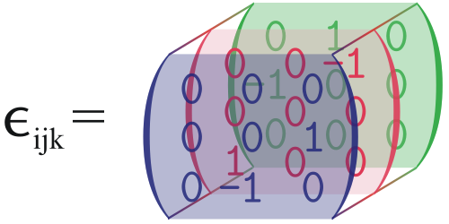

!!! Info " 说明"

    连续介质力学 I ，主要的内容为张量分析+应力应变关系+流体力学，百分之八十的东西都在之前的课上的学过，所以没怎么记（我懒）。其实主要原因是这门课跟我另一门课冲突了，我选择后者因此一节课都没有听过，所以只是记了一些复习的东西：)

    哦对反正我的方向也用不到连续介质力学（材料力学，最多弹性力学），所以学的不咋地（x）

方程中每个项出现的自由指标必须相同

- 无意义的等式

$$
a_{i} = b_{j}
$$

- 有意义的等式

$$
a_{i}+k_{i} = c_{i} \,\mathrm{or} \,a_{i}+b_{i}c_{j}d_{j} = f_{i}
$$

!!! example

    如果一个等式里面出现两个自由指标，如

    $$
    T_{ij} = A_{im}A_{j,}
    $$

    则这是一个九个等式的缩写，其中右端为三项求和

关于 Kronecker 积有趣的文章：[What is: Kronecker Delta - A Comprehensive Guide](https://statisticseasily.com/glossario/what-is-kronecker-delta-comprehensive-guide/)

三维形式的 [Levi-Civita](https://en.wikipedia.org/wiki/Levi-Civita_symbol) 符号：

考虑一个标准右手坐标系：$\mathbf{e}_{1} = \mathbf{i},\mathbf{e}_{2} =\mathbf{j},\mathbf{e}_{3}=\mathbf{k}$ ，则有：

$$
\mathbf{e}_{i}\times \mathbf{e}_{j} = \sum_{k=1}^{3}\epsilon_{ijk}\mathbf{e}_{k} 
$$

根据这个关系式，考虑两个向量的叉乘，则可以写成：

$$
\begin{align}
\mathbf{u}\times \mathbf{v} &= (u_{i}\mathbf{e}_{i})\times (v_{j} \mathbf{e}_{j}) \\
& =u_{i}v_{j} \epsilon_{ijk}\mathbf{e}_{k }
\end{align}
$$

## Tensor 

考虑一个三维笛卡尔坐标系中的变换 $T$

$$
[T] = \begin{bmatrix}
T_{11} & T_{12} & T_{13} \\
T_{21} & T_{22} & T_{23} \\
T_{31} & T_{32} & T_{33}
\end{bmatrix}
$$

考虑一个单位向量基：$\mathbf{e}_{1},\mathbf{e}_{2},\mathbf{e}_{3}$ ，则变换后结果可以记为：

$$
\mathbf{Te}_{i} = T_{ji}\mathbf{e}_{j}
$$

称我们所考虑的张量矩阵相对于我们所选的基向量 $\left\{ \mathbf{e}_{i} \right\}$

!!! note
    大部分张量的性质可以参考矩阵的性质 

### Orthogonal tensor 

假定两个笛卡尔坐标系 $\left\{ \mathbf{e}_{i} \right\}$ 和 $\left\{ \mathbf{e}_{i}' \right\}$ 之间满足正交张量变换：

$$
\mathbf{e}_{i}' = \mathbf{Q} \mathbf{e}_{i} =Q_{mi}\mathbf{e}_{m}
$$

其中正交张量中的分量满足

$$
Q_{im} Q_{jm}=Q_{mi} Q_{mj} =\delta_{ij}
$$

$Q_{ij}$ 是坐标基向量之间的夹角：

$$
Q_{ij}  = \cos (\mathbf{e}_{i},\mathbf{e}_{j}')
$$

给定在 $\left\{ \mathbf{e}_{i} \right\}$ 下的向量 $\mathbf{a}$ ，则在 $\left\{ \mathbf{e}_{i}' \right\}$ 下对应的对应表示为：

$$
[\mathbf{a}]' =[\mathbf{Q}]^{T}[\mathbf{a}]
$$

坐标变换：

$$
[T]' = [Q]^{T}[T][Q]  \,\mathrm{ or}\, T_{ij}'=Q_{mi}Q_{nj}T_{mn}
$$

其中 $Q$ 是坐标变换矩阵

利用变换法则定义张量：

| components                                   | tensor                      |
| -------------------------------------------- | --------------------------- |
| $\alpha'=\alpha$                             | zeroth-order tensor(scalar) |
| $a_{i}'=Q_{mi}a_{m}$                         | first-order tensor(vector)  |
| $T_{ij}'=Q_{mi}Q_{nj}T_{mn}$                 | second-orfer tensor(tensor) |
| $S_{ijk}'=Q_{mi}Q_{nj}Q_{rk}S_{mnr}$         | third-order tensor          |
| $C_{ijkl}'=Q_{mi}Q_{nj}Q_{rk}Q_{sl}C_{mnrs}$ | fourth-order tensor         |

### Dual vector 
张量 $T$ 可以表示为一个对称张量和一个反对称张量的和：

$$
T = T^{S} +T^{A}
$$

- 对称张量：

$$
T^{S} = \frac{T+T^{T}}{2} 
$$

- 反对称张量：

$$
T^{A} = \frac{T-T^{T}}{2}
$$

反对称张量只有三个独立的分量。（对角线元素为零）

!!! note "dual vector of the antisymmetric tensor"

    对于一个反对称张量 $\mathbf{T}$ ，存在对应的向量 $\mathbf{t^{A}}$ 满足对于任意向量 $\mathbf{a}$ ，其在张量下的变换 $\mathbf{Ta}$ 可以如下叉乘形式：

    $$
    \mathbf{Ta} = \mathbf{t^{A}}\times \mathbf{a}
    $$

    称 $\mathbf{t^{A}}$ 是反对称张量的对偶向量(dual vector) ，也称为轴向量(axial vector)

可以求得：

$$
\mathbf{t^{A}} = T_{32}\mathbf{e}_{1} +T_{13}\mathbf{e}_{2} +T_{21}\mathbf{e}_{3}
$$

简写成：

$$
2\mathbf{t^{A}} = -\varepsilon_{ijk}T_{jk}\mathbf{e}_{i} 
$$

[张量分析傻瓜入门（翻译）：七、对偶向量 - 知乎](https://zhuanlan.zhihu.com/p/120309589)

### Invariants of a tensor 

第一不变量：

$$
I_{1} = T_{ii} =tr \mathbf{T}
$$

第二不变量：

$$
I_{2}= \begin{vmatrix}
T_{11} & T_{12} \\
T_{21}  & T_{22}
\end{vmatrix} + \begin{vmatrix}
T_{22} & T_{23} \\
T_{32}  & T_{33}
\end{vmatrix}+ \begin{vmatrix}
T_{11} & T_{13} \\
T_{31}  & T_{33}
\end{vmatrix} = \frac{1}{2}\left( T_{ii}T_{jj}-T_{ij}T_{ji} \right)  
$$

第三不变量：

$$
I_{3} = \det [T]
$$

## Description of motions of a Continuum

参考时间 $t_{0}$ ，在 $(X_{1},X_{2},X_{3})$ 的物质轨迹可以描述为：

$$
\mathbf{x} = \mathbf{x}(\mathbf{X},t)
$$

### 两种运动描述

Lagrangian 描述（物质描述）着眼于物质

$$
\mathbf{\Theta} = \hat{\mathbf{\Theta}}(X_{1},X_{2},X_{3},t)
$$

Eulerian 描述（空间描述）着眼于流场空间点的描述

$$
\mathbf{\Theta} =  \tilde{\mathbf{\Theta}} (x_{1},x_{2},x_{3},t)
$$

### 物质导数

物质描述：

$$
\frac{{\rm{D}} {\Theta} }{{\rm {D}} t }  = \left( \frac{\partial \hat{{\Theta}} }{\partial t  }  \right) 
$$

空间描述：

$$
\frac{{\rm{D}}{\Theta} }{{\rm {D}} t }  = \left( \frac{\partial \hat{{\Theta}} }{\partial t  }  \right)  + \mathbf{v} \cdot \nabla \tilde{{\Theta}}
$$

$\Theta$ 是任意函数。如速度场 $\mathbf{v}$ 可以轨迹描述 $\mathbf{x}(\mathbf{X},t)$ 求导得到。

## Infinitesimal Deformation 
考虑一个连续体从初始状态到变形后状态的运动。假定在参考时刻，质点 $P$ 在 $\mathbf{X}$ ，时间 $t$ 质点运动到了新位置 $\mathbf{x}$ ，位移向量定义为：

$$
\mathbf{u}(\mathbf{X},t) = \mathbf{x} - \mathbf{X}
$$

即：

$$
\mathbf{x} = \mathbf{X} + \mathbf{u}
$$

假定 $P$ 有一个邻近质点 $Q$ 在 $\mathbf{X}+d \mathbf{X}$ ，变形后 $Q$ 运动到 $\mathbf{x}+ d\mathbf{x}$ ，则有：

$$
\mathbf{x}+ d\mathbf{x} =\mathbf{X}+d \mathbf{X}+ \mathbf{u}(\mathbf{X}+d \mathbf{X},t)
$$

可得相对变形：

$$
d\mathbf{x} =d \mathbf{X}+ \mathbf{u}(\mathbf{X}+d \mathbf{X},t) -  \mathbf{u}(\mathbf{X},t)
$$

当变形量 $d\mathbf{X}$ 很小时，有泰勒展开可得：

$$
d\mathbf{x} =(\mathbf{I}+\nabla \mathbf{u})d \mathbf{X}
$$

称 $\mathbf{F} = \mathbf{I}+\nabla \mathbf{u}$ 为变形梯度张量。

记 $ds$ 为 $d \mathbf{x}$ 的长度，$d S$ 为 $d\mathbf{X}$ 的长度，有：

$$
ds^{2} = d \mathbf{X} \cdot \mathbf{C}d \mathbf{X}
$$

其中 
 
$$
\mathbf{C} = \mathbf{F}^{T}\mathbf{F}
$$

$\mathbf{C}$ 成为 right Cauchy-Green deformation tensor 。 展开有

$$
\mathbf{C}= \mathbf{I} + \nabla \mathbf{u}+(\nabla \mathbf{u})^{T} + (\nabla \mathbf{u})^{T}(\nabla \mathbf{u}) \triangleq \mathbf{I} + 2\mathbf{E}^{*}
$$

对于小变形，可以忽略 $(\mathbf{u})^{T}(\nabla \mathbf{u})$  ，则取 $\nabla \mathbf{u}$ 对称部分 $E = \frac{1}{2}[\nabla \mathbf{u}+(\nabla \mathbf{u})^{T}]$ 为小变形下的应变张量。带回有：

$$
d \mathbf{x}^{(1)}\cdot d\mathbf{x}^{(2)} = d \mathbf{X}^{(1)} \cdot d \mathbf{X}^{(2)} +2 d \mathbf{X}^{(1)} \cdot \mathbf{E}d \mathbf{X}^{(2)}
$$

小变形情况有：

$$
\frac{{\rm{d}}  s -\mathrm{d}S }{{\rm {d}} S } = \mathbf{n}\cdot \mathbf{En} = E_{nn} 
$$

$\frac{{\rm{d}}  s -\mathrm{d}S }{{\rm {d}} S }$ 为单位伸长，即正应变，右边表示应变张量在 $\mathbf{n}$ 方向上的投影。即沿原始方向 $\mathbf{n}$ 的单位伸长等于 $\mathbf{n}\cdot \mathbf{En}$ 

在变形前，取两个相互垂直的微小线元：

$$
d\mathbf{X}^{(1)} = dS_{1} \mathbf{m} \quad d \mathbf{X}^{(2)} = dS_{2} \mathbf{n}
$$

变形后取乘积：

$$
d \mathbf{x}^{(1)}\cdot d\mathbf{x}^{(2)} = d \mathbf{X}^{(1)} \cdot d \mathbf{X}^{(2)} +2 d \mathbf{X}^{(1)} \cdot \mathbf{E}d \mathbf{X}^{(2)}
$$

利用正交性可以得到：

$$
ds_{1}ds_{2} \cos(\theta) = 2dS_{1 }dS_{2}(\mathbf{m}\cdot \mathbf{En})
$$

定义剪应变 $\gamma$ 为角度减少量，则有 $\theta = \frac{\pi}{2}-\gamma$ ：

$$
ds_{1} ds_{2} \sin\gamma = 2dS_{1 }dS_{2}(\mathbf{m}\cdot \mathbf{En})
$$

### Principal strain 
对于一个应力张量 $E$ ，其特征值 $\lambda$ 也称为主应力，包含了从该质点出发的所有方向中最与最小的正应力。

### Time rate of change of a material element 

$$
\frac{{\rm{D}}   }{{\rm {D}}  t } d \mathbf{x} = (\nabla \mathbf{v})d \mathbf{x} 
$$

可以速度梯度分成对称张量和反对称张量：

$$
(\nabla \mathbf{v}) = \mathbf{D } + \mathbf{W}
$$

其中：

$$
\mathbf{D} = \frac{1}{2}\left[ (\nabla \mathbf{v})+(\nabla \mathbf{v})^{T} \right]  \quad \mathbf{W} = \frac{1}{2}\left[ (\nabla \mathbf{v})-(\nabla \mathbf{v})^{T} \right] 
$$

对于 

$$
d \mathbf{x}\cdot d\mathbf{x} = (ds)^{2}
$$

取物质导数：

$$
2 d \mathbf{x} \cdot \frac{D}{Dt} d \mathbf{x} =2 ds \frac{D(ds)}{Dt}
$$

看开左式有：

$$
d \mathbf{x} \cdot \frac{D}{Dt} d \mathbf{x} = d \mathbf{x} \cdot \mathbf{D}d \mathbf{x}+d \mathbf{x} \cdot \mathbf{W}d \mathbf{x}
$$

利用反对称性质有： $d \mathbf{x} \cdot \mathbf{W}d \mathbf{x} =0$ 则

$$
ds \frac{D(ds)}{Dt} = d \mathbf{x} \cdot \mathbf{D}d \mathbf{x}
$$

取 $d \mathbf{x}= ds \mathbf{n}$  则有：

$$
\frac{1}{ds} \frac{D(ds)}{Dt} = \mathbf{n}\cdot \mathbf{D}\mathbf{n} = D_{nn}
$$

---
对于 $\mathbf{W}$ ，有：

$$
\mathbf{W} \mathbf{a} = \omega \times \mathbf{a}
$$

其中 

$$
\omega = - (W_{23}\mathbf{e}_{1}+W_{31}\mathbf{e}_{2}+W_{12}\mathbf{e}_{3})
$$

因此

$$
\frac{{\rm{D}}   }{{\rm {D}}  t } d \mathbf{x} =\mathbf{D}d \mathbf{x} +\omega \times d \mathbf{x}
$$

## Polar decomposition 
对于任何具有非零行列式的变形梯度张量 $\mathbf{F}$ ，总是将其分解称一个正交张量和对称张量的乘积，即：

$$
\mathbf{F} = \mathbf{RU}
$$

或者 

$$
\mathbf{F} = \mathbf{VR}
$$

其中 $\mathbf{U}$ 和 $\mathbf{V}$ 为正定对称张量，分别成为右拉伸张量和左拉伸张量。对于 

$$
d \mathbf{x} = \mathbf{F} d \mathbf{X} = \mathbf{RU}d \mathbf{x}
$$

其中 $\mathbf{U}d\mathbf{x}$ 描述一个纯拉伸变形（不发生旋转），而 $\mathbf{R}$ 的作用就相当于是旋转一个刚体。同样的对于第二个分解，我们可以视作是对刚体做了一个旋转，然后再对其做一个纯拉伸。可以很容易得到如下式子：

$$
\mathbf{U} = \mathbf{R}^{T} \mathbf{VR}
$$

从几何上讲，我们讲运动视为先旋转后纯拉伸或者先纯拉伸后旋转，这两者没有区别，但是导致了两个不同的拉伸张量，其分量具有不同的几何意义。根据这两个拉伸张量，定义两个常用的变形张量：

- 右柯西-格林张量：

$$
\mathbf{C} \triangleq \mathbf{U}^{2}
$$

- 左柯西-格林张量

$$
\mathbf{B} \triangleq V^{2}
$$

对于给定的 $\mathbf{F}$ ，存在对应唯一的 $\mathbf{U}$ 

$$
\mathbf{U}^{2} = \mathbf{F}^{T}\mathbf{F}
$$

$C_{ii} =( \frac{{\rm{d}}  s_{i} }{{\rm {d}} S_{i} })^{2}$ 描述了沿 $e_{i}$ 方向的变形量。

$$
ds_{1} ds_{2} \cos \beta = dS_{1} dS_{2} \mathbf{e}_{1}\cdot \mathbf{C}\mathbf{e}_{2}
$$

描述夹角。

## Stress 

$\mathbf{e}_{i}$ 平面上的应力向量 $\mathbf{t}_{\mathbf{e}_{i}}$ 由下式给出：

$$
\mathbf{t}_{\mathbf{e}_{i}} = \mathbf{T}\mathbf{e}_{i} = \mathbf{T}_{mi}\mathbf{e}_{m}
$$

已知一个平面的法向量 $\mathbf{n}$ ，可得在该平面得应力分布：

$$
\mathbf{t} = \mathbf{T}\mathbf{n}
$$

取主应力方向为基向量，对于任意平面 $\mathbf{n}=n_{1}\mathbf{e}_{1}+n_{2}\mathbf{e}_{2} + n_{3}\mathbf{e}_{3}$ 的应力向量为

$$
\mathbf{t} = n_{1}T_{1}\mathbf{e}_{1} + n_{2}T_{2}\mathbf{e}_{2}+ n_{3}T_{3}\mathbf{e}_{3}
$$

平面上的主应力表示为：

$$
T_{n} = \mathbf{n}\cdot \mathbf{t} = n_{1}^{2}T_{1}+n_{2}^{2}T_{2} + n_{3}^{2}T_{3}
$$

切应力的大小可由如下表达式给出：

$$
T^{2}_{s} =\lvert \mathbf{t} \rvert^{2} -T_{n}^{2} 
$$

## Piola kirchhoff stress tensor 

柯西应力张量是基于当前位置的微分面积定义的，同样可以基于未变形面积定义应力张量，他们被称为第一类和第二类 Piola kirchhoff 应力张量。

Nanson 公式给出连续介质变形过程中参考构型与当前构型之间的面积元素变换关系：

$$
\mathbf{n}_{0}dA_{0}=\frac{1}{\det \mathbf{F}} \mathbf{F}^{T} \mathbf{n}dA
$$

第一类 Piola-Kirchhoff 应力张量定义为

$$
\mathbf{t}_{0} = \mathbf{T}_{0}\mathbf{n}_{0}
$$

其中 $\mathbf{T}_{0}=J \mathbf{TF}^{-T} ,J= \det \mathbf{F}$ 。PK 1 应力描述的是当前力在参考面积（未变形状态）上的分布，表示参考构型下单位面积上所受的当前构型下的力。一般未非对称张量。

第二类 Piola-Kirchhoff 应力张量定义为：

$$
\tilde{T} = J \mathbf{F}^{-1}\mathbf{T}\mathbf{F}^{-T}
$$

这是一个对称张量，描述了参考力在参考面积上的分布。
