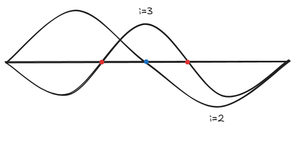
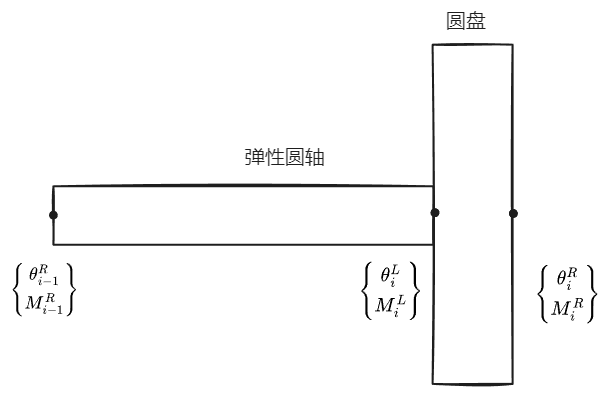

## 解的定性性质
我们来讨论振动问题的一些解的定性性质。

以杆为例，第一个定性性质是频率是离散无重复的即 $0\le \omega_{1 }\le \omega_{2}\leq\dots$

第二个定性性质是节点的交错性，他分为三种：

1. 杆的两个相邻位移振型节点 $\varphi_{i},\varphi_{i+1}$ 相互交错
2. 杆的两个相邻转角 $\theta_{i},\theta_{i+1}$ 节点相互交错
3. 同阶转角 $\theta_{i}$ 与位移 $\varphi_{i}$ 相互交错

所谓交错性可以按照下图理解（不考虑两条曲线相交的节点）：可以看到 $\mathrm{i} \,=2$ 的节点（蓝色）在 $\mathrm{i} \, = 3$ 节点 (红色) 之间，也就是说，相邻振型（转角）的节点必须是交错排序（左边和右边节点必须是另一条曲线的节点）

第三个定性性质是所有振型只有两个独立振型，所谓独立振型是指频率与振型相互独立，这个比较难理解，做一个简单的证明

取 $(\omega_{i},\varphi_{i}),(\omega_{j},\varphi_{j})$，带入杆的振动方程中得

$$
\begin{align}
\frac{d  }{d x } \left[ E(x)A(x) \frac{d \varphi_{i}(x) }{d x } \right]= \omega^{2}_{i} \rho(x)A(x)\varphi_{i}(x) \tag{1} \\
\frac{d  }{d x } \left[ E(x)A(x) \frac{d \varphi_{j}(x) }{d x } \right]= \omega^{2}_{j} \rho(x)A(x)\varphi_{j}(x)\tag{2}
\end{align}
$$

$(2)$ 式乘上 $\omega_{i}^{2} \varphi_{i}(x)$ 后与 $(1)$ 相减得

$$
\frac{d  }{d x } \left[ E(x)A(x) \frac{d \varphi_{i}(x) }{d x } \right]-\frac{d  }{d x } \left[ E(x)A(x) \frac{d \varphi_{j}(x) }{d x } \right]\varphi_{i}(x) \omega_{i}^{2} = 0
$$

因为 $\omega_{i} ,\omega_{j},\varphi_{i}(x),\varphi_{j}(x)$ 是已知的，所以我们总是可以用这四个已知量表示 $E(x)A(x)$ ，同样的，我们也可以表示出 $\rho(x)A(x)$ 。而对于剩下的频率与振型函数，总要满足上述关系时，也就是说剩下的频率与振型函数总是与上述四个已知量有关。这只是一个非常简单的结论说明，暂时不能用于实际中。

我们给出梁的振动解的定性问题

第一个定性性质：频率是离散无重复。

第二个定性性质：节点交错性

1. 梁的相邻两个 $\varphi(x) \text{ or }\theta(x)\text{ or }M(x)\text{ or }Q(x)$ 的节点是相互交错的
2. 同阶 $\varphi_{i},\theta_{i} (\theta_{i},M_{i})(Q_{i},\theta_{i})$ 相互交错。

更多内容参见 [结构力学中的定性理论](https://book.douban.com/subject/26387899/)

## 弹性体振动的近似解问题

!!! note 
    黄老师说这章过一下就行，考试应该考简答题（？）

    这章内容主要来源季文美的《机械振动》

### 集中质量法

我们可以将惯性相对地大而弹性极微弱地部件看作集中质量（刚体或质点），而把那些惯性相对的小而弹性极为显著的部件看作无质量的弹簧。对于均匀或近乎均匀的弹性体，我们保留或大致保留弹性体原有的弹性特性，而将质量集中到弹性体的若干个截面上。但是如何选取各个接种点以及如何配置各点的质量，才能使得所得结果比较接近于实际情况，这在很大程度上要靠经验或实验的启示，缺乏一般的理论指导，优点是做法简单，所得质量矩阵为对角阵，计算量小

比如说如上变截面梁，我们先用若干个均匀梁端所组成的阶梯梁来替代变截面梁，然后保持各个梁端的弹性特性，将质量分别集中到梁的两端（取平分）。接下去就可以按多自由度系统的问题来处理了

比如说均匀简支梁，取分成四段的模型，而前三阶固有频率的近似值为

$$
p_{1} = 9.860\alpha \quad p_{2}=39.2 \alpha \quad p_{3}=83.24\alpha \qquad \alpha \equiv \sqrt{ \frac{EI}{\rho l^{4}} }
$$

而对应的准确值

$$
p_{1}= 9.867 \alpha \quad p_{2} = 39.48 \alpha \quad p_{3} = 88.83 \alpha
$$
要求更高阶的固有频率就得取更多分段的模型

对于固支端、铰之或滑动支座端的情形，用集中质量法得到的固有频率值的误差于 $\frac{1}{N^{4}}$ 成正比， $N$ 为分段数，对于具有自由端的梁，误差则与 $\frac{1}{N^{2}}$ 成正比。

### 假设振型法
在介绍假设振型法之前，先引入广义坐标近似法

广义坐标法将系统的惯性与弹性特性转化到一些振型上去，振型本身都是物理坐标的确定函数，在找出这些振型的运动规律以后，再用它们确定系统物理坐标的运动。主振型叠加法就是一种广义坐标法，对于弯曲振动，我们将其视作是一系列主振动叠加而成

$$
y(x,t) = \sum_{i} q_{i}(t)\sin \frac{ \text{i}\pi x}{l}
$$

实际上，我们所考察的频率范围是有限的，我们只需要取级数的有限项和就能准确地反映实际情况。各种广义坐标法近似法就是在这一基础上发展而来的。

在主振型叠加法中，我们采用的是系统的振型函数，但是我们不能总是找到这些振型函数的解析表达式，于是我们可考虑采用一些更适用的函数，这些函数不一定满足系统的运动微分方程，但是必须具备方程中的各阶导数，并满足适当的边界条件。做如下定义：

- **比较函数** ：满足边界条件的函数
- **容许函数** ： 满足几何边界条件

于是一维弹性体振动的解可近似表示为有限项的线性和

$$
y(x,t)=\sum^{n}_{i=1} \phi_{i}(x) q_{i}(t)
$$

$\phi_{i}(x)$ 是这一边值问题的比较函数或容许函数，$q_{i}(t)$ 为相应的广义坐标。$\phi_{i}(x)$ 函数之间不一定具有正交性，所以广义坐标运动微分方程不再是相互独立，广义质量矩阵与广义刚度矩阵一般不是对角阵，而只是对称阵。

---

假设模态法就是一种广义坐标的近似法，他用有限个假设模态振动的线性和来近似地描述弹性体的振动。

以梁的振动为例，因为梁的位移可表示为

$$
y(x,t) = \sum_{i=1}^{n}  \phi_{i}(x)q_{i}(t)
$$

$\phi_{i}(x)$ 为假设模态函数，一般是指定边值问题的容许函数。

动能:

$$
\begin{align}
T &= \frac{1}{2} \int_{0}^{l} \rho(x)\left[ \frac{\partial y}{\partial t}(x,t) \right]^{2}  \, {\rm d}x \\
&=\frac{1}{2} \sum_{i}^{} \sum_{j}^{} q_{i}(t)q_{j}(t)\int_{0}^{l} \rho(x)\phi_{i}(x)\phi_{j}(x) \, {\rm d} x 
\end{align}
$$

写成矩阵形式为

$$
T = \frac{1}{2} \dot{\mathbf{q}}^{T} \mathbf{M}\dot{\mathbf{q}}
$$

同样的势能也可以表示为

$$
U = \frac{1}{2} \sum_{i}^{} \sum_{i}^{} q_{i}(t)q_{j}(t) \int_{0}^{l} E(x)I(x) \phi_{i}''(x)\phi_{j}''(x)\, {\rm d} 
$$

矩阵形式

$$
U = \frac{1}{2} \mathbf{q}^{T }\mathbf{K}\mathbf{q}
$$

其中 $\mathbf{q}$ 为广义位移列阵  $\dot{\mathbf{q}}$ 为广义速度列阵 $\mathbf{M}$ 为广义质量矩阵 $\mathbf{K}$ 为广义刚度矩阵，与之前不同，此时广义质量矩阵与广义刚度矩阵不为对角阵。

如果只考虑自由振动，Lagrange 方程给出

$$
\frac{d  }{d t }  \left( \frac{\partial T }{\partial \dot{q} _{i}}  \right) - \frac{\partial  T }{\partial q_{i} } +\frac{\partial U }{\partial q_{i} } =0 
$$

带入可得

$$
\mathbf{M} \ddot{\mathbf{q}} + \mathbf{K} \mathbf{q} = 0
$$

同样设定主振型振动：

$$
\mathbf{q} = \mathbf{a} \sin (\omega t)
$$

代入得

$$
[\mathbf{K}-\lambda \mathbf{M}] \mathbf{a} = 0 \quad\lambda =\omega^{2}
$$

于是这个问题又归结于一个特征值的问题，不过此时求出的固有频率 $\omega$ 是对原有连续系统的近似值。同样的，我们也可以证明正交关系：

$$
\mathbf{a}_{j}^{T} \mathbf{M} a_{i} = \begin{cases}
0 & i \neq j \\
M_{i} & i=j
\end{cases}\qquad\mathbf{a}_{j}^{T} \mathbf{K} a_{i} = \begin{cases}
0 & i \neq j \\
K_{i} & i=j
\end{cases}
$$

相对于原有的振型函数 $X_{i}(x) = \sum_{j=1}^{n} a_{ji}\phi_{i}(x) = \mathbf{a}^{T}_{i} \Phi = \Phi^{T}a_{i}$ 由于质量矩阵满足

$$
\mathbf{M} =   \int_{0}^{l} \rho(x) \Phi \Phi^{T} \, {\rm d} x
$$

所以 

$$\begin{align}
&\int_{0}^{l}  \rho(x)X_{i}(x)X_{j}(x) \, {\rm d} x \\
&= \int_{0}^{l} \rho(x)\mathbf{a}_{i}^{T}\Phi \Phi^{T}\mathbf{a}_{i} \, {\rm d} x \\
&=\mathbf{a}_{i}^{T} \int_{0}^{l} \rho(x)\Phi \Phi^{T} \, {\rm d} x \ \mathbf{a}_{i}  \\
&=\mathbf{a}_{i}^{T} \mathbf{M } \mathbf{a}_{i} = \begin{cases}
0 &i\neq j \\
M_{i} &i=j
\end{cases}
\end{align}
$$

### 模态综合法

这边做一个简要赘述：对于一个复杂结构的振动分析，我们可以将其转化成若干个较为简单的子结构，然后找到它们的假设模态，在对接面上保持位移协调以及内力协调条件，把子结构重新常被成总体结构，这样，我们就可以利用各个子结构的假设模态来综合总体结构的振动模态。

### 有限元法

有限元法把一个复杂结构（连续系统）抽象化为有限个元素在有限个节点处对接而成的组合结构，每个元素都是一个弹性体。元素的位移用结点位移插值函数表示，插值函数实质上就是一种假设模态。我们对每个元素取假设模态，由于元素数目通常取得非常大，所以假设模态取得非常简单，一般是多项式函数形式。但此时我们并不是取模态作为广义坐标，而是取结点位移作为系统的广义坐标，这时，各个元素的分布质量将按照一定的格式集中到各个结点上去。

以梁的弯曲振动为例

下图是长度为 $l$ 的均匀梁段在常值结点力作用下的静挠曲线（暂时没考虑振动）

由于分布载荷为零，所以挠曲线满足

$$
\frac{d ^{4}y }{d x^{4} }  = 0
$$

取解：

$$
y(x) = a_{0} +a_{1}x+a_{2}x^{2} +a_{3} x^{3} \equiv X(x) A \tag{1}
$$

我们取梁两端的挠度和转角作为广义坐标，即

$$
\mathbf{ y} = \begin{Bmatrix}
y(0) \\
y'(0 ) \\
y(l) \\
y'(l)
\end{Bmatrix}
$$

可以得到系数列阵满足

$$
 A = \begin{bmatrix}
1 & 0 & 0 & 0 \\
0 & 1 & 0 & 0 \\
-\frac{3}{l^{2}} & -\frac{2}{l} & \frac{3}{l^{2}} & -\frac{1}{l} \\
\frac{2}{l^{3}} & \frac{1}{l^{2}}  &  -\frac{2}{l^{3}}  & \frac{1}{l^{2}}
\end{bmatrix}\mathbf{y} \equiv C^{-1}\mathbf{y}
$$

所以 $(1)$ 又可以写成

$$
y(x) =X(x) A = X(x)C^{-1}\mathbf{y} \equiv \Phi(x) \mathbf{y}
$$

所以 $\Phi(x)$ 也就是梁元素在常值结点力作用下，梁挠曲线的静模态函数，满足

$$
\Phi(x)=\left\{\begin{align}
&\phi_{1}(x) = 1- 3\left( \frac{x}{l} \right) ^{2}+2\left( \frac{x}{l} \right) ^{3} \\
& \frac{\phi_{2}(x)}{l} = \frac{x}{l}\left( 1-\frac{x}{l} \right)^{2} \\
&\phi_{3}(x) = 3 \left( \frac{x}{l} \right) ^{2} -2 \left( \frac{x}{l} \right) ^{3}  \\
& \frac{\phi_{4}(x)}{l} = \left( \frac{x}{l} \right) ^{2}\left( \frac{x}{l} -1\right) 
\end{align}\right.\tag{2}
$$

现在考虑梁的弯曲振动，如果我们仍用 $\mathbf{y}$ 描述梁的广义坐标，那么 $\mathbf{y}$ 显然是时间的函数，那么挠曲线就将不仅是空间上的函数，而且是时间上的函数，我们仍能取相同形式

$$
y(x,t) = \Phi(x)\mathbf{y}(t)
$$

$\Phi(x)$ 仍满足式子 $(2)$ ，同时 $\Phi(x)$ 满足

$$
\begin{align}
&\frac{\partial^{2}y }{\partial x^{2} } (x,t)= \Phi''(x)\mathbf{y} \\
& \frac{\partial y }{\partial t }(x,t) = \Phi (x) \dot{\mathbf{y}} 
\end{align}
$$

所以梁的动能满足

$$
T= \frac{1}{2} \dot{\mathbf{y}}^{T}\mathbf{M} \dot{\mathbf{y}} \qquad \mathbf{M} = \int_{0}^{l} \rho \Phi^{T}\Phi \, {\rm d} x
$$

梁的势能满足

$$
U = \frac{1}{2} \mathbf{y}^{T} \mathbf{K}\mathbf{y} \qquad \mathbf{K} = \int_{0}^{l} EI \Phi''^{T}\Phi'' \, {\rm d}x  
$$

根据式 $(2)$ 可以推导出质量矩阵和刚度矩阵的表达式

在梁弯曲的简化理论中，我们只需要考虑剪力与弯矩，在梁元素两端又四个对接力 $f_{i}(i=1,2,,3,4)$ ，假定梁上作用分布载荷 $f(x,t)$ ，我们来求对应的广义力，虚位移

$$
\delta y(x,t) = \sum_{i}^{} \phi_{i}(x)\delta y_{i}
$$

虚功：

$$
\delta W =\sum_{i}^{} f_{i}\delta y_{i}+\int_{0}^{l} f(x,t)\delta y(x,t) \, {\rm d}x = \sum_{_{i}}^{} \left\{ f_{i} + \int_{0}^{l} f(x,t)\phi_{i}  \, {\rm d}x  \right\}\delta y_{i}  
$$

所以广义力

$$
Q_{i } =f_{i} + \int_{0}^{l} f(x,t)\phi_{i} \, {\rm d} x
$$

Lagrange 方程给出梁振动方程

$$
{\bf M} \ddot{\mathbf{y}} + \mathbf{K}\mathbf{y} = \mathbf{Q}
$$

$\mathbf{Q}\equiv \left\{ Q_{i} \right\}$ 为广义力列阵。我们就可以求解 $\mathbf{y}$ 进而给出梁振动的近似表达式。

### 加权残数法
对于一个弹性体振动问题，我们一般要求解两个函数：振型函数 $\Phi(x)$ 以及时间函数 $T(t)$ ，对于振型函数，我们一般需要求解以下方程

$$
\left[ E(x)A(x)\frac{{\rm{d}}  ^{2} \Phi}{{\rm {d}} x^{2} }  \right] -\omega^{2} \rho(x)A(x) \Phi = 0
$$

其中 $\omega^{2}$ 表示频率。记将解带入方程后两端差为**残数**，显然对于精确解，残数应当为零。但是我们并不能总是给出精确解，考虑如下弱形式：

$$
\int_{0}^{l} \psi(x)R(\overset{ \sim }{ \Phi }(x)) \, {\rm d}x =0  
$$

$$
R(\overset{ \sim }{ \Phi }(x),x)  = \left[ E(x)A(x)\frac{{\rm{d}}  ^{2} \overset{ \sim }{ \Phi }}{{\rm {d}} x^{2} }  \right] -\omega^{2} \rho(x)A(x) \overset{ \sim }{ \Phi }
$$

其中 $\psi(x)$ 为已知权函数，也就是我们退而求其次，要求其关于所在区域的加权平均值为零。满足上述加权平均值关系的解 $\overset{ \sim }{ \Phi }(x)$ 称为近似解。所以对于我们需要求解的近似振型函数：

$$
R(\overset{ \sim }{ \Phi }(x)) = \sum_{ i=1}^{n} \alpha_{i} \overset{ \sim }{ \varphi }_{i}(x)
$$

一般而言， $\overset{ \sim }{ \varphi }(x)$ 是我们设定的试函数（一般而言满足边界条件）。因此当我们设定好权函数 $\psi(x)$ 后，我们的任务就剩下求解待定参数 $\alpha_{i}$。

对于 $\psi(x)$ 我们一般有如下四种取法：

- 伽辽金法：权函数取为试函数，因此

$$
\int_{0}^{l} \overset{ \sim }{ \varphi }_{i}(x)R\left[ \sum_{j=1}^{n} \alpha_{j}\overset{ \sim }{ \varphi }_{j}(x) ,x\right]  \, {\rm d} x =0
$$

- 配点法，也称并置法，取 $n$ 个点 $x_{1},x_{2},\dots,x_{n}$ ，令残差在这些点上为零

$$
R\left[ \sum_{j=1}^{n} \alpha_{j}\overset{ \sim }{ \varphi }_{j}(x_{i}) ,x_{i}\right]  =0
$$

显然取狄拉克函数 $\delta(x-x_{i})$ 可为权函数。

- 子区域法：我们划分 $n$ 个区域 $[l_{i-1},l_{i}]$ ，令残数在各个子区域的积分为零，即
$$
\int_{l_{i-1}}^{l_{i}}R\left[ \sum_{j=1}^{n} \alpha_{j}\overset{ \sim }{ \varphi }_{j}(x) ,x\right]   \, {\rm d} x =0
$$

那么对应权函数满足

$$
\chi_{i} (x)= \left\{\begin{aligned} 1 & \quad x \in [l_{i-1},l_{i}]\\
0& \quad \text{otherwise }\end{aligned}\right. 
$$

- 最小平方法：要求残数的平方值在全区间上的累积取最小值，以此确定权函数。即

$$
\int_{0}^{l} \frac{\partial R }{\partial \alpha_{i} } R\left[ \sum_{j=1}^{n}\alpha_{j }\overset{ \sim }{ \varphi }_{j}(x),x  \right]  \, {\rm d}x =0 
$$

### 传递矩阵法

考虑多刚体盘的圆截面扭转振动，取上述单元体，记转角 $\theta$ 为广义位移，扭矩 $M$ 为广义力。

圆盘两侧满足

$$
\begin{align}
&\theta_{i}^{L} = \theta^{R}_{i} \\
&M^{R}_{i}-M^{L}_{i}= J_{i} \ddot{\theta}^{R}_{i} = -\omega^{2}J_{i}\theta_{i}^{R}
\end{align}
$$

$J_{i}$ 为惯性矩，我们假定扭转运动为周期函数满足 $\ddot{\theta_{i}} = -\omega^{2} \theta_{i},\omega$ 为频率，以矩阵形式写出就是

$$
\begin{Bmatrix}
\theta_{i}^{R} \\
M_{i}^{R}
\end{Bmatrix} = \begin{bmatrix}
1&0 \\
-\omega^{2} J_{i} &  1
\end{bmatrix}
\begin{Bmatrix}
\theta_{i}^{L} \\
M_{i}^{L}
\end{Bmatrix}
$$

对于弹性体，我们假定其惯性矩为零，则其运动满足

$$
M_{i}^{L} = M_{i-1}^{R}= k_{i}(\theta^{L}_{i}-\theta^{R}_{i-1}) 
$$

我们依旧给出矩阵形式

$$
\begin{Bmatrix}
\theta_{i}^{L} \\
M_{i}^{L}
\end{Bmatrix} = \begin{bmatrix}
1& 1/k_{i} \\
0 &  1
\end{bmatrix}
\begin{Bmatrix}
\theta_{i-1}^{R} \\
M_{i-1}^{R}
\end{Bmatrix}
$$

所以可以得出

$$
\begin{Bmatrix}
\theta_{i}^{R} \\
M_{i}^{R}
\end{Bmatrix} = \begin{bmatrix}
1&0 \\
-\omega^{2} J_{i} &  1
\end{bmatrix}
\begin{bmatrix}
1& 1/k_{i} \\
0 &  1
\end{bmatrix}
\begin{Bmatrix}
\theta_{i-1}^{R} \\
M_{i-1}^{R}
\end{Bmatrix}\triangleq S_{i}\begin{Bmatrix}
\theta_{i-1}^{R} \\
M_{i-1}^{R}
\end{Bmatrix}
$$

因此叠加就可得到

$$
\begin{Bmatrix}
\theta_{n}^{R} \\
M_{n}^{R}
\end{Bmatrix}= S_{n}S_{n-1}\dots S_{1} \begin{Bmatrix}
\theta_{0}^{R} \\
M_{0}^{R}
\end{Bmatrix} \triangleq \begin{bmatrix}
s_{11} & s_{12} \\
s_{21} & s_{22}
\end{bmatrix}
\begin{Bmatrix}
\theta_{0}^{R} \\
M_{0}^{R}
\end{Bmatrix} 
$$

为了求解固有频率，我们需要根据边界条件，定出矩阵中某一元素 $s_{ij}$ 为零。
