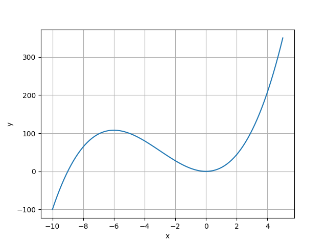

## 保守系统的非线性振动
根据能量守恒原理，保守系统的总能总是保持不变的，即

$$
\frac{1}{2} m \dot{x}^{2}+U(x) =E
$$

$U(x)$ 为系统势能， $E$ 满足一定非线性条件。可以得出

$$
\frac{dx}{\pm \sqrt{ \frac{2(E-U(x))}{m} }} = dt
$$

假定系统满足一定的周期性，且有一定的对称性。我们可以解出周期满足

$$
4 \int_{0}^{x_\max}  \frac{dx}{ \sqrt{ \frac{2(E-U(x))}{m} }} = T
$$

对于简单的非线性恢复力 $F(x) = x,x^{3},\dots x^{2n+1}$ 我们可以求出对应的解析解

如果恢复力中包含偶函数，例如 $F(x) = k_{1}x +k_{2}x^{2}$ ，那么对应的势能为 $U(x) = \frac{1}{2}k_{1}x^{2}+\frac{k_{2}}{3}x^{3}$ 。势能函数大概如图所示

因为势能不能为零，为了保证其在 $x$ 负半轴处有解。所以负半轴的势能取值限制了系统运动。取负半轴处最大值为 $E_{\max}$。所以总能量应满足关系式

$$
0< E <E_{\max}
$$

此时我们无法利用对称性求解周期，但在系统运动中，无论是从位移最大处 $x_{\max}$ 到位移最小处 $x_{\min}$ ，还是从位移最小处到位移最大处，两者的时间应当是相同的，因此

$$
T  = 2 \int_{x_{\min}}^{x_{max}}  \frac{{\, {\rm d}x }}{\sqrt{ \frac{2(E-U(x))}{m} }}
$$

## 非线性振动 
对于非线性振动系统，将方程成线性部分和非线性部分

$$
\ddot{x} + \omega^{2} x = \varepsilon f(x,\dot{x})
$$

因为非线性部分源自刚度和阻尼；非线性振动中有两个比较典型的物理模型，分别对应不同的非线性项。

- 非线性刚度：Duffing 振子

$$
\ddot{x} + 2c  \dot{x} +k_{1}x+k_{3}x^{3} = f(t)
$$

- 非线性阻尼： VanderPol 振子

$$
\ddot{x} +(c_0+c_1x^2+c_2\dot{x}^2)\dot{x} + kx = f(t)
$$

对于一般的非线性振动系统，我们很难给出准确的解析解，如果满足 $0< \varepsilon\ll  1$ 也就是弱非线性情况，我们能给出近似解；对于强非线性情况，我们只有数值解。

### 平均摄动法

对于微分方程

$$
\ddot{x} +\omega^{2}x = \varepsilon f(x,\dot{x})
$$

由于 $\varepsilon$ 是小参数，我们可以将解按 $\varepsilon$ 直接展开的幂级数形式，即

$$
x(t,\varepsilon) =x_{0}(t)+\varepsilon x_{1}(t) +\varepsilon^{2} x_{2}(t)+\dots 
$$

这里取非线性项为三次刚度 $f(x) = x^{3}$ 我们将这个解带入我们的方程，一一比较系数显然可得

$$
\begin{align}
&\varepsilon^{0} : \ddot{x}_{0}+\omega^{2} x_{0} = 0 \\
&\varepsilon^{1} : \ddot{x}_{1} + \omega^{2} x_{1}=f(x_{0},\dot{x}_{0})\\ 
&\dots
\end{align}
$$

此时初始条件为

$$
x(0) = A \quad \dot{x}(0) = 0
$$

所以第一个方程给出解

$$
x_{0}  = A \cos \omega t
$$

显然这是一个无外加激励时，保守系统的解。我们将这个解带入第二个方程

$$
\ddot{x}_{1}  +\omega^{2} x =-\alpha A^{3} \cos ^{3}\omega t
$$

杜哈梅积分给出解的形式

$$
x_{1}(t) = C_{1} \cos \omega t +C_{2} \sin \omega t +\beta  t \cos \omega t + \Gamma \cos \omega t
$$

$C_{1},C_{2},\beta,\Gamma$ 为系数。注意第三项为一个含有 $t$ 的长期项。尽管在一定时间内，方程的解具有的渐进性，但是随着时间的增加显然会出现发散解的现象。

### L-P 法 

引入新的时间变量

$$
\tau = \omega t
$$

其中 $\omega$ 是关于 $\varepsilon$ 的未知函数，满足

$$
\omega = \omega_{0} + \omega_{1}\varepsilon + \omega_{2}\varepsilon^{2}+\dots
$$

于是方程变为

$$
\omega^{2} x'' + \omega_{0}^{2}x = \varepsilon f\left( x(\tau),\omega \frac{{\rm{d}}  x }{{\rm {d}} \tau }  \right)
$$

我们依旧考虑三次刚度项，所以基本摄动法给出

$$
\begin{align}
&\varepsilon^{0} : \omega _{0}^{2}x''_{0}+\omega_{0}^{2} x_{0} = 0 \\
&\varepsilon^{1} :\omega_{0}^{2}x_{1}'' +2 \omega_{0} wx_{0}''+\omega_{0} ^{2} x_{1}= -x_{0}^{3} \\
&\dots
\end{align}
$$

初始条件仍相同，所以给出第一个方程的解

$$
x_{0} = A \cos \tau
$$

将上述解带入第二个方程可得

$$
\omega_{0}^{2} x_{1}''+\omega_{0}^{2}x_{1} = \frac{1}{4} \omega_{0}A_{0}\left( 8 \omega_{1}-\frac{3}{\omega_{0}}  A_{0}^{2} \right) \cos \tau - \frac{1}{4} A_{0}^{3} \omega_{0}^{2}\cos 3 \tau
$$

右端第一项将引起共振从而出现长期项，为了使得长期项不出现，需令其系数为零，因此有

$$
\omega_{1} = \frac{3A^{2}}{8\omega_{0}}
$$

同样的可以求得剩下的 $\omega_{i}$ 所以时间变量满足

$$
\tau = \omega t = \left( \omega_{0}  + \frac{3A^{2}}{8\omega_{0}} \varepsilon+\dots\right) t
$$

如果我们取的级数项够多，有效的区域也就会又大
### 平均法(K-B 法)

$$
\ddot{x} +\omega_{0}^{2}x = \varepsilon f(x,\dot{x})
$$

对于上述方程，我们做如下假定

$$
\begin{align} 
&\varepsilon = 0:\cases{x(t) = A \cos (\omega_{0}t+\varphi_{0})\\
\dot{x}(t) = -\omega_{0} A \sin(\omega_{0}t+\varphi_{0})} \\
&\varepsilon \neq {0}: 
\cases{x(t) = a(t) \cos (\omega_{0}t+\varphi(t))\\
\dot{x}(t) = -\omega_{0} a(t) \sin(\omega_{0}t+\varphi(t))}
\end{align}
$$

此时补充条件

$$
\dot{a} \cos (\omega_{0}t+\varphi(t))-a \dot{\varphi}(t)\sin (\omega_{0}t+\varphi(t))=0
$$

将上述 $\varepsilon\neq 0$ 的假设带入方程中 (考虑 $\varepsilon=0 ,\varepsilon\neq 0$ ) 可得

$$
\begin{align}
&\dot{ a} = - \frac{\varepsilon}{\omega_{0}} f[ \quad] \sin (\omega_{0}t +\varphi) \\
& \dot{\varphi} = - \frac{\varepsilon}{\omega_{0}a} f[\quad] \cos (\omega_{0} t+\varphi )
 \end{align}
$$

(PS:老师上课没写中间的东西那我不写也是合理的)

对于上述两项，等式的右边含有小量 $\varepsilon$ 说明这两项也是一个小量，因此 $a$ 和 $\varphi$ 的变换过程是很缓慢的，也就是随 $t$ 慢变的量，因此我们可以将其视作是一个平稳变化项和微小扰动的叠加。为了方便起见，我们记 $\omega_{0}t +\varphi(t)\triangleq \psi$ 。那么右边就是一个关于变量 $\psi$ 周期为 $2\pi$ 的周期函数，那么我们总可以用三角函数展开，展开后我们只取一个近似项，便可以将上述转换为如下形式（具体细节参照季文美《机械振动》P516）

$$
\begin{align}
&\dot{ a} = - \frac{\varepsilon}{2 \pi\omega_{0}} \int_{0}^{2\pi} \sin \psi f(a \cos \psi,-\omega_{0}a\sin \psi) \, {\rm d} \psi  \\
& \dot{\varphi} = - \frac{\varepsilon}{2\pi\omega_{0}a}\int_{0}^{2\pi} \cos \psi f(a\cos \psi,-\omega_{0} a \sin \psi) \, {\rm d} \psi
 \end{align}
$$

因为这是一个慢变过程，所以在一个周期 $t = \frac{2\pi}{\omega_{0}}$ 内可以将 $a$ 和 $\varphi$ 视作常数

!!! tip 
    例题源自季文美《机械振动》P518参数不重要，重要的是大概的解题过程（ 

求杜芬方程的周期解：

$$
\ddot{x} + \omega_{0}^{2}(x+\varepsilon x ^{3}) = 0
$$

当 $\varepsilon = 0$ 时，方程有解

$$
\begin{align}
& x = a \cos \psi ,\quad \psi = \omega_{0} t +\theta  \\
&\dot{x} =  - \omega_{0}a \sin \psi
\end{align}
$$

当 $\varepsilon \neq 0$ 时，我们仍然保留解的形式，但此时 $a$ 和 $\theta$ 都是时间 $t$ 的函数。将解带入杜芬方程中可得

$$
\omega_{0} \dot{a} \sin \psi  + \omega_{0} a \dot{\theta} \cos \psi= \varepsilon \omega^{2} a^{3} \cos ^{3} \psi
$$

补充方程

$$
\dot{a} \cos \psi = a \dot{\theta} \sin \psi
$$

将上述两个方程联立求解可得标准方程

$$
\begin{align}
& \dot{a} = \frac{1}{8} \varepsilon \omega_{0} a^{3} \left(  2 \sin 2 \psi + \sin 4 \psi  \right)  \\
& \dot{\theta} = \frac{1}{8} \varepsilon \omega_{0} a ^{2} \left( 3+ 4 \cos 2\psi + \cos 4 \psi  \right) 
\end{align}
$$

在 $\frac{2\pi}{\omega_{0} }$ 时间内对时间项取平均

$$
\begin{align}
&\dot{ a} = 0 \\
& \dot{\theta} = \frac{3}{8} \varepsilon \omega_{0}a^{2}
\end{align}
$$

得到一次近似解

$$\begin{align}
&\overline{a}_{1} = a_{0} = \text{const}  \\
&\overline{ \theta}_{1 }= \frac{3}{ 8} \varepsilon \omega_{0}a^{2} t + \theta_{0} \quad \psi_{1}=\omega_{0}\left( 1+ \frac{3}{8} \varepsilon a_{0}^{2} \right)t + \theta_{0}
\end{align}
$$

范德波方程

$$
\ddot{x} + \varepsilon(x^{2}-1) \dot{ x}+ x= 0
$$

同样取变换

$$
\begin{align}
& x = a \cos \psi ,\quad \psi = t +\theta  \\
&\dot{x} =  - a \sin \psi
\end{align}
$$

所以可得标准方程

$$
\begin{align}
&\dot{a} = \frac{1}{8}\varepsilon a [4-a ^{2}-4 \cos 2 \psi + a ^{2} \cos 4\psi] \\
&\dot{\theta} =\frac{1}{8}\varepsilon [(4-2a^{2})\sin 2 \psi - a ^{2} \sin 4 \psi]
\end{align}
$$

做平均化可得平均方程：

$$\begin{align}
&\dot{ a} = \frac{1}{ 8}\varepsilon a (4- a ^{2}) \\
&\theta = 0
\end{align}
$$

积分得

$$
\overline{a}^{2}_{1} =  \frac{4}{1+\left( \frac{4}{a_{0}^{2}}-1 \right)e^{-\varepsilon t} } \quad \overline{\theta}_{1} = \theta_{0}
$$

## 极限环

对于一个 VanderPol 振子我们所考虑的非线性阻尼是一个正的阻尼，而线性阻尼是一个负的阻尼。此时相平面上会出现一个闭轨线（图中L1）当初始时刻在闭轨线内部时，阻尼整体表现出负阻尼特性，由于负阻尼使得振荡系统发散，所以振幅逐渐变大，但是负阻尼特性会随振幅变大而减小，逐渐趋近闭轨线；同理，当初始时刻在闭轨线外部是，阻尼整体表现出正阻尼特性；正阻尼特性使得振荡系统衰减，但是正阻尼特性也随之减弱，所以也表现出逐渐趋近闭轨线，这样的闭轨线成为极限环。

如果极限环的两侧相轨线都逐渐趋于它，则极限环是稳定的。如果哪怕有一侧的相轨迹是离开它的，极限环是不稳定的。稳定的极限环对应于系统的稳态周期运动，这样的稳态运动称为自激振动或者简称自振。自振发生于系统受到某些不可避免的干扰而自发地开始振动，振幅一直增长至系统的非线性因素起作用而限制振幅为止。这种运动之所以能够维持，是由于存在一个系统有关的外部恒定能源，又由于系统固有的非线性机制，在运动着的系统与恒定能源之间引起交变力的出现，使系统周期性地从恒定能源获取能量，平衡由于阻尼而造成地能量损耗。

