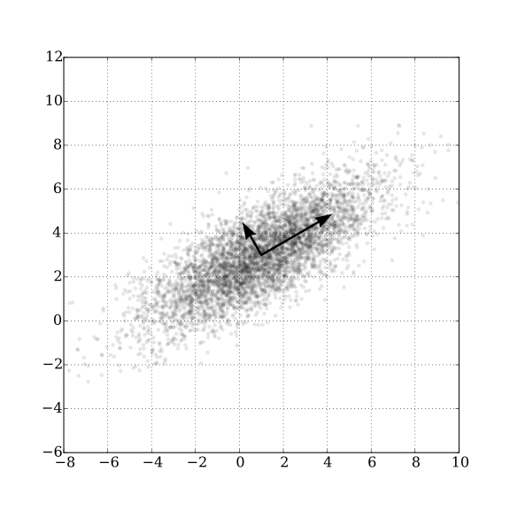

# 主成分分析

[Principal component analysis - Wikipedia](https://en.wikipedia.org/wiki/Principal_component_analysis)

主成分分析利用正交变换把由线性相关变量表示的观测数据转换为少数几个由线性无关变量表示的数据，线性无关的变量称为主成分，该方法主要用于发现数据中的基本结构

主成分分析的直观解释：数据集合中的样本由实数空间（正交坐标系）中的点表示，空间的一个坐标轴表示一个变量，规范化处理后得到的数据分布在原点附近。对原坐标系中的数据进行主成分分析等价于进行坐标系旋转变换，将数据投影到新坐标系的坐标轴上；新坐标系的第一坐标轴、第二坐标轴等分别表示第一主成分、第二主成分等，数据在每一轴上的坐标值的平方表示相应变量的方差；并且，这个坐标系是在所有可能的新的坐标系中，坐标轴上的方差的和最大的。

在数据总体上进行的主成分分析称为总体主成分分析，在有限样本上进行的主成分分析称为样本主成分分析。

## 总体主成分

假设 $\vec{x}=(x_{1},x_{2},\dots,x_{m})^{T}$ 是 $m$ 维随机变量，其均值向量记为 $\vec{\mu}$ ：

$$
\vec{\mu} = \mathbb{E}(\vec{x}) = (\mu_{1},\mu_{2},\dots,\mu_{m})^{T}
$$

协方差矩阵：

$$
\Sigma  = \mathrm{cov}(\vec{x},\vec{x}) = \mathbb{E}[(\vec{x}-\vec{\mu})(\vec{x}-\vec{\mu})]
$$

考虑一个线性变换：

$$
y_{i} =\alpha_{i}^{T}\vec{x} = \alpha_{1i}x_{1}+\alpha_{2i}x_{i}+\dots+\alpha_{mi}x_{m} \tag{1}
$$

下面给出总体主成分的定义：

!!! note "Definition"

    给定满足 $(1)$ 的线性变换，满足

    1. 系数 $\alpha_{i}^{T}$ 是单位向量 $\alpha^{T}_{i}\alpha_{i}=1$ 且 $\alpha_{i}^{T}a_{j}=0$ 
    2. 变量 $y_{i}$ 与 $y_{j}$ 互不相关， 即 $\mathrm{cov}(y_{i},y_{j})=0$
    3. 变量 $y_{1}$ 是 $\vec{x}$ 的所有线性变换中方差最大的；$y_{2}$ 是与 $y_{1}$ 不相关的 $\vec{x}$ 的所有线性变换中方差最大的；一般地 $y_{i}$ 是与 $y_{1},y_{2},\dots,y_{i-1}$ 都不相关地 $\vec{x}$ 的所有线性变换中方差最大的，这时分别称 $y_{1},y_{2},\dots y_{m}$ 为 $\vec{x}$ 的第一主成分、第二主成分、…、第 $m$ 主成分 

!!! note "Theorem"

    设 $\vec{x}$ 是 $m$ 维随机变量，$\Sigma$ 是 $\vec{x}$ 的协方差矩阵，$\Sigma$ 的特征值分别是 $\lambda_{1}\geq\lambda_{2}\geq\dots\geq\lambda_{m}\geq 0$ ，特征值对应的单位特征向量分别是 $\alpha_{1},\alpha_{2},\dots,\alpha_{m}$ ，则 $\vec{x}$ 的第 $k$ 主成分为：

    $$
    y_{k} =\alpha_{k}^{T} \vec{x} =\alpha_{1k}x_{1}+\alpha_{2k}x_{2}+\dots+\alpha_{mk}x_{m}
    $$

    $\vec{x}$ 的第 $k$ 主成分的方差为 

    $$
    \mathrm{var}(y_{k}) =\alpha_{k}^{T}\Sigma\alpha_{k} =\lambda_{k}
    $$

    即协方差矩阵 $\Sigma$ 的第 $k$ 个特征值。

上述定理给出推论：

!!! tip "Corollary"

    $m$ 维随机变量 $\vec{y}=(y_{1},y_{2},\dots,y_{m})^{T}$ 的分量依次是 $\vec{x}$ 的第一主成分到第 $m$ 主成分的充要条件是：
    
    - $\vec{y}=A^{T}\vec{x}$ ，$A$ 为正交矩阵：

    $$
    A=\begin{bmatrix}
    \alpha_{11} & \alpha_{12} & \dots & \alpha_{1m} \\
    \alpha_{21} & \alpha_{22} & \dots & \alpha_{2m} \\  
    \vdots & \vdots  &  & \vdots\\
    \alpha_{m1} & \alpha_{m2} & \dots & \alpha_{mm} \\
    \end{bmatrix}
    $$

    - $\vec{y}$ 的协方差矩阵为对角矩阵

    $$
    \begin{align}
    &\mathrm{cov}(\vec{y}) = \mathrm{diag} (\lambda_{1},\lambda_{2},\dots,\lambda_{m}) \\
    &\lambda_{1}\geq\lambda_{2}\geq \dots\geq\lambda_{m}
    \end{align}
    $$

    其中 $\lambda_{k}$ 是 $\Sigma$ 的第 $k$ 个特征值，$\alpha_{k}$ 是对应的单位特征向量

证明如下：

因为 $\lambda_{k}$ 是 $\Sigma$ 的第 $k$ 个特征值，$\alpha_{k}$ 是对应的单位特征向量，根据定义有：

$$
\Sigma\alpha_{k}=\lambda_{k}\alpha_{k}
$$

用矩阵表示就是：

$$
\Sigma A = A\Lambda
$$

由于 $A$ 是单位正交矩阵，所以可得得出：

$$
\begin{align}
A^{T}\Sigma A & =\Lambda  \\
\Sigma=A & \Lambda A^{T}
\end{align}
$$

证毕。

### 性质

- 总体主成分 $\vec{y}$ 的协方差矩阵是对角矩阵

$$
\mathrm{cov}(\vec{y})=\Lambda =\mathrm{diag}(\lambda_{1},\lambda_{2},\dots,\lambda_{m})
$$

- 总体主成分 $\vec{y}$ 的方差之和等于随机变量 $\vec{x}$ 的方差之和

$$
\sum_{i=1}^{m} \lambda_{i}=\sum_{i=1}^{m} \sigma_{ii}
$$

考虑：

$$
\begin{align}
\sum_{i=1}^{m} \mathrm{var}(x_{i}) &= \mathrm{tr}(\Sigma^{T})=\mathrm{tr}(A\Lambda A)^{T} = \mathrm{tr}(A^{T}\Lambda A)  \\
&= \mathrm{tr}(\Lambda) = \sum_{i=1}^{m} \lambda_{i} =\sum_{i=1}^{m} \mathrm{var}(y_{i})
\end{align}
$$

- 第 $k$ 个主成分 $y_{k}$ 与变量 $x_{i}$ 的相关系数 $\rho(y_{k},x_{i})$ 称为**因子负荷量**（factor loading），表示第 $k$ 个主成分 $y_{k}$ 与变量 $x_{i}$ 的相关关系，计算公式：

$$
\rho(y_{k},x_{i})= \frac{\sqrt{ \lambda_{k} }\alpha_{ik}}{\sqrt{ \sigma_{ii} }}
$$

根据相关关系定义给出：

$$
\rho(y_{k},x_{i}) = \frac{\mathrm{cov}(y_{i},x_{i})}{\sqrt{ \mathrm{var}(y_{k})\mathrm{var}(x_{i}) }}=\frac{\mathrm{cov}(\alpha_{k}^{T}\vec{x},e_{i}^{T}\vec{x})}{\sqrt{ \lambda_{k} }\sqrt{ \sigma_{ii} }}
$$

将协方差展开得：

$$
\mathrm{cov}(\alpha_{k}^{T}\vec{x},e_{i}^{T}\vec{x}) = \alpha_{k}^{T}\Sigma e_{i}=e_{i}^{T}\Sigma \alpha_{k} =\lambda e_{i}^{T}\alpha_{k}=\lambda_{k}\alpha_{ik}
$$

- 第 $k$ 个主成分 $y_{k}$ 与 $m$ 个变量的因子负荷量满足：

$$
\sum_{i=1}^{m} \sigma_{ii}\rho^{2}(y_{k},x_{i}) =\lambda_{k}
$$

- $m$ 个主成分与第 $i$ 个变量的因子负荷量满足：

$$
\sum_{k=1}^{m} \rho^{2}(y_{k},x_{i})=1
$$

### 主成分的个数

主成分分析的主要目的是降维，一般选择 $k(k\ll m)$ 个主成分来替代 $m$ 个原有变量，并保留原有变量的大部分信息，这里的信息指原有变量的方差。

!!! note "Theorem"

    对于任意正整数 $q$ ，$1\leq q\leq m$ ，考虑正交线性变换：

    $$
    \vec{y} = B^{T} \vec{x}
    $$

    其中 $\vec{y}$ 是 $q$ 维度向量, $B^{T}$ 是 $q \times m$ 矩阵，令 $\vec{y}$ 的协方差矩阵为

    $$
    \Sigma_{\vec{y}} = B^{T}\Sigma B
    $$

    则 $\Sigma_{\vec{y}}$ 的迹 $\mathrm{tr}(\Sigma_{y})$  在 $B = A_{q}$ 时取到最大值，其中矩阵 $A_{q}$ 由正交矩阵 $A$ 的前 $q$ 列组成

这个定理说明，当 $\vec{x}$ 的线性变换 $\vec{y}$ 在 $B =A_{q}$ 时，其协方差矩阵的迹取到最大值，也就是说，**当取 $A$ 的前 $q$ 列，取 $\vec{x}$ 的前 $q$ 个主成分时，能够最大限度地保留原有变量方差的信息。**

!!! note "Theorem"

    考虑正交变换：

    $$
    \vec{y} = B^{T}\vec{x}
    $$

    这里 $B^{T}$ 时 $p\times m$ 矩阵，协方差的迹在 $B=A_{P}$ 时取到最小值，其中 $A_{p}$ 由 $A$ 的后 $p$ 列组成。

这个定理说明，当舍弃 $A$ 的后 $p$ 列时，即舍弃变量 $\vec{x}$ 的后 $p$ 个主成分时，原有变量的方差信息损失最少。

### 规范化变量的总体主成分
取 $\vec{x}=(x_{1},x_{2},\dots,x_{m})^{T}$ 为 $m$ 维随机变量，$x_{i}$ 为第 $i$ 个随机变量，取：

$$
x^{*}_{i} = \frac{x_{i}-\mathbb{E}(x_{i})}{\sqrt{ \mathrm{Var}(x_{i}) }}
$$

此时 $x_{i}^{*}$ 称为 $x_{i}$ 的规范化随机变量。规范化随机变量的协方差矩阵就是相关矩阵 $R$

规范化随机变量的总体主成分有以下性质：

- 协方差矩阵

$$
\Lambda ^{*} = \mathrm{diag}(\lambda_{1}^{*},\lambda_{2}^{*},\dots,\lambda_{m}^{*})
$$

- 协方差矩阵的特征值之和为 $m$ 

$$
\sum_{k=1}^{m} \lambda_{k}^{*} =m
$$

- 规范化随机变量 $x^{*}_{i}$ 与主成分 $y_{k}^{*}$ 的相关系数（因子负荷量）为  

$$
\rho(y_{k}^{*},x_{i}^{*})=\sqrt{ \lambda _{k}^{*}}e^{*}_{ik}
$$

其中 $e_{k}^{*}=(e_{1k}^{*},e_{2k}^{*},\dots,e_{mk}^{*})$ 为矩阵 $R$ 对应于特征值 $\lambda_{k}^{*}$ 的单位特征向量。

- 所有规范化随机变量 $x^{*}_{i}$ 与主成分 $y_{k}^{*}$ 的相关系数的平方和等于 $\lambda_{k}^{*}$
- 规范化随机变量 $x^{*}_{i}$ 与所有主成分 $y_{k}^{*}$ 的相关系数的平方和等于 $1$

## 样本主成分分析

假设对 $m$ 维随机变量 $\vec{x}=(x_{1},x_{2},\dots,x_{m})^{T}$ 进行 $n$ 次独立观测，$\vec{x}_{1},\vec{x}_{2},\dots \vec{x}_{n}$ 表示观测数据，用样本矩阵 $\vec{X}$ 表示，记作：

$$
\vec{X} = \begin{bmatrix}
\vec{x}_{1} & \vec{x}_{2} & \dots & \vec{x}_{n}
\end{bmatrix}
= \begin{bmatrix}
x_{11} & x_{12} & \dots & x_{1n} \\
x_{21} & x_{12} & \dots & x_{1n} \\
\vdots & \vdots &  & \vdots \\
x_{m1} & x_{m2} & \dots & x_{mn}
\end{bmatrix}
$$

样本均值向量：

$$
\bar{x} = \frac{1}{n}\sum_{j=1}^{n} \vec{x}_{j}
$$

样本协方差矩阵

$$
S= [s_{ij}]_{m\times m}  \quad s_{ij} = \frac{1}{n-1}\sum_{k=1}^{n} (x_{ik}-\bar{x}_{i})(x_{jk}-\bar{x}_{j})
$$

样本相关矩阵

$$
R=[r_{ij}]_{m\times m} \quad r_{ij} = \frac{s_{ij}}{\sqrt{ s_{ii}s_{jj} }}
$$

同样定义 $\mathbb{R}^{m}\mapsto \mathbb{R}^{m}$ 线性变换：

$$
\vec{y} = A^{T}\vec{x} \quad A=\begin{bmatrix}
a_{1} & a_{2} & \dots & a_{n}
\end{bmatrix}= \begin{bmatrix}
a_{11} & a_{12} & \dots & a_{1n} \\
a_{21} & a_{12} & \dots & a_{1n} \\
\vdots & \vdots &  & \vdots \\
a_{m1} & a_{m2} & \dots & a_{mn}
\end{bmatrix}
$$

对应样本均值：

$$
\bar{y}_{i} = a_{i}^{T} \vec{x}
$$

样本方差 $\mathrm{var}(y_{i})$

$$
\begin{align}
\mathrm{var}(y_{i}) &= \frac{1}{n-1}\sum_{j=1}^{n} (a_{i}^{T}\vec{x}_{j}-a_{i}^{T}\bar{x})^{2} \\
&= a_{i}^{T}\left[ \frac{1}{n-1}\sum_{j-1}^{n} (\vec{x}_{j}-\bar{x})(\vec{x}_{j}-\bar{x})^{T} \right] a_{i} = a_{i}^{T}Sa_{i}
\end{align}
$$

协方差：

$$
\mathrm{cov} (y_{i},y_{k}) = a_{i}^{T}Sa_{k}
$$

这里给出样本主成分的简单定义：

!!! note "Definition"

    一般地，样本第 $i$ 主成分 $y_{i}=a_{i}^{T}\vec{x}$ 使在 $a_{i}^{T}a_{i}=1$ 和样本协方差 $a_{k}^{T}Sa_{i}=0$ 条件下，使得 $a_{i}^{T}\vec{x}_{j}$ 的样本方差 $a_{i}^{T}Sa_{i}$ 最大的 $\vec{x}$ 的线性变换。

总体主成分的性质同样适用于样本主成分。在使用样本主成分时，一般假设样本数据时规范化的，即：

$$
x_{ij}^{*} = \frac{x_{ij}-\bar{x}_{i}}{\sqrt{ s_{jj} }}
$$

为了方便仍记作 $x_{ij}$ ，规范化的样本矩阵仍记作 $X$ ，此时样本协方差矩阵 $S$ 就是样本相关矩阵 $R$

$$
R = \frac{1}{n-1}XX^{T}
$$

样本协方差矩阵是对总体协方差矩阵的无偏估计，样本相关矩阵式总体相关矩阵的无偏估计。

传统的主成分分析通过数据的协方差矩阵或相关矩阵的特征值分解进行，现在常用的方法是通过数据矩阵的奇异值分解进行。

!!! note "相关矩阵的特征值分解算法"

    1. 对观测数据进行规范化处理，得到规范化数据矩阵
    2. 计算样本相关矩阵
    3. 求解样本相关矩阵的 $k$ 个特征值和对应的 $k$ 个单位特征向量，一般求方差贡献率 $\sum^{i=1}_{k}\eta_i$ 达到预定值的主成分个数 $k$
    4. 求 $k$ 个样本主成分
    5. 计算 $k$ 个主成分 $y_{j}$ 与原变量 $x_{i}$ 的相关系数 $\rho(x_{i},y_{j})$ 以及 $k$ 个主成分对原变量 $x_{i}$ 的贡献率 $\nu_{i}$
    6. 计算 $n$ 个样本的主成分值，第 $j$ 个样本 $x_{j}$ 的第 $i$ 主成分值由如下式子给出

    $$
    y_{ij} = \sum_{l=1}^{m}a_{li}x_{lj} 
    $$

给定样本矩阵 $X$ ，利用数据矩阵奇异值分解进行主成分分析，对于 $m\times n$ 矩阵 $A$ ，假设其秩为 $r,0<k<r$ ，可以将矩阵 $A$ 进行如下截断奇异值分解：

$$
A \approx U_{k}\Sigma_{k}V^{T}_{k}
$$

定义一个新的 $n\times m$ 矩阵 $X'$

$$
X' = \frac{1}{\sqrt{ n-1  }}X^{T}
$$

$X'$ 的每一列均值为零（因为做了样本数据规范化），可得：

$$
X'^{T}X' = \left( \frac{1}{\sqrt{ n-1 }}X^{T} \right) ^{T}\left( \frac{1}{\sqrt{ n-1 }}X^{T} \right)  = \frac{1}{n-1}XX^{T}
$$

也就是 $X'^{T}X'$ 等于 $X$ 的协方差矩阵 $S_X$ 。主成分分析归结于求方差矩阵 $S_X$ 的特征值和对应的单位特征向量，所以问题转化为求矩阵 $X'^{T}X'$ 的特征值和对应的单位特征向量。

假设 $X'$ 的截断奇异值分解为 $X'= U\Sigma V^{T}$ ，那么 $V$ 的列向量就是 $S_{X}=X'^{T}X'$ 的单位特征向量。因此 $V$ 的列向量就是 $X$ 的主成分。于是，求 $X$ 主成分可以通过求 $X'$ 的奇异值分解来实现。

