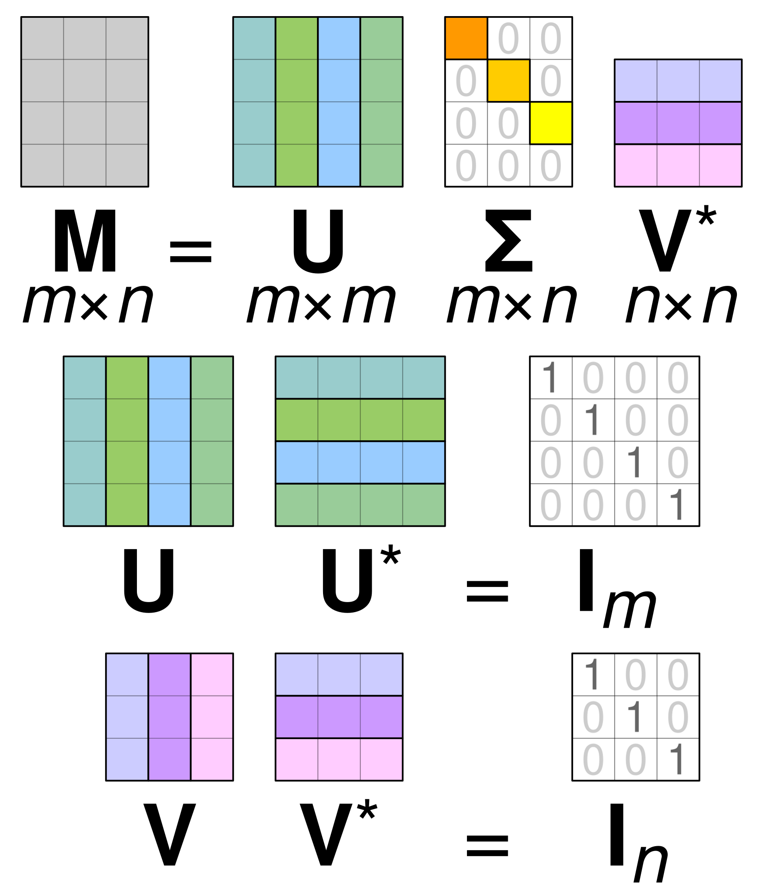

# 奇异值分解

特征分解：

$$
A = Q\Lambda Q^{-1}
$$

$Q$ 是一个 $N\times N$ 的方程，其第 $i$ 列为 $A$ 的特征向量 $q_{i}$ ，$\Lambda$ 为对角矩阵，其对角线上的元素为对应的特征值。

!!! warning
    只有可对角化的矩阵才可进行特征分解。

将一个非零 $m\times n$ 实矩阵分解成如下形式：

$$
A =U\Sigma V^{T}
$$

其中 $U$ 是 $m$ 阶正交矩阵，$V$ 是 $n$ 阶正交矩阵，$\Sigma$ 是有降序排列的非负的对角线元素组成的 $m\times n$ 矩阵对角矩阵。

$$
\Sigma =\mathrm{diag}(\sigma_{1},\sigma_{2},\dots,\sigma_{p})
$$

$\sigma_{i}$ 称为矩阵的奇异值。 $U$ 的列向量称为左奇异向量， $V$ 的列向量称为右奇异向量。这是因为将上式奇异值分解左乘 $V$ ，由于 $V$ 为正交矩阵，则有 $V^{T}V =I$ 可得
 
$$
AV=U\Sigma 
$$

!!! note
    任何矩阵均有奇异值分解，事实上矩阵的奇异值分解可以看作是方阵的对角化的推广。奇异值分解不唯一。(这是因为奇异向量不唯一)

采用构造法证明：假定 $m\geq n$ ，我们采用一个实对称矩阵 $A^{T}A$ （这是一个 $n\times n$ 矩阵，用这个形式是因为这个矩阵维度比较小，方便处理）。这同时也是一个半正定的矩阵，因此其特征值都是实数且非负的，由特征分解可得，存在一个 $n$ 阶正交矩阵 $V$ 实现 $A^{T}A$ 的对角化，使得 $V^{T}(A^{T}A)V = \Lambda$ 成立。假定此时特征值按降序排列，引用奇异值分解可得：

$$
\begin{align}
V^{T}(V\Sigma^{T}U^{T}U\Sigma V^{T})V& = \Lambda\\
\implies\sigma_{j}^{2}& =\lambda_{j} \\
\implies \sigma_{j}&= \sqrt{ \lambda_{j} }
\end{align}
$$

假定矩阵 $A$ 的秩为 $r$ 对应矩阵 $A^{T}A$ 的秩也为 $r$ ，而正的特征值的个数等于秩，有：

$$
\lambda_{1}\geq\lambda_{2}\geq \cdots\lambda_{r}\geq 0 \quad \lambda_{r+1} = \lambda_{r+2} =\dots=\lambda_{n} = 0
$$

对应

$$
\sigma_{1}\geq\sigma_{2}\geq \dots\sigma_{r}\geq 0 \quad \sigma_{r+1} = \sigma_{r+2} =\dots=\sigma_{n} = 0
$$

取 $V_{1} = [v_{1},\dots,v_{r}]$  为 $A^{T}A$  的正特征值对应的特征向量，$V_{2}=[v_{r+1},\dots,v_{n}]$ 为零特征值对应的特征向量，构造

$$
V=[V_{1} \quad V_{2}]
$$

可得奇异值分解中 $n$ 阶正交矩阵。

取

$$
\Sigma_{1} = \begin{bmatrix}
\sigma_{1} &  &  &   \\
 & \sigma_{2} &  &  \\
 &  & \ddots &  \\
 &  &  & \sigma_{r}
\end{bmatrix}
$$

此时 $\Sigma_{1}$ 是一个 $r$ 阶对角矩阵，其对角线元素为按降序排列的正的 $\sigma_{1},\dots,\sigma_{r}$ 于是对角矩阵 $\Sigma$ 可以取成：

$$
\Sigma = \begin{bmatrix}
\Sigma_{1} &  0\\
0 & 0
\end{bmatrix}
$$

这就是矩阵 $A$ 的奇异值分解中的 $m\times n$ 对角矩阵 $\Sigma$ 

接着构造 $m$ 阶正交矩阵 $U$ ，取 $u_j = (\sigma_{j})^{-1}Av_{j}$ 构造矩阵 $U = \begin{bmatrix}u_{1} & u_{2} & \cdots & u_{r}\end{bmatrix}$ 则有

$$
AV_{1} =U_{1} \Sigma_{1}
$$

$U_{1}$ 的列向量构成了一组标准正交集，这是因为：

$$
\begin{align}
u_{i}^{T}u_{j} &= \left( \frac{1}{\sigma_{i}}v_{i}^{T}A^{T} \right) \left( \frac{1}{\sigma_{j}}Av_{j} \right)  \\
&=\frac{1}{\sigma_{i}\sigma_{j}}v_{i}^{T}(A^{T}Av_{j})\quad(A^{T}Av_{j}=\sigma_{j}^{2}v_{j}) \\
& =\frac{\sigma_{j}}{\sigma_{i}} v_{i}^{T}v_{j} \\
& = \delta_{ij}
\end{align}
$$

因此， $u_{1},u_{2},\dots u_{r}$ 构成 $A$ 的列空间的一组标准正交基，列空间维数为 $r$ 。如果用值域 $R(A)^{\perp}$ 表示值域 $R(A)$ 的正交补，则有 $R(A)$ 维数为 $r$ ，$R(A)^{\perp}$ 的维数为 $m-r$ 两者维数之和等于 $m$ 而且有 $R(A)^{\perp} = N(A^{T})$ （$N(\cdot)$ 表示零空间）。令 $U_{2}=\begin{bmatrix} u_{r+1}  & u_{r+2} & \cdots  & u_{m}\end{bmatrix}$  为 $N(A^{T})$ 的标准正交基，则得到了构成了 $\mathbb{R}^{m}$ 的一组标准正交基，因此定义 $m$ 阶正交矩阵：

$$
U=[U_{1}\quad U_{2}]
$$

这就是矩阵 $A$ 的奇异值分解中的 $m$ 阶正交矩阵。

最后将构造出来的 $U,\Sigma,V$ 带入可得：

$$
\begin{align}
U\Sigma V^{T} & =\begin{bmatrix}
U_{1} &U_{2}  
\end{bmatrix}\begin{bmatrix}
\Sigma_{1} & 0 \\
0 & 0
\end{bmatrix} \begin{bmatrix}
V_{1}^{T} \\
V_{2}^{T}
\end{bmatrix} \\
&=U_{1}\Sigma_{1}V_{1}^{T} \\
& = AV_{1}V_{1}^{T} \\
&=A
\end{align}
$$

$A=U\Sigma V^{T}$称为矩阵的完全奇异值分解 ，还有其他形式的奇异值分解：

- 紧奇异值分解是与原始矩阵等秩的奇异值分解。 
- 截断奇异值分解是比原始矩阵低秩的奇异值分解。

!!! note "紧奇异值分解"

    设有 $m\times n$ 实矩阵 $A$ ，其秩为 $\mathrm{rank}(A) =r,r\leq \min(m,n)$ 则称 $U_{r}\Sigma_{r}V_{r}^{T}$ 为 $A$ 的紧奇异值分解，即

    $$
    A = U_{r}\Sigma_{r}V_{r}^{T}
    $$

    矩阵 $U_{r}$ 由完全奇异值分解中 $U$ 的前 $r$ 列、矩阵 $V_{r}$ 由 $V$ 的前 $r$ 列，矩阵 $\Sigma_{r}$ 由 $\Sigma$ 的前 $r$ 个对角线得到。

 在矩阵的奇异值分解中，只取最大的 $k$ 个奇异值（ $k<r$ ，$r$ 为矩阵的秩）对应的部分，就得到矩阵的截断奇异值分解。实际应用中提到矩阵的奇异值分解时，通常指截断奇异值分解。

!!! note "截断奇异值"

    有 $m\times n$ 实矩阵 $A$ ，其秩为 $\mathrm{rank}(A) =r,r\leq \min(m,n)$ 则称 $U_{k}\Sigma_{k}V_{k}^{T}$ 为 $A$ 的截断奇异值分解，即

    $$
    A \approx U_{k}\Sigma_{k}V_{k}^{T}
    $$

    矩阵 $U_{k}$ 由完全奇异值分解中 $U$ 的前 $k$ 列、矩阵 $V_{k}$ 由 $V$ 的前 $k$ 列，矩阵 $\Sigma_{k}$ 由 $\Sigma$ 的前 $k$ 个对角线得到。对角矩阵 $\Sigma_k$ 的秩比原始矩阵 $A$ 的秩低

从线性变换的角度理解奇异值分解，$m\times n$矩阵 $A$ 表示从 $n$ 维空间 $\mathbb{R}^{n}$ 到 $m$ 维空间 $\mathbb{R}^{m}$ 的一个线性变换。线性变换可以分解为三个简单的变换（T = rotation₂ ∘ stretch ∘ rotation₁）：

- 一个坐标系的旋转或反射变换（$V$ ：表示 $\mathbb{R}^{n}$ 正交坐标系的旋转变换）
- 一个坐标轴的缩放变换 （ $\Sigma$ ：表示原始正交坐标系坐标轴的缩放变换）
- 另一个坐标系的旋转或反射变换（$U$ ：表示 $\mathbb{R}^{m}$ 正交坐标系的旋转变换）

奇异值定理保证这种分解一定存在。

!!! tip "性质"

    - 设矩阵 $A$ 的奇异值分解为 $A =U\Sigma V^{T}$ 则以下关系成立：

    $$
    \begin{align}
    A^{T}A &=(U\Sigma V^{T})^{T}(U\Sigma V^{T})=V(\Sigma^{T}\Sigma)V^{T} \\
    AA^{T} &= (U\Sigma V^{T})(U\Sigma V^{T})^{T} =U(\Sigma\Sigma^{T})U^{T}
    \end{align}
    $$

    - 在矩阵 $A$ 的奇异值分解中，奇异值、左奇异向量和右奇异向量之间存在对应关系。（构造法证明时已经说过了）
    - 奇异值唯一，但是奇异向量不唯一
    - 矩阵 $A$ 和 $\Sigma$ 的秩相等，等于正奇异值 $\sigma_i$ 的个数 $r$ 
    - 矩阵 $A$ 的 $r$ 个右奇异向量 $v_{1},v_{2},\dots v_{r}$ 构成 $A^{T}$ 值域 $R(A^{T})$ 的一组标准正交基， $n-r$ 个右奇异向量 $v_{r+1},v_{r+2},\dots v_{n}$ 构成 $A$ 零空间 $N(A)$ 的一组标准正交基，
    - 矩阵 $A$ 的 $r$ 个左奇异向量 $u_{1},u_{2},\dots u_{r}$ 构成 $A$ 值域 $R(A)$ 的一组标准正交基， $m-r$ 个右奇异向量 $u_{r+1},u_{r+2},\dots u_{n}$ 构成 $A^{T}$ 零空间 $N(A^{T})$ 的一组标准正交基，

奇异值分解的计算：

1. 计算 $A^{T}A$ 的特征值和特征向量
2. 特征向量单位化，构成 $n$ 阶正交矩阵 $V$
3. 计算奇异值，构建对角矩阵 $\Sigma$ 
4. 构造 $m$ 阶正交矩阵
5. 奇异值分解
 
设矩阵 $A\in \mathbb{R}^{m\times n} = [a_{ij}]_{m\times n}$ ，定义矩阵 $A$ 的弗罗贝尼乌斯范数：

$$
\lVert A \rVert _{F} = \left( \sum_{i=1}^{m} \sum_{j=1}^{n} (a_{ij})^{2} \right) ^{1/2}
$$

!!! tip "Corollary"

    设矩阵 $A\in \mathbb{R}^{m\times n}$ $A$ 的奇异值分解为 $U\Sigma V^{T}$ 其中 $\Sigma = \mathrm{diag}(\sigma_{1},\sigma_{2},\dots\sigma_{n})$ 则：

    $$
    \lVert A \rVert _{F} = (\sigma^{2}_{1}+\sigma^{2}_{2}+\dots+\sigma^{2}_{n})^{1/2}
    $$

奇异值分解是在平方损失弗罗贝尼乌斯范数意义下对矩阵的最优近似，即数据压缩，紧奇异值分解时弗罗贝尼乌斯范数下的无损压缩，截断奇异值分解是有损压缩。

!!! note "Definition"

    设矩阵 $A\in \mathbb{R}^{m\times n}$ ，矩阵的秩 $\mathrm{rank}(A)= r$ ，并设 $\mathcal{M}$ 为 $\mathbb{R}^{m\times n}$ 中所有 秩不超过 $k$ 的矩阵集合 $0<k<r$ ，则存在一个秩为 $k$ 的矩阵 $X\in \mathcal{M}$ ，使得：

    $$
    \lVert A-X \rVert _{F} =\min_{S \in \mathcal{M} }\lVert A-S \rVert _{F}
    $$

    称矩阵 $X$ 为矩阵 $A$ 在弗罗贝尼乌斯范数意义下的最优近似

$$
 U\Sigma = \begin{bmatrix}
\sigma_{1}u_{1} & \sigma_{2}u_{2} & \dots & \sigma_{n}u_{n}
\end{bmatrix}
$$

外积展开式

$$
A=\sigma_{1}u_{1}v_{1}^{T}+\sigma_{2}u_{2}v_{2}^{T}+\dots+\sigma_{n}u_{n}v_{n}^{T}
$$

因此矩阵可以表示成 $n$ 个秩一矩阵的和：

$$
A=\sum_{k=1}^{n} \hat{A}_{k} \quad \hat{A}_{k} = \sigma_{k}u_{k}v^{T}_{k}
$$

取 $A$ 的截断奇异值分解 $A_{k}$ 

$$
A_{k} =\sigma_{1}u_{1}v_{1}^{T}+\sigma_{2}u_{2}v_{2}^{T}+\dots+\sigma_{k}u_{k}v_{k}^{T}
$$

显然 $A_{k}$ 秩为 $k$ ，是秩为 $k$ 矩阵在弗罗贝尼乌斯范数意义下 $A$ 的最优近似矩阵。由于奇异值 $\sigma$ 衰减很快，所以 $k$ 取很小是，$A_{k}$ 也是对 $A$ 有很好的近似

