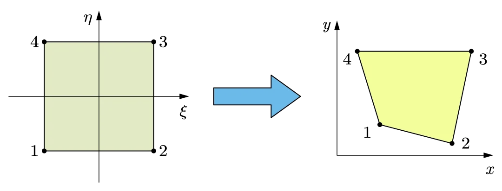

## Isoparametric Formulation

实际上，三角形单元和矩形单元无法同时满足我们在建模复杂几何形状和高精度方面的需求。

- 三角形网格：准确度低
- 矩形网格：只适用于简单网格
- 等参单元

在等参单元中，几何形状的描述和场变量（如位移、应力）的插值函数都使用相同的形函数，因此称为等参单元，

等参单元（任意直线四边形）适用各种几何情况，但是很难找到对应积分的解析形式。当我们涉及到的单元上的积分时，也就是：

$$
\mathbf{k}^{e} = \int_{V^{e}}\mathbf{B}^{T}\mathbf{DB}\mathrm{d}V
$$

由于我们的等参单元是通过非线性映射得到的，这会导致 $\mathbf{B}$ 不是一定常数，因此积分的形式会比较复杂，同时，在积分过程，我们不可避免地会对积分区域进行分割，这会导致积分形式变得更加复杂，所以积分对应的解析表达式会比较难给出。

我们考虑做一个变化，比如说将 $xy$ 中的任意四边形变换成计算空间 $st$ 中的正方形（上图是一个逆变化）。在计算空间中，$x，y$ 由如下表达式给出：

$$
\begin{align}
x &= a_{1} +a_{2} s+a_{3} t +a_{4}st  \\
y &= a_{5} + a_{6}s + a_{7} t +a_{8}st
\end{align}
$$

系数由如下方式给出：

$$
\begin{align}
x_{1}&= a_{1}+a_{2}(-1)+a_{3}(-1)+a_{4}(-1)(-1) \\
x_{2}&= a_{1}+a_{2}(1)+a_{3}(-1)+a_{4}(1)(-1) \\
x_{3}&= a_{1}+a_{2}(1)+a_{3}(1)+a_{4}(1)(1) \\
x_{4}&= a_{1}+a_{2}(-1)+a_{3}(1)+a_{4}(-1)(1)
\end{align}
$$

尽管构建了物理空间到计算空间的映射，但我们还没有解得计算空间中的形函数，但我们知道形函数应该满足：

$$
N_{i}= \cases{1 \quad \text{at node } i\\ 0 \quad \text{at nodes other than } i}
$$

因此采用如下方式计算形函数：

$$
\begin{align}
N_{1}= \frac{1}{4}(1-s)(1-t) &\quad N_{2} =\frac{1}{4}(1+s)(1-t) \\
N_{3}= \frac{1}{4}(1+s)(1+t) &\quad N_{4} =\frac{1}{4}(1-s)(1+t)
\end{align}
$$

定义 Jacbian 矩阵

$$
\mathbf{J}= \begin{bmatrix}
\frac{\partial x }{\partial s }  & \frac{\partial y }{\partial s }  \\
\frac{\partial x }{\partial t }  & \frac{\partial y }{\partial t } 
\end{bmatrix}=\begin{bmatrix}
\underset{ i=1 }{ \overset{ 4 }{ \sum } }\frac{\partial N_{i} }{\partial s }x_{i}  & \underset{ i=1 }{ \overset{ 4 }{ \sum } }\frac{\partial N_{i} }{\partial s }y_{i}    \\
\underset{ i=1 }{ \overset{ 4 }{ \sum } }\frac{\partial N_{i} }{\partial t }x_{i}   &\underset{ i=1 }{ \overset{ 4 }{ \sum } }\frac{\partial N_{i} }{\partial t }y_{i}  
\end{bmatrix}
$$

用来描述坐标变化

考虑应变矩阵：

$$
\mathbf{B} = \begin{bmatrix}
 \frac{\partial  }{\partial x }  & 0 \\
0 & \frac{\partial  }{\partial y }  \\
\frac{\partial  }{\partial y }  & \frac{\partial  }{\partial x } 
\end{bmatrix}\mathbf{N}
$$

因为要求形函数对于 $x,y$ 的偏导（注意此时形函数由计算空间中的形函数给出），所以需要做一个坐标变换。利用 Jacbian 矩阵，可以求得

$$\boxed{
\begin{Bmatrix}
\frac{\partial N_{i} }{\partial x }  \\
\frac{\partial N_{i} }{\partial y } 
\end{Bmatrix} =  \frac{1}{\det(\mathbf{J})}\begin{Bmatrix}
\frac{\partial y }{\partial t } \frac{\partial N_{i} }{\partial s }  -\frac{\partial y }{\partial s } \frac{\partial N_{i} }{\partial t }  \\
-\frac{\partial x }{\partial t } \frac{\partial N_{i} }{\partial s }  +\frac{\partial x }{\partial s } \frac{\partial N_{i} }{\partial t } 
\end{Bmatrix}}
$$

带入后可以求得应变矩阵

应变矩阵也可以写成如下显式形式：

$$
\mathbf{B}=\lvert \mathbf{J} \rvert ^{-1}\begin{bmatrix}
\mathbf{B }_{1} & \mathbf{B }_{2} & \mathbf{B }_{3} & \mathbf{B }_{4}
\end{bmatrix}_{3\times 8}
$$

其中

$$
\mathbf{B}_{i} = \begin{bmatrix}
a N_{i,s}-bN_{i,t} & 0 \\
0 & cN_{i,t}-dN_{i,s} \\
cN_{i,t}-dN_{i,s} & aN_{i,s}-bN_{i,t}
\end{bmatrix}
$$

系数：

$$
\begin{align}
a &= \frac{1}{4}[y_{1}(s-1)+y_{2}(-1-s)+y_{3}(1+s)+y_{4}(1-s)] \\
b &= \frac{1}{4}[y_{1}(t-1)+y_{2}(1-t)+y_{3}(1+t)+y_{4}(-1-t)] \\
c &= \frac{1}{4}[x_{1}(t-1)+x_{2}(1-t)+x_{3}(1+t)+x_{4}(-1-t)] \\
d &= \frac{1}{4}[x_{1}(s-1)+x_{2}(-1-s)+x_{3}(1+s)+x_{4}(1-s)]
\end{align}
$$

显式 Jacbian

$$
\lvert \mathbf{J} \rvert = \frac{1}{8}\left\{ X_{c} \right\}^{T}\begin{bmatrix}
0 & 1-t & t-s & s-1 \\
t-1 & 0 & s+1 & -s-t \\
s-t & -s-1 & 0 & t+1   \\
1-s & s+t & -t-1 & 0
\end{bmatrix} \left\{ Y_{c} \right\} 
$$

$$
\begin{align}
\left\{ X_{C} \right\} ^{T} &= \begin{Bmatrix}
x_{1} & x_{2} & x_{3} & x_{4}
\end{Bmatrix} \\
\left\{ Y_{C} \right\} ^{T} &= \begin{Bmatrix}
y_{1} & y_{2} & y_{3} & y_{4}
\end{Bmatrix}
\end{align}
$$

所以刚度矩阵可以写成如下形式

$$
\mathbf{k}_{e} = h \int_{-1}^{1}\int_{-1}^{-1} \mathbf{B}^{T}\mathbf{D}\mathbf{B}\lvert J \rvert \mathrm{d}s \mathrm{d}t
$$

$h$ 是当我们考虑到元素的厚度。

思考一个问题，什么样的元素算是有一个“好形状”的元素呢？他应当满足 $J> 0$ ，Jacbian 矩阵描述的单元区域在计算空间和物理空间中的面积变换比率，我们希望计算空间中的每一点都被唯一地映射到实际单元中，没有重叠和交叉，如果 $J =0$ ，面积为零，形函数不可逆，如果 $J< 0$ ，：映射发生了翻转或交叉，就不是一对一的映射了，参考单元中某些点会被映射到同一点，物理上没有意义。

!!! info 
    Jacbian 行列式 $\det(\mathbf{J})$ 是衡量单元质量的关键

??? example

    

    先求位移插值函数：

    $$
    \begin{align}
    x &= \sum N_{i}x_{i} = \frac{1}{4}(1+s)(13+3t) \\
    y &= \sum N_{i}y_{i} = 2(1+t)  
    \end{align}
    $$

    然后可求得 Jacbian 矩阵：

    $$
    J = \begin{bmatrix}
    \frac{\partial x }{\partial s }  & \frac{\partial y }{\partial s } \\
    \frac{\partial x }{\partial t }  & \frac{\partial y }{\partial t }  
    \end{bmatrix}= \begin{bmatrix}
    \frac{13}{4}+\frac{3}{4}t & 0 \\
    \frac{3}{4}(1+s) & 2
    \end{bmatrix}
    $$

    求取 $\frac{\partial N_{1} }{\partial x }$ 和 $\frac{\partial N_{2} }{\partial  y}$ ，先求表达式：

    $$
    \begin{align}
    &\begin{Bmatrix}
    \frac{\partial N_{i} }{\partial x }  \\
    \frac{\partial N_{i} }{\partial y }  
    \end{Bmatrix}= \frac{1}{\lvert J \rvert } \begin{Bmatrix}
    \frac{\partial y }{\partial t } \frac{\partial N_{i}  }{\partial s } -\frac{\partial y }{\partial s } \frac{\partial N_{i} }{\partial t } \\
    -\frac{\partial x  }{\partial t }\frac{\partial N_{i} }{\partial s }+\frac{\partial x }{\partial s } \frac{\partial N_{i} }{\partial t }    
    \end{Bmatrix}= \frac{2}{13+3t}\begin{Bmatrix}
    2\frac{\partial N_{i} }{\partial s } \\
    -\frac{3(1+s)}{4}\frac{\partial N_{i} }{\partial s } +\frac{(13+3t)}{4}\frac{\partial N_{i} }{\partial t }  
    \end{Bmatrix} \\
    \implies& \frac{\partial N_{1} }{\partial x }  = \frac{t-1}{13+3t} \\
    & \frac{\partial N_{2} }{\partial y }   = \frac{2}{13+3t}\left[ -\frac{3(1+s)}{4}\frac{(1-t)}{4} -\frac{(13+4t)}{4}\frac{(1+s)}{4}\right] 
    \end{align}
    $$

    现在求取 $s$ 和 $t$ 的值，将 $x=1.5,y=2$ 带入位移插值函数中，可得：

    $$
    s = - \frac{7}{13} \quad t =0
    $$

    因此可以求得：

    $$
    \frac{\partial N_{1} }{\partial x }  = -\frac{1}{13}\quad \frac{\partial N_{2} }{\partial y }  = - \frac{12}{169}
    $$

## Numerical Integration

我们有两种简单的格式来计算数值积分：

**格式 1**

1. 将积分区间分成 $N$ 个小段
2. 选择一个函数来近似每个小段内 $f(x)$ 的变化；最简单函数是等于每个小段中点处 $f(x)$ 值的常数函数；
3. 这个常数函数与小段长度的乘积近似为该小段上f$(x)$的积分；
4. 将所有小段的乘积求和，得到$f(x)$在区间$(-1,1)$上的积分的近似值。

**格式 2**：格式 2 的步骤基本上与格式 1 相同，但是选择每段中点的切线来近似 $f(x)$ 的变化

采用数值方法进行积分有两个关键步骤：

1. 划分积分区域（Divide the interval of integration）
2. 在每个子区域内，选择适当的简单函数来近似真实函数（In each sub-interval, choose proper simple functions to approximate the true function.）

数值方法有两个两个关键特点：

1. 数值结果是对精确解的近似（The numerical result is an approximation to the exact solution）
2. 数值结果的准确性取决于子区间的数量和选择的近似函数。（The accuracy of numerical result depends on the number of sub-interval and approximate function.）

一个关键的缺点是数值方法的准确性依赖于我们划分的积分区域的数量 $N$  

在有限元分析中，我们需要估计如下积分形式的刚度矩阵：

$$
\mathbf{k}_{e} = h \int_{B^{e}}\mathbf{B}^{T} \mathbf{DB} \lvert \mathrm{J} \rvert \mathrm{d}s \mathrm{d} t
$$

为了计算 $F(r)$ 的数值积分，我们构造一个多项式函数 $\Phi(r)$ ，在给定 $n$ 个点上满足：$\Phi(r_{i})=F(r_{i})$ ，则取如下近似：

$$
\int_{a}^{b}F(r) \mathrm{d }r \approx \int_{a}^{b}\Phi(r)\mathrm{d}r
$$

$r_{i}$ 被称为采样点或者积分点，点的位置和数量决定了数值积分的精度

两种主要的积分格式：

1. NewtonCotes积分（NewtonCotes多项式）
2. Gauss积分（Gauss多项式）

### Newton-Cotes

一般而言我们用 $n+1$ 来构造一个 $n$ 阶多项式，但这意味着我们要解一个 $n+1$ 的线性方程组。 我们采用拉格朗日插值来求取这个多项式。

!!! note "[Lagrange polynomial](https://en.wikipedia.org/wiki/Lagrange_polynomial)"
    对应某个多项式函数，已知有给定的 $k+1$ 个取值点：

    $$
    (x_{0},y_{0}),\dots,(x_{k},y_{k})
    $$

    应用拉格朗日插值公式得到的拉格朗日插值多项式为：

    $$
    L(x) = \sum_{j=0}^{k}y_{j}\mathscr{l}_{j}(x) 
    $$

    其中，每个 $\mathscr{l}_{j}(x)$ 表达式为：

    $$
    \mathscr{l}_{j}(x)= \prod_{i=0,i\neq j}^{k}\frac{x-x_{i}}{x_{j}-x_{i}}=\frac{(x-x_{0})}{(x_{j}-x_{0})}\dots\frac{(x-x_{j-1})}{(x_{j}-x_{j-1})}\frac{(x-x_{j+1})}{(x_{j}-x_{j+1})}\dots\frac{(x-x_{k})}{(x_{j}-x_{k})}
    $$

在 Newton-Cotes 格式中，$F$ 的采样点是等距的。

$$\begin{align}
\int_{a}^{b} F(r)\mathrm{d}r &= \int_{a}^{b} \Phi(r)\mathrm{d} r+R_{n} = \sum_{i=0}^{n} \left[ \int_{a}^{b}l_{i}(r)\mathrm{d}r \right]F_{i}+R_{n}  \\
&\overset{\xi = \frac{r-a}{b-a}}{\implies} (b-a)\sum_{i=1}^{n}  \left[ \int_{0}^{1}l_{i}(\xi )\mathrm{d}\xi \right]F_{i} +R_{n}
\end{align}
$$

因为 $\int^{1}_{0}l_{i}(\xi)\mathrm{d}\xi$  只与划分的点数 $n$ 有关，可以记为 $C_{i}^{n}$ ，则 $F$ 的数值积分表达式为：

$$
\int_{a}^{b}F(r)\mathrm{d} r =(b-a)\sum_{i=0}^{n} C_{i}^{n}F_{i}+R_{n}
$$

其中 $R_{n}$ 表示误差。

如果 $F(r)$ 是一个 $n$ 阶多项函数， New-Cotes 格式应当给出精确解

如果考虑是在单位上的积分，那么 Newton-Cotes 个数给出的解分别为：

$$
I = \int_{-1}^{1} F(x)\mathrm{d}x = 2\sum_{i=0}^{n} C_{i}F(x_{i})+R_{n} = 2\sum_{i=0}^{n} C_{i}F_{i}+R_{n}
$$

$$
I= \int_{-1}^{1}\int_{-1}^{1}F(x,y) \mathrm{d}x\mathrm{d}y = 4\sum_{i=0}^{n} \sum_{j=0}^{m} C_{i}C_{j}F(x_{i},y_{i})+R_{n}
$$

$$
I=\int_{-1}^{1}\int_{-1}^{1}\int_{-1}^{1}F(x,y,z)\mathrm{d}x\mathrm{d}y\mathrm{d}z = 8\sum_{i=0}^{n} \sum_{j=0}^{m} \sum_{k=0}^{p} C_{i}C_{j}C_{k}F(x_{i},y_{j},z_{k})+R_{n}
$$

### Gauss

在 Newton-Cotes 格式中，我们人为划分采样点，故采样点是已知的；而在 Gauss 格式中，我们认为采样点是未知的，我们引用如下新的多项式函数 $P(r)$:

$$
P(r)=(r-r_{1})(r-r_{2})\dots(r-r_{n})
$$

取如下近似：

$$
F(r) = \Phi(r)+P(r)\left( \beta_{1}+\beta_{2}r+\dots+\beta_{n}r^{n-1} \right) 
$$

$\Phi(r)$ 是通过插值已知函数得到的多项式。

这是一个 $2n-1$ 阶多项式，带入积分并展开可得：

$$
\int_{a}^{b} F(r)\mathrm{d}r = \sum_{i=1}^{n} \left[ \int_{a}^{b}l_{i}(r)\mathrm{d}r \right]F_{i} + \sum_{j=1}^{n} \left[ \int_{a}^{b}r^{j-1}P(r)\mathrm{d}r \right]\beta_{j} +R_{n}
$$

第一项是插值函数的积分；第二项是我们引入的多项式函数积分结果，我们不希望他影响到我们的数值积分结果，因此利用正交性：

$$
\int_{a}^{b}r^{j-1}P(r)\mathrm{d}r =0
$$

这就是选择采样点的依据：选择使 $P(r)$ 与低阶多项式正交的点，也称为高斯点。因此，我们消掉了右边的第二项积分。为简化计算取变换：

$$
r = \frac{b+a}{2}+ \frac{b-a}{2}\xi
$$

积分变为：

$$
\int_{a}^{b}F(r)\mathrm{d}r = \frac{b-a}{2}\int_{-1}^{1}F(\xi)\mathrm{d}\xi = \frac{b-a}{2}\sum_{i=1}^{n} \left[ \int_{-1}^{1}l_{i}(\xi)\mathrm{d}\xi \right]F_{i} = \frac{b-a}{2}\sum_{i=1}^{n} W_{i}F_{i}
$$

称 $W_{i}$ 为权重函数，这一般是满足假设要求的已知函数。如果 $F(r)$ 是一个 $2n-1$ 阶多项式，Gauss格式应该给出确定解。

如果考虑是在单位上的积分，那么 Gauss 个数给出的解分别为：

$$
I = \int_{-1}^{1} F(x)\mathrm{d}x = \sum_{i=0}^{n} W_{i}F(x_{i})+R_{n} = \sum_{i=0}^{n} W_{i}F_{i}+R_{n}
$$

$$
I= \int_{-1}^{1}\int_{-1}^{1}F(x,y) \mathrm{d}x\mathrm{d}y = \sum_{i=0}^{n} \sum_{j=0}^{m} W_{i}W_{j}F(x_{i},y_{i})+R_{n}
$$

$$
I=\int_{-1}^{1}\int_{-1}^{1}\int_{-1}^{1}F(x,y,z)\mathrm{d}x\mathrm{d}y\mathrm{d}z = \sum_{i=0}^{n} \sum_{j=0}^{m} \sum_{k=0}^{p} W_{i}W_{j}W_{k}F(x_{i},y_{j},z_{k})+R_{n}
$$

常用的权重函数：

- 切比雪夫：

$$
W(x) = (1-x^{2})^{-1/2}
$$

- 埃米特

$$
W(x) = e^{-x^{2}}
$$

勒让德求积：

| 点的数目 | 点的位置                                        | 权重 $W_{i}$                  |
| ---- | ------------------------------------------- | --------------------------- |
| $1$  | $0$                                         | $2$                         |
| $2$  | $\pm {1} /\sqrt{ 3 }$                       | $1$                         |
| $3$  | $0$                                         | $8 / 9$                     |
|      | $\pm \sqrt{ 3 /5 }$                      | $5 /9$                      |
| $4$  | $\pm \frac{\sqrt{ 525-70\sqrt{ 30 } }}{35}$ | $\frac{18+\sqrt{  30}}{36}$ |
|      | $\pm \frac{\sqrt{ 525+70\sqrt{ 30 } }}{35}$ | $\frac{18-\sqrt{  30}}{36}$ |

!!! summary

    1. Newton-Cotes公式和Gauss公式都使用多项式函数来近似被积函数。
        
    2. Newton-Cotes公式使用等间距采样点来构建多项式函数。因此，当使用n个采样点时，Newton-Cotes公式可以为(n-1)阶多项式提供精确积分。
        
    3. Gauss公式使用不等间距采样点来构建多项式函数。当使用n个采样点时，Gauss公式可以为(2n-1)阶多项式提供精确积分。
        
    4. Gauss公式提供了一种更高效的数值积分方案。
        
    5. Gauss公式中的采样点位于积分域内，但Newton-Cotes公式中有两个采样点位于边界上。

尽管我们经常使用 Gauss 格式，但是 Gauss 并不能将边界点作为采样点，所以有时候也会用到 Newton-Cotes 格式

### Accuracy

有了数值积分方法，现在的问题就是，我们需要几阶的积分，又需要多少个积分点？

假定希望得到的形函数多项式的阶次为 $p$ ，对于应变矩阵 $\mathbf{B}$ 其阶次为 $p-1$ （因为取一阶导数） ，考虑Jacbian行列式为常数，刚度矩阵：

$$
	\mathbf{k}_{e} = h \int_{B^{e}}\mathbf{B}^{T} \mathbf{DB} \lvert \mathrm{J} \rvert \mathrm{d}s \mathrm{d} t
$$

对应的最高阶次

$$
	\mathcal{O}(\mathbf{B}^{T}\mathbf{DB}) =2(p-1) 
$$

如果在一个方向上有 $n$ 个积分点，如果使用 Gauss 格式，为了精确求得积分，要求：

$$
2n-1 \geq 2(p-1)
$$

可得

$$
n\geq \frac{2p-1}{2}
$$

一般而言，由于应变是对位移求一阶导数得到的，因此，通过数值方法得到应力应变的准确度会比位移得到的低。同时，有限元上的积分一般是在 Gauss 点上进行的，因此计算得到的 Gauss 点上的应力应变会比节点（nodal points）上的应力应变更为准确。

当使用 1x1 积分方案（仅计算单元中心一个积分点）时，若单元变形为沙漏（Hourglass）形状(两个对顶的三角形或四边形)，积分点处给出计算的应变能为零，这种变形模式称为虚假零能量模式（spruious zero-energy modes），这是因为实际的物理变形应该消耗能量。这个线性发生的原因是因为方案仅采样单元中心点，无法捕捉梯度变化，解决方案有采用更多的积分点（Full integration）

在有限元方法中，位移通常是采用连续的形函数来逼近的，位移在元素之间是连续的，但是在元素交界处不一定光滑（non-smooth），这导致了应变在相邻元素边界一般是不连续的，也就是说位移是 $C^{0}$ 光滑的。应变的不连续会带有连一些问题，因此为了使得应变应变场是光滑的，我们对其做（加权）平均，从而使我们的结果更为平滑，也有其他平滑方法。比如有四个 CST 元素，我们想求取四个元素组成的四边形的应力，我们应当取

$$
\sigma_{p}= \frac{\sum A_{i}\sigma_{i}}{\sum A_{i}}
$$

$\sigma_{i}$ 和 $A_{i}$ 表示第 $i$ CST 元素对应的应力和面积，即加权平均
